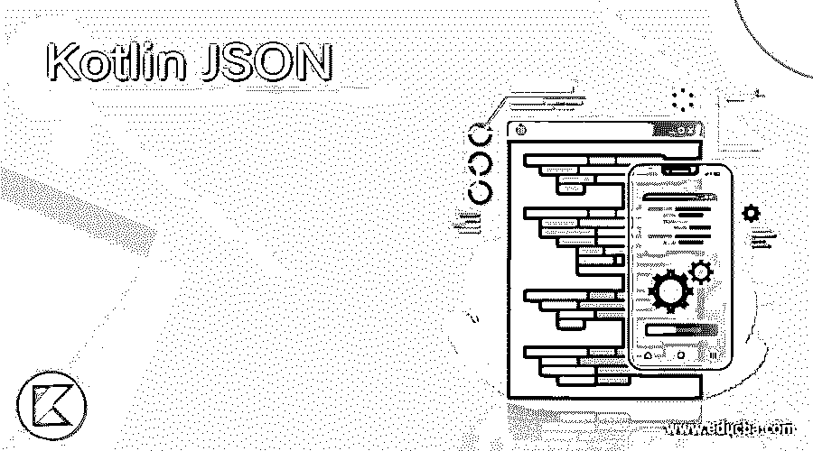
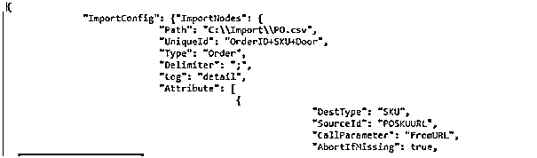
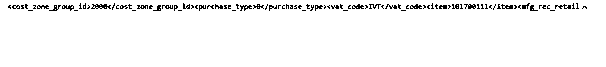
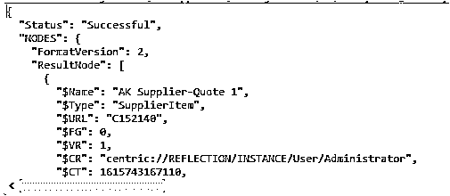
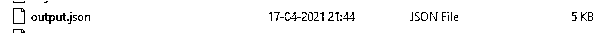

# 我的天啊

> 原文：<https://www.educba.com/kotlin-json/>




## Kotlin JSON 简介

kotlin JSON 是在服务器和客户端之间解析数据的默认方法之一。它是最小的，文本的，是 JavaScript 的一个子集。这看起来像是 XML 解析的替代方案。JSON 对象包含类似于映射集合的键和值对。键可以是字符串类型，值是 JSON 类型。逗号分隔符是键和值的分隔符。花括号{}是表示 JSON 对象的运算符，用于利用用户数据，看起来像是在数组列表的帮助下绑定的数组。

**语法:**

<small>网页开发、编程语言、软件测试&其他</small>

在 kotlin 中，语言被用来实现和结合其他特性，如 JSON、XML 等。使用 JSON 概念转换和解析用户数据，这有助于将 JSON 从字符串数据类型转换为数据类。

```
data class name1
{
var varibalename: datatype;
}
fun main()
{
val varname= Gson().fromJson<name1>(json,name1::class.java)
val xmlinputs=”<xml tag codes>” // depends upon the requirement
val varnames=XML.toJSONObject(xmlinputs)
---- some kotlin logic codes depends upon the requirement--
}
```

上面的代码是在 kotlin 语言中利用 JSON 概念的基本语法。我们使用 Gson()方法调用 kotlin 接口中的 fromJson()方法。

### JSON 在 Kotlin 中是如何工作的？

JSON 是 JavaScript 对象符号，在它的帮助下，用户数据在客户机和服务器之间被解析。读取和快速解析并刷新数据变得更加容易。在 kotlin 中，不可变数据类更加简洁，这使得为 JSON 数据格式构建基本模型变得容易。用户数据被相应地归档到所需的类中，这些类将被用于实现其他不支持样板代码的默认方法。当解码来自 post-man 等网络工具的 JSON 数据时，缺省值将填补空白。该请求将使用任何工具发送，我们根据用户端提出的请求收到了 JSON 格式的响应。在流 API 的帮助下，我们可以通过从流中读取来处理大量的 JSON 文档。这个特性将允许我们的代码处理 JSON 值，同时它仍然被接受为 read value 格式。JSON 对象是一组可修改的名称和值映射。名称是唯一的和非空的字符串值。它可以是 JSON 对象、JSON 数组、字符串和其他数据类型的混合，等等。

### 例子

让我们讨论一下 Kotlin JSON 的例子。

#### 示例#1

```
package one;
import org.json.JSONObject
import org.json.XML
fun main(<u>args</u>: Array<String>) {
val firsts = 14
val inputxml = """
<?xml version="1.0" encoding="UTF-8"?>
<ImportConfig>
<ImportNodes Type="Order" UniqueId="OrderID+SKU+Door"
Path="C:\Import\PO.csv"
Log="detail"
Delimiter=";">
<Attribute Id="RealizedProduct" DestType="SKU" SourceId="POSKUURL" Url="true" CallParameter="FromURL" AbortIfMissing="true" OnCreate="true" />
<Attribute Id="PO" Url="true" CallParameter="ParentURL" AbortIfMissing="true" OnCreate="true" />
</ImportNodes>
</ImportConfig>
<Reader Type="SQLServer" Database="PurchaseOrders" Instance="MBI-UAT" User="sa" Password="csisa"/>
<Query Query="SELECT REPLACE((CONCAT(POSupplier, SalesOrder, CitesCode)), ' ', '') AS 'PO', REPLACE((CONCAT(S.SalesOrder, S.Door, POSupplier)), ' ', '') AS 'OrderID', REPLACE(REPLACE(REPLACE(REPLACE(REPLACE(REPLACE(UPPER(CONCAT(S.Season,S.ProductID)),' ', ''),'-', ''),'(', ''),')', ''),'.', ''),'_','') AS 'SKU',URL.NodeURL AS 'POSKUURL',CONCAT(S.SalesOrder, '-', S.Door) AS 'SalesOrder',S.POSupplier,S.ConsolidatedQty,S.Buyer,S.Seller,S.Door FROM [PurchaseOrders].[dbo].SalesOrderLine S CROSS APPLY (SELECT TOP 1 U.NodeURL FROM C8.Shadow.Shadow_POSKU U WHERE U.NewPOImpID COLLATE DATABASE_DEFAULT = REPLACE(REPLACE(REPLACE(REPLACE(REPLACE(REPLACE(UPPER(CONCAT(S.Season,S.StyleTN,S.Colorway)),' ', ''),'-', ''),'(', ''),')', ''),'.', ''),'_','') COLLATE DATABASE_DEFAULT) URL"/>
<Attribute Id="OrderQuote" DestType="SupplierItem" Expr='block(cn=POColor.ProductColor.`Node Name`,sup=PO.POSupplier.SupplierNumber,quotes=POProduct.Product.ProductSourcing.join(ProductSources).join(SupplierItems).join(CurrentRevision),out=list(ref_type),fn=list(ref_type),foreach(rec1,quotes,block(cols=rec1.Colors,foreach(rec2,cols,if(rec2.`Node Name`==cn,add(out,rec1),"")))),lst=out.filter(State.enumValue()=="APPROVED"||State.enumValue()=="DRAFT" ||State.enumValue()=="PENDING").filter(Master.__Parent__.Supplier.SupplierNumber==sup),foreach(rec,lst,add(fn,rec.Master)),if(fn.size() == 1, at(fn, 0), dummy))'/>
<Attribute Id="QuantityPerSize" SourceId="ConsolidatedQty" ValueOp="Replace" />
<Attribute Id="MBI_Order_Buyer_Ref" SourceId="Buyer" RefUniqueId="Node Name" />
<Attribute Id="MBI_Order_Seller_Ref" SourceId="Seller" RefUniqueId="Node Name" />
<Attribute Id="MBI_Order_Door_Ref" SourceId="Door" RefUniqueId="MBI_Contact_ContactID_String" />
<Attribute Id="MBI_Order_SalesOrder_Ref" SourceId="SalesOrder" RefUniqueId="Node Name" />
"""
val jsonconversion = XML.toJSONObject(inputxml)
val result = jsonconversion.toString(firsts)
println(result)
}
```

**样本输出:**




在第一个例子中，我们可以将 XML 数据转换成 JSON 格式的数据。

#### 实施例 2

```
package one;
import org.json.JSONObject
import org.json.XML
fun main(<u>args</u>: Array<String>) {
val inputxml = """
{
"item": 101700111,
"dept": 69,
"class": 1314,
"subclass": 1051,
"item_desc": "Saleigh's Groove",
"short_desc": "Saleigh's Groove",
"up_desc": "SALEIGH'S GROOVE",
"cost_zone_group_id": 2000,
"package_size": 6,
"mfg_rec_retail": 349.99,
"supplier": "BPS-004289",
"vpn": 786431,
"selling_unit_retail": 349.99,
"origin_country_id": "ZA",
"unit_cost": 125.00,
"purchase_type": 0,
"image_name": "526_small.jpg",
"image_addr": "http://cuplmcpt01/plm/",
"PriceZones":{"1000":456,
"1001":456,
"1002":456,},
"last_update_id":"SalWag",
"vat_code": "IVT",
"UDA": [
{"uda_id": 1, "uda_value": 1, "uda_desc": "Brand","uda_value_desc":"K-Way"},
{"uda_id": 21,"uda_value": 2, "uda_desc": "Story","uda_value_desc":"Some Story"},
{"uda_id": 44,"uda_value": 12,"uda_desc": "Bonded", "uda_value_desc":"No"},
{"uda_id": 41,"uda_value": 10,"uda_desc": "Uniform","uda_value_desc":"No"}] }
"""
val jsonconversion = JSONObject(inputxml)
val result = XML.toString(jsonconversion)
println(result)
}
```

**样本输出:**




在第二个例子中，我们可以使用默认方法将 JSON 文件数据转换成 XML 格式。我们可以称之为 XML。toString()方法将 JSON 数据转换成字符串格式和 XML 格式。

#### 实施例 3

```
package one;
import java.io.File
import org.json.JSONObject
import org.json.XML
import com.google.gson.Gson
import com.google.gson.GsonBuilder
fun main(args: Array<String>) {
val firsts = 7
val inputxml = """
<?xml version="1.0" encoding="UTF-8"?>
<?xml version="1.0" encoding="UTF-8"?>
<ImportConfig>
<ImportNodes Type="Order" UniqueId="OrderID+SKU+Door"
Path="C:\Import\PO.csv"
Log="detail"
Delimiter=";">
<Attribute Id="RealizedProduct" DestType="SKU" SourceId="POSKUURL" Url="true" CallParameter="FromURL" AbortIfMissing="true" OnCreate="true" />
<Attribute Id="PO" Url="true" CallParameter="ParentURL" AbortIfMissing="true" OnCreate="true" />
</ImportNodes>
</ImportConfig>
<Reader Type="SQLServer" Database="PurchaseOrders" Instance="MBI-UAT" User="sa" Password="csisa"/>
<Query Query="SELECT REPLACE((CONCAT(POSupplier, SalesOrder, CitesCode)), ' ', '') AS 'PO', REPLACE((CONCAT(S.SalesOrder, S.Door, POSupplier)), ' ', '') AS 'OrderID', REPLACE(REPLACE(REPLACE(REPLACE(REPLACE(REPLACE(UPPER(CONCAT(S.Season,S.ProductID)),' ', ''),'-', ''),'(', ''),')', ''),'.', ''),'_','') AS 'SKU',URL.NodeURL AS 'POSKUURL',CONCAT(S.SalesOrder, '-', S.Door) AS 'SalesOrder',S.POSupplier,S.ConsolidatedQty,S.Buyer,S.Seller,S.Door FROM [PurchaseOrders].[dbo].SalesOrderLine S CROSS APPLY (SELECT TOP 1 U.NodeURL FROM C8.Shadow.Shadow_POSKU U WHERE U.NewPOImpID COLLATE DATABASE_DEFAULT = REPLACE(REPLACE(REPLACE(REPLACE(REPLACE(REPLACE(UPPER(CONCAT(S.Season,S.StyleTN,S.Colorway)),' ', ''),'-', ''),'(', ''),')', ''),'.', ''),'_','') COLLATE DATABASE_DEFAULT) URL"/>
<Attribute Id="OrderQuote" DestType="SupplierItem" Expr='block(cn=POColor.ProductColor.`Node Name`,sup=PO.POSupplier.SupplierNumber,quotes=POProduct.Product.ProductSourcing.join(ProductSources).join(SupplierItems).join(CurrentRevision),out=list(ref_type),fn=list(ref_type),foreach(rec1,quotes,block(cols=rec1.Colors,foreach(rec2,cols,if(rec2.`Node Name`==cn,add(out,rec1),"")))),lst=out.filter(State.enumValue()=="APPROVED"||State.enumValue()=="DRAFT" ||State.enumValue()=="PENDING").filter(Master.__Parent__.Supplier.SupplierNumber==sup),foreach(rec,lst,add(fn,rec.Master)),if(fn.size() == 1, at(fn, 0), dummy))'/>
<Attribute Id="QuantityPerSize" SourceId="ConsolidatedQty" ValueOp="Replace" />
<Attribute Id="MBI_Order_Buyer_Ref" SourceId="Buyer" RefUniqueId="Node Name" />
<Attribute Id="MBI_Order_Seller_Ref" SourceId="Seller" RefUniqueId="Node Name" />
<Attribute Id="MBI_Order_Door_Ref" SourceId="Door" RefUniqueId="MBI_Contact_ContactID_String" />
<Attribute Id="MBI_Order_SalesOrder_Ref" SourceId="SalesOrder" RefUniqueId="Node Name" />
"""
val jsonconversion = <u>XML.toJSONObject(inputxml)</u>
val result = jsonconversion.toString(firsts)
println(result)
val gs=Gson()
var news:String=gs.toJson(result)
File("output.json").writeText(news)
}
```

**样本输出:**







在上面的最后一个例子中，我们可以将 XML 转换成 JSON，它会将数据写入一个单独的 JSON 文件。

### 结论

在 kotlin 语言中，我们可以使用不同的特性和插件来创建用户友好的应用程序。其中 JSON 是一种方便用户的数据格式，它可以用来通过像 kotlin 这样的基于 web 的应用程序发送和接收用户响应。

### 推荐文章

这是一个 Kotlin JSON 的指南。在这里，我们讨论定义、语法和参数，以及 JSON 如何在 Kotlin 示例中使用代码实现。您也可以看看以下文章，了解更多信息–

1.  [科特林范围](https://www.educba.com/kotlin-range/)
2.  [科特林循环](https://www.educba.com/kotlin-loops/)
3.  [科特林构造函数](https://www.educba.com/kotlin-constructors/)
4.  [科特林琴弦](https://www.educba.com/kotlin-string/)


