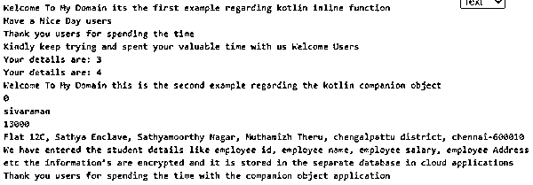
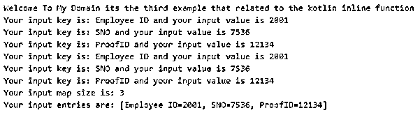

# 科特林内嵌函数

> 原文：<https://www.educba.com/kotlin-inline-function/>

## Kotlin 内联函数简介

kotlin inline 函数是使用关键字 inline 的函数类型之一。它用于增强高阶函数以及这些内联函数的性能，这些内联函数有助于调用并告诉编译器复制参数和函数。它不支持局部和虚拟类型的函数，也不支持嵌套类、函数表达式和其他缺省参数值。它可能是可选的数据类型，如整数、数组或字符串参数，将在脚本中传递匿名函数或 lambdas。

**语法:**

<small>网页开发、编程语言、软件测试&其他</small>

在 kotlin 语言中有许多默认的关键字、变量和函数，用于利用和创建具有不同特性的应用程序。在这些内联函数中，有一个性能函数和高阶函数，编译器会将参数类型和函数告知并复制到特定的代码位置。

`fun main(args:Array<String>)
{
functionName()
{
---some kotlin script logic codes depends upon the requirement---
}
inline fun functionName()
{
---some logics based on the kotlin inline function with lambda or any other expressions---
}
}`

以上代码是在 kotlin 应用程序中创建和使用内联函数的基本语法。

### Kotlin 中的内联函数是如何工作的？

内联函数是 kotlin 语言中的默认函数之一，基本上可以用来请求编译器在脚本的调用位置复制内联代码。如果程序是使用编译器编译的，并且它保存每个内联类的包装器类，并且可以在运行时表示每个的实例，则包装器是每组内联类，并且它们的实例可以在运行时用底层类类型来表示。这是我们之前在其他语言中使用的，比如 java Int，可以表示为原始 Int 或者整数。kotlin 编译器更喜欢使用底层类型而不是包装器来产生最佳性能并优化代码，但是有时有必要在类周围保留包装器，因为根据经验，内联类是装箱的，并且每当它们与另一种类型一起使用时。因此，内联类既可以用底层值表示，也可以用包装器表示，引用相等是针对它们的，因此在 kotlin 代码中是禁止的。由于内联被编译为基础类型，因此可能会导致各种难以理解的错误，并且可能会因为代码上的签名冲突而在意外的平台上执行。

### 例子

让我们讨论一下 Kotlin 内联函数的例子。

#### 示例#1

`package one;
fun demo(exam: (id: String)->Unit, id: String){
println("Welcome To My Domain its the first example regarding kotlin inline function")
println("Have a Nice Day users")
exam(id)
}
inline fun demo1(exam: (id: String)->Unit, id: String){
println("Welcome To My Domain its the first example regarding kotlin inline function")
println("Have a Nice Day users please try again")
exam(id)
}
class Second {
var stdid:Int = 0
var stdName:String="sivaraman"
var stdRollno:Int=13
var stdAddress:String="Flat 12C, Aravind Enclave, Sathyamoorthy street, Srinivasa nagar, chengalpattu district, chennai-600009"
fun stddets(){
println("Welcome To My Domain this is the second example reagrding the kotlin companion object")
println("${this.stdid}")
println("${this.stdName}")
println("${this.stdRollno}")
println("${this.stdAddress}")
println("We have entered the student details like student id, student name, student roll number, student Address etc the information’s are encrypted and it is stored in the separate database in cloud applications")
}
companion object eg{
var p: Int = 3
var empid:Int = 0
var empName:String="sivaraman"
var empSalary:Int=13000
var empAddress:String="Flat 12C, Sathya Enclave, Sathyamoorthy Nagar, Muthamizh Theru, chengalpattu district, chennai-600010"
fun details(){
println("Your details are: $p")
p++
}
fun empdetails(){
println("Welcome To My Domain this is the second example regarding the kotlin companion object")
println("${this.empid}")
println("${this.empName}")
println("${this.empSalary}")
println("${this.empAddress}")
println("We have entered the student details like employee id, employee name, employee salary, employee Address etc the information’s are encrypted and it is stored in the separate database in cloud applications")
}
}
}
fun main() {
demo({ id: String ->
println("Thank you users for spending the time")
println("Kindly keep trying and spent your valuable time with us $id")
}, "Welcome Users")
Second.details()
Second.eg.details()
Second.eg.empdetails()
println("Thank you users for spending the time with the companion object application")
}`

**输出:**

在上面的例子中，我们使用带有类的伴随对象来执行内联函数中的操作。

#### 实施例 2

`package one;
fun demo(exam: (EmpId: String)->Unit, EmpId: String){
println("Welcome To My Domain its the second example that relates to the kotlin inline function")
println("Have a Nice day users please try again")
exam(EmpId)
}
inline fun demo1(x: Int, eg: () -> Unit):Int {
eg()
return 7*x
}
fun main() {
demo({ EmpId: String ->
println("Please keep on spending the time with our application")
println("Kindly keep trying and spent your valuable time with us $EmpId")
}, "Hello Users")
var x = 7
println(demo1(x, {println("Welcome Your: Kotlin Inline Functions are")}))
}`

**输出:**

在第二个例子中，我们使用 lambda 表达式来执行内联函数计算。

#### 实施例 3

`package one;
inline fun <reified T> demo(ls: List<Any>): Boolean {
ls.forEach {
if (it is T) {
System.out.println("Welcome To My Domain its the third example that related to the kotlin inline function")
return true
}
}
System.out.println("Thank you users kindly write the code that related to the kotlin inline function")
return false
}
fun main(args: Array<String>) {
demo<String>(listOf("raman", 2, args))
val second = mapOf<String, Int>("Employee ID" to 2001, "SNO" to 7536, "ProofID" to 12134)
for ((k,v) in second) {
println("Your input key is: $k and your input value is $v")
}
second.forEach { (k, v) ->
println("Your input key is: $k and your input value is $v")
}
println("Your input map size is: ${second.size}")
println("Your input entries are: ${second.entries}")
}`

**输出:**

在最后一个例子中，我们额外使用了一个 map 接口来执行内联函数中的操作。

### 结论

kotlin 语言有许多默认函数来执行后端的操作。在移动应用程序中，这些操作和功能各不相同。像 kotlin 一样，内联函数执行高端应用程序，它优化代码来运行应用程序。

### 推荐文章

这是一个 Kotlin 内联函数的指南。在这里，我们讨论介绍，语法，内联函数如何在 Kotlin 中工作？代码实现示例。您也可以看看以下文章，了解更多信息–

1.  [科特林范围](https://www.educba.com/kotlin-range/)
2.  [科特林循环](https://www.educba.com/kotlin-loops/)
3.  [科特林构造函数](https://www.educba.com/kotlin-constructors/)
4.  [科特林琴弦](https://www.educba.com/kotlin-string/)

