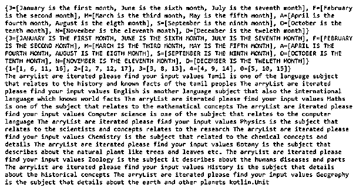
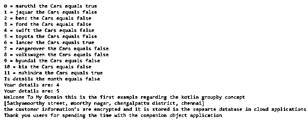
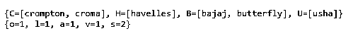

# "群体风暴"

> 原文：<https://www.educba.com/kotlin-groupby/>


## 科特林集团简介

kotlin groupby 是默认函数之一，它用于执行 lambda 操作，并返回集合接口。函数 groupby()执行键值操作，如果我们将字符作为数组类型返回，它将返回字符组。假设使用多个键来检查和验证特定条件以及组，并且通过使用在应用分组期间执行的操作支持实现这些任务的默认功能之前执行的分组实例来一次或多次操作元素。

**语法:**

<small>网页开发、编程语言、软件测试&其他</small>

在 kotlin 标准库中，用于在集合元素的帮助下实现应用程序，并用于执行广泛的功能。分组是通过使用特定类别来收集数据项的特征之一。

```
fun main(args:Array<String>)
{
val vars=listOf(“”) //listOf() is one of the array default method we can use our other default methods which based on the requirements.
vars.groupBy(parameters)
---some logic codes---
}
```

上面的代码是执行 groupBy()函数的基本语法，以便对各个区域执行数据操作。

### groupBy 在科特林是如何工作的？

groupby 函数是对特定数据执行分组操作的内置函数之一，即使可以在数据中应用该函数，也可以使用自定义过滤器来实现。这些操作主要支持收集数据和 util 包，其他类也可以在不同的领域使用这些功能。收集包主要用于获取 lambda 的结果和分离元素列表中相应的值。它还借助 lambda 表达式调用了值转换函数。如果我们假设使用了两个 lambda 函数，那么它会产生并调用键选择器函数，该函数使用单独的值而不是原始元素进行映射。通过使用单独的选择器返回的关键字对原始数组的元素进行分组，并且它将被应用于使用集合接口返回的特定元素，就像映射一样，其中每个关键字都与视图中映射接口的对应值列表相关联。数据可以是字符串、数字、字符、操作符和符号等的列表，如果想要根据它们的大小对它们进行分组，我们可以很容易地使用并帮助 groupBy 函数，该函数根据它提供的逻辑对集合进行分组，并返回带有该组集合数据的 map 接口。

#### 示例#1

```
package one;
class Test
{
fun demo(){
var lsts=ArrayList<String>()
lsts.add("Tamil is one of the language subject that relates to the history and known facts of the tamil peoples")
lsts.add("English is another language subject that also the international language which knows world facts")
lsts.add("Maths is one of the subject that relates to the mathematical concepts")
lsts.add("Computer science is one of the subject that relates to the computer language")
lsts.add("Physics is the subject that relates to the scientists and concepts relates to the research")
lsts.add("Chemistry is the subject that related to the chemical concepts and details")
lsts.add("Botany is the subject that describes about the natural plant like trees and leaves etc.")
lsts.add("Zoology is the subject it describes about the humans diseases and parts")
lsts.add("History is the subject that details about the historical concepts")
lsts.add("Geography is the subject that details about the earth and other planets")
for(i in lsts)
print("The arryList are iterated please find your input values $i ")
}
}
fun main(args: Array<String>) {
val vars = listOf("January is the first month", "February is the second month", "March is the third month", "April is the fourth month","May is the fifth month","June is the sixth month",
"July is the seventh month", "August is the eigth month", "September is the ninth month","October is the tenth month","November is the eleventh month","December is the tweleth month")
println(vars.groupBy { it.first().toUpperCase() })
println(vars.groupBy(keySelector = { it.first() },
valueTransform = { it.toUpperCase() }))
val lst = 1.rangeTo(17).toList()
println(lst.groupBy { it%5 })
val al=Test()
println(al.demo())
}
```

**输出:**




在上面的例子中，我们在代码逻辑上使用了一个名为 ArrayList class 的集合类型和 groupby 函数。

#### 实施例 2

```
package one;
enum class Cars(val available: Boolean = false){
maruthi(true),
jaquar,
benz,
ford,
swift,
toyota,
lancer(true),
rangerover,
volkswagen,
hyundai,
kia,
mahindra(true);
companion object{
fun custdet(modelname: Cars): Boolean {
return modelname.name.compareTo("July") == 0 || modelname.name.compareTo("January") == 0
}
}
}
class first
{
fun custdet(){
var custdetails=listOf("Sathyamoorthy street", "moorthy nagar", "chengalpattu district", "chennai")
println(custdetails.groupBy { it.first().toUpperCase() })
println(custdetails.groupBy(keySelector = { it.first() },
valueTransform = { it.toUpperCase() }))
println("Welcome To My Domain this is the second example regarding the kotlin groupby")
println("We have entered the customer details like customer id, customer name, customer salary, customer Address etc. the information’s are encrypted and it is stored in the separate database in cloud applications")
}
companion object Test{
var x: Int = 4
var custdetails=listOf("Sathyamoorthy street", "moorthy nagar", "chengalpattu district", "chennai")
fun custdet(){
println("Your details are: $x")
x++
}
fun custdeta(){
println("Welcome To My Domain this is the first example regarding the kotlin groupby concept")
println("${this.custdetails}")
println("the customer information’s are encrypted and it is stored in the sepaarte database in cloud applications")
}
}
}
fun main(args:Array<String>){
for(vars in Cars.values()) {
println("${vars.ordinal} = ${vars.name} the Cars equals ${vars.available}")
}
val details = Cars.benz;
println("Is details the month equals ${Cars.custdet(details)}")
first.custdet()
first.Test.custdet()
first.Test.custdeta()
println("Thank you users for spending the time with the companion object application")
}
```

**输出:**




在第二个例子中，我们使用了 enums 和 companion 对象来利用客户详细信息，并使用 groupby 方法来分离数据。

#### 实施例 3

```
package one;
fun main(args: Array<String>) {
val fans = listOf("crompton", "havelles", "croma",
"bajaj", "usha", "butterfly")
println(fans.groupBy { it.first().toUpperCase() })
val tv = listOf("onida", "lg", "airtec",
"vu", "samsung", "sony")
println(tv.groupingBy { it.first() }.eachCount())
}
```

**输出:**




在最后一个例子中，我们使用了 groupby 和 groupingBy 方法的差异来映射数据和代码的时间复杂度。

### 结论

groupby 是一个 util 类和函数，用于将来自多个表单的数据与输入条件一起分组到一个过滤器中。它有一些默认的方法来执行过滤条件，它也节省了时间-复杂性，性能和用户将看到的数据以及具体的条件。

### 推荐文章

这是一个 Kotlin groupBy 指南。在这里我们讨论介绍，语法，groupBy 如何在 Kotlin 中工作？代码实现示例。您也可以看看以下文章，了解更多信息–

1.  [科特林内嵌函数](https://www.educba.com/kotlin-inline-function/)
2.  [科特林收藏馆](https://www.educba.com/kotlin-collections/)
3.  [釜用 JSON](https://www.educba.com/kotlin-json/)
4.  [科特林元组](https://www.educba.com/kotlin-tuple/)


