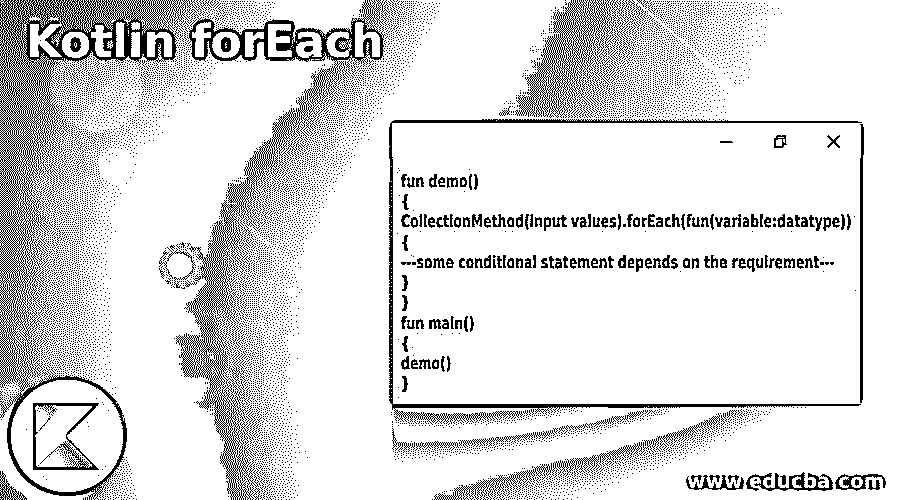
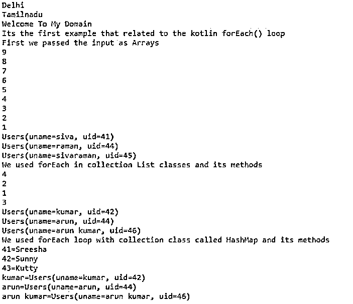
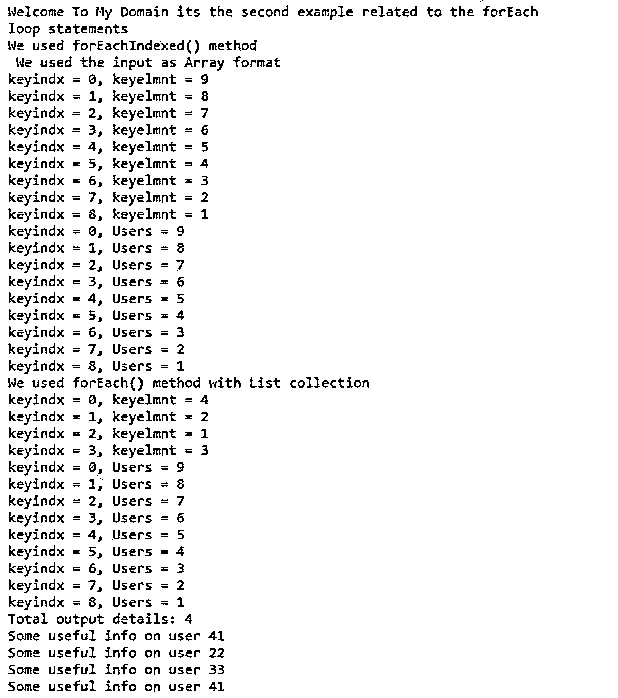
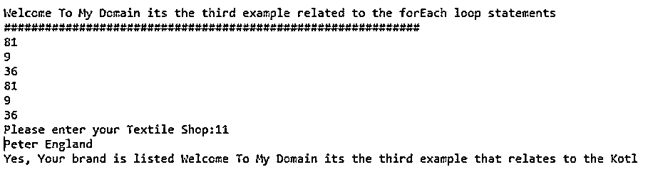

# Kotlin forEach

> 原文：<https://www.educba.com/kotlin-foreach/>




## Kotlin forEach 简介

Kotlin forEach 是循环语句中的一种，传统上更多地用于执行其他循环，如 while 循环。循环用于获取集合、列表中的每个元素，并对列表中的每个元素执行操作，如数组和其他集合列表。它就像传统 for 循环方法的函数方法，for 循环和 forEach 都是相同的，从数组或列表中生成输出，如果我们使用更简洁、更智能的函数运算符，它也会更有用。

### Kotlin forEach 的语法

在 kotlin 语言中，它使用多种循环来实现基于移动设备的应用程序。每种类型的循环语句都将根据编程要求与其他条件语句一起使用。

<small>网页开发、编程语言、软件测试&其他</small>

```
fun demo()
{
CollectionMethod(input values).forEach(fun(variable:datatype))
{
---some conditional statement depends on the requirement---
}
}
fun main()
{
demo()
}
```

上述代码是在不同领域使用 forEach()循环的基本语法之一。我们可以调用 forEach()循环方法对列表中的每个元素执行操作。这就像是一种使用循环路径的传统演奏方法。

### Kotlin 中的 forEach 是如何工作的？

*   forEach 循环是的迭代循环之一，但是我们可以使用数据类型调用变量的附加函数。它还调用其他实用程序和包，如集合、文件、等。如果我们使用一个集合概念，比如一个列表，将数据映射到数组类型，并使用基于索引的格式计算值。为了使用索引格式定期存储和检索数据，还使用 forEach()循环语句调用了列表和映射值，其中函数作为参数变量调用。
*   它还可以支持 lambda 和其他匿名变量以及从 lambda 等表达式和其他正则表达式返回的本地和非本地类型的值的函数。在数组和其他列表集合中，从数组或集合列表生成输出结果时，for 和 forEach 循环是相同的。应用程序支持并使用函数运算符来执行本地用户的其他用户定义和默认任务。
*   我们可以使用嵌套的 forEach 循环来迭代所有的值，无论是隐式的还是显式的参数。对于其他 lambda 和匿名语句，隐式参数是封闭的和强制的。

### Kotlin forEach 示例

下面是提到的例子:

#### 示例#1

**代码:**

```
class States(val stname : String, val stcapital : List<Places>)
class Places(val pname : String, val cities : List<String>)
class Months {
val mn = listOf("January", "February","March","April","May","June","July","August","September","October","November","December")
val electrnoics = listOf("Ups","Inverters","Gadgets","Desktop PCs","Microwave Oven","Fridge","Washing Machine","mobile")
val laptops = listOf("Dell latitude", "dell inspiron","sony","acer","samsung","lenovo","apple")
val stplaces = listOf(
States("Delhi", listOf(Places("Noida", laptops),
Places("Darjeeling", mn))),
States("Tamilnadu", listOf(Places("chennai", electrnoics))))
}
data class Users(
val uname: String,
val uid: Int
)
fun main() {
var ct=Months()
ct.stplaces.forEach { c -> println(c.stname) }
println("Welcome To My Domain")
println("Its the first example that related to the kotlin forEach() loop")
println("First we passed the input as Arrays")
val ar = arrayOf(9, 8, 7, 6,5,4,3,2,1)
ar.forEach { println(it) }
val userar = arrayOf(Users("siva", 41),
Users("raman", 44),
Users("sivaraman", 45))
userar.forEach { println(it) }
println("We used forEach in collection List classes and its methods")
val inp = listOf(4, 2, 1, 3)
inp.forEach{println(it)}
val userlst = listOf(Users("kumar", 42),
Users("arun", 44),
Users("arun kumar", 46))
userlst.forEach { println(it) }
println("We used forEach loop with collection class called HashMap and its methods")
val userhshmap = hashMapOf(41 to "Sreesha", 42 to "Sunny", 43 to "Kutty" )
userhshmap.forEach{ println(it) }
val usrmap = hashMapOf("kumar" to Users("kumar", 42),
"arun" to Users("arun", 44),
"arun kumar" to Users("arun kumar", 46))
usrmap.forEach{ println(it) }
}
```

**输出:**




在第一个示例中，我们还使用了集合概念，通过 forEach()循环迭代来迭代值。

#### 实施例 2

**代码:**

```
val userss: MutableList<Int> = mutableListOf(41, 22, 33)
val details: List<Int> = userss
fun userdetails(addUsers: Int) {
userss.add(addUsers)
}
fun demo2(): List<Int> {
return details
}
fun main() {
println("Welcome To My Domain its the second example related to the forEach loop statements")
println("We used forEachIndexed() method")
val ar = arrayOf(9, 8, 7, 6,5,4,3,2,1)
println(" We used the input as Array format")
ar.forEachIndexed{keyindx, keyelmnt -> println("keyindx = $keyindx, keyelmnt = $keyelmnt")}
ar.forEachIndexed{keyindx, Users -> println("keyindx = $keyindx, Users = $Users")}
var inp = listOf(4, 2, 1, 3)
println("We used forEach() method with List collection")
inp.forEachIndexed{keyindx, keyelmnt -> println("keyindx = $keyindx, keyelmnt = $keyelmnt")}
ar.forEachIndexed{keyindx, Users -> println("keyindx = $keyindx, Users = $Users")}
userdetails(41)
println("Total output details: ${demo2().size}")
demo2().forEach {
i -> println("Some useful info on user $i")
}
}
```

**输出:**




这里我们使用 forEachIndexed 循环来迭代具有键和值格式的元素。

#### 实施例 3

**代码:**

```
import java.util.Scanner;
fun demo(x: Any) = when (x) {
is String -> x.startsWith("Welcome To My Domain its the third example that relates to the Kotlin forEach")
else -> false
}
fun main() {
println("Welcome To My Domain its the third example related to the forEach loop statements")
println("#############################################################")
val arinp = arrayOf(9,3,6)
arinp.forEach { n -> println(n * n) }
arinp.forEach { println(it*it) }
var str = Scanner(System.`in`)
print("Please enter your Textile Shop:")
var texName = str.nextInt()
var out = when(texName){
1->"Chennai Silks"
2->"Saravana Stores"
3->"Bharani"
4->"SPJ"
5->"AllenSolly"
6->"Jockey"
7->"Arrow"
8->"DSP"
9->"Minister White"
10->"Park Avenue"
11->"Peter England"
12->"Reymond"
13->"Levis"
else -> {
println("Your brand is not listed here")
}
}
println(out)
var new = "Welcome To My Domain its the third example that relates to the Kotlin forEach concept"
var res = demo(new)
if(res) {
println("Yes, Your brand is listed Welcome To My Domain its the third example that relates to the Kotlin forEach")
}
else {
println("No, Sorry your brand is not listed here Kindly try with one more and please stay with our application and spent your valuable time for us thanks")
}
}
```

**输出:**




在最后一个例子中，我们用 when，即 switch 语句来打印控制台上的 case 语句，用 forEach 循环迭代。

### 结论

在 kotlin 语言中，我们使用不同种类的循环来存储和检索迭代过程中的元素。此外，迭代停止，直到循环被用户端或任何其他异常(如循环被 kotlin 编译器和执行时间存在)终止。

### 推荐文章

这是一本科特林外语指南。这里我们讨论一下引言，forEach 在 kotlin 中是如何工作的？以及更好理解的例子。您也可以看看以下文章，了解更多信息–

1.  [科特林内嵌函数](https://www.educba.com/kotlin-inline-function/)
2.  [科特林收藏馆](https://www.educba.com/kotlin-collections/)
3.  [科特林元组](https://www.educba.com/kotlin-tuple/)
4.  [科特林循环](https://www.educba.com/kotlin-loops/)


