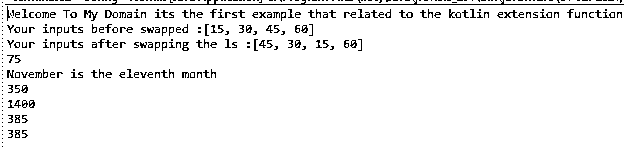
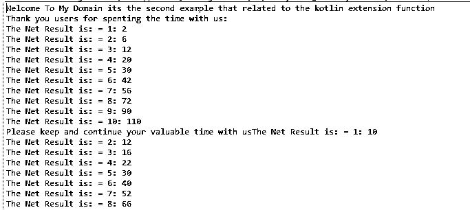

# 科特林扩展函数

> 原文：<https://www.educba.com/kotlin-extension-function/>

## Kotlin 扩展函数介绍

kotlin 扩展函数是一种机制，可以提供该机制来扩展具有新功能的类，而无需从其他类(如父类和子类)继承。其他设计模式能够调用类及其属性，以便它们的方法可以用于调用通常的方法，如果原始类的方法可以是任何类型，如访问修饰符 final 将被调用其方法和实例 目标类及其参数的扩展属性，这可能会创建现有类的新属性。

**语法:**

<small>网页开发、编程语言、软件测试&其他</small>

在 kotlin 语言中，有许多默认的关键字、变量和其他函数来实现应用程序。其中一个扩展是从一个类扩展另一个类的函数。我们也可以使用一个接口来扩展类和其他父类。我们还可以扩展数据类型，如 Int，String 等。

`fun main()
{
fun datatype.method():datatype{
---some logics depends on the requirement---
}
}`

上面的代码是在 kotlin 语言上使用扩展函数的基本语法。像这样，我们可以使用类和接口等。

### Kotlin 中的扩展函数是如何工作的？

扩展函数类似于扩展类、数据类型(如 Int、Float、String 等)的机制。主要是扩展主要是从类中可见的，如 java 反射及其类中的静态方法，并且它还将调用特定源和目标类的扩展函数。我们可以调用 static 以及最终的 java 类和方法，以及它们的 target 或 destination 类方法参数的实例。与成员函数相比，更容易找到扩展函数，并且它们保证是类及其任何类型的成员，如超类和接口。数据类的扩展函数应该只使用数据载体，它们不能自己携带数据类的状态。它也主要被称为其他代码更改，可能希望将一些库对象周围的复杂表达式更改为更简单、更易读的表达式。当不能访问该类时，扩展就起作用，它属于文件使用的库，如果假设它不被创建。如果该类不使用该方法，并且不必扩展它，那么 time 也将使用扩展函数。

### 科特林扩展函数示例

以下是 Kotlin 扩展函数的不同示例:

#### 示例#1

`fun MutableList<Int>.swap(inp1: Int, inp2: Int):MutableList<Int> {
val res = this[inp1] this[inp1] = this[inp2] this[inp2] = res
return this
}
fun main(args: Array<String>) {
println("Welcome To My Domain its the first example that related to the kotlin extension function")
val ls = mutableListOf(15,30,45,60)
println("Your inputs before swapped :$ls")
val out = ls.swap(0, 2)
println("Your inputs after swapping the ls :$out")
val num1 = listOf(25,50, 75, 100)
val res1 = num1.minByOrNull { it % 3 }
println(res1)
val str = listOf("Janurary is the first month", "February is the second month", "March is the third month", "April is the fourth month","May is the fifth month","June is the sixth month","July is the seventh month","August is the eigth month","September is the ninth month","October is the tenth month","November is the eleventh month","December is the twelth month")
val strres = str.maxWithOrNull(compareBy { it.length })
println(strres)
val num2 = listOf(35, 70, 105, 140)
val res2 = num2.reduce { res2, x -> res2 + x }
println(res2)
val out2 = num2.fold(0) { <u>res2</u>, x -> res2 + x * 4 }
println(out2)
val num3 = listOf(45, 90, 135, 180, 205)
val res3 = num3.foldIndexed(0) { p, y, z -> if (p % 2 == 0) y + z else y }
println(res3)
val out3 = num3.foldRightIndexed(0) { p, z, y -> if (p % 2 == 0) y + z else y }
println(out3)
}`

**样本输出:**

在第一个例子中，我们使用了可变列表类及其特性来扩展交换号码的功能。

#### 实施例 2

`class Second {
companion object {
fun demo(): String {
return "Thank you for creating and utilising the extension function on this method"
}
}
}
class Employee {
var <u>salary</u>:Int = 10000
var name:String="Sivaraman"
var empid: Int=41
fun empdetails(){
println("The Employee details are: ${this.name},${this.empid},${this.salary}")
}
companion object New{
var <u>x</u>: Int = 3
fun dem(){
println("Your input value is: $<u>x</u>")
<u>x</u>++
}
}
}
fun Second.Companion.demo1() {
println("Welcome To My Domain its the second example that related to the kotlin extension function")
}
fun main(<u>args</u>: Array<String>) {
Second.demo1()
val num3 = listOf(2, 4, 6, 8, 10, 12, 14,16,18,20)
val inp1 = num3.runningReduce { u, v -> u + v }
val inp2 = num3.runningFold(10) { u, v -> u + v }
val res = { w: Int, z: Int -> "The Net Result is: = ${w + 1}: $z" }
println(inp1.mapIndexed(res).joinToString("\n", "Thank you users for spenting the time with us:\n"))
println(inp2.mapIndexed(res).joinToString("\n","Please keep and continue your valuable time with us"))
}`

**样本输出:**

在第二个例子中，我们使用了类和伴随对象，我们可以像 demo1()一样扩展伴随对象方法，并在 main 方法中调用它。

#### 实施例 3

`fun String.removeFirstLastChar(): String = this.substring(3, this.length - 1)
fun main(<u>args</u>: Array<String>) {
println("Welcome To My Domain its the third example that related to the kotlin extension function")
val str= "The home contains tv,fridge,bureau, cuphoard, bed, washing machine, PC, Webcam,oven,grinder,mixie and other househod things which are valuable for maintaing house"
val res = str.removeFirstLastChar()
println("Have a Nice day users please keep on spenting your valuable time with us: $res")
}`

**样本输出:**

在最后一个例子中，我们在扩展函数中使用 substring() string 方法来修剪字符并打印控制台屏幕。

### 结论

在编程语言中，我们使用 extend 关键字来扩展父类和子类，即使接口将与类一起实现和扩展。这里 kotlin 扩展它扩展了函数和类、伴随对象以及其他默认方法和自定义关键字，扩展了应用程序的属性和特性。

### 推荐文章

这是一个 Kotlin 扩展函数的指南。在这里，我们讨论了 Kotlin 中扩展函数的工作原理，并给出了代码和输出的例子。您也可以看看以下文章，了解更多信息–

1.  [科特林 kclass](https://www.educba.com/kotlin-kclass/)
2.  [釜用 JSON](https://www.educba.com/kotlin-json/)
3.  [科特林群比](https://www.educba.com/kotlin-groupby/)
4.  [科特林构造函数](https://www.educba.com/kotlin-constructors/)

