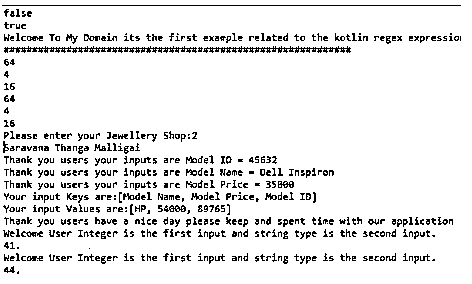
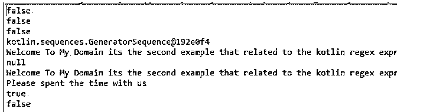
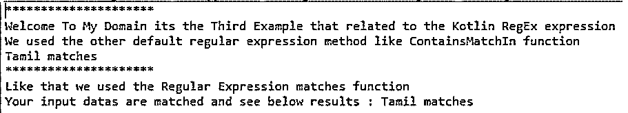

# 科特林正则表达式

> 原文：<https://www.educba.com/kotlin-regex/>


## Kotlin 正则表达式简介

Kotlin 正则表达式是编程语言的基本部分之一，它支持正则表达式的类，该类表示正则表达式的对象，可用于匹配字符串值，它还使用其他构造函数，这些构造函数将接受参数和非参数，它接受其他默认和非默认方法字符串数据类型和这些类使用的其他运算符及其利用文本搜索和高级开发内容的方法模式表达式定义文本，它包括文本文字和元字符。

### Kotlin 正则表达式的语法

在 kotlin 语言中，正则表达式主要用于在 html 内容中查找和搜索文本，它提供了 Regex()类来处理其他默认函数。它有许多操作符、操作数和其他符号来执行 kotlin 应用程序中的操作。

<small>网页开发、编程语言、软件测试&其他</small>

```
fun main(args:Array<String>)
{
val vars1=”values”.toRegex()
val vars2=”values1”
val res=regex.replace(vars2,”new”)
val match=regex.matches(“values”)?.value
----some logic codes depends on the requirement---
}
```

上述代码是在指定字符串中使用正则表达式的基本语法，带有操作数和运算符，如特殊字符和符号。

### 正则表达式在 Kotlin 中是如何工作的？

*   kotlin regex()类似于用于编写表达式和验证文本数据的方法和类，用于开发目的的搜索和高级内容。很可能它可以支持所有的字符，像字母和非字母，符号和操作符。正则表达式主要用于在内容中查找和搜索文本，并处理正则表达式，kotlin 提供了 Regex()类，其函数处理这些类型的表达式。它有一些类型，如模式正则表达式，可以用内容来表征，为了查看或控制它，包括文本文字和元字符。
*   元字符是可以使用正则表达式控制的特殊字符之一。Kotlin 正则表达式有一些默认方法，如 replace()、replaceFirst()、matches()等。这些是使用指定任务执行操作的一些默认方法。此外，运营商喜欢“.”用于匹配任何类型的单字符串值，“+”用于匹配前面的元素一次或多次。像“*”这样的其他符号用于与前面的元素进行零次或多次匹配，“^”在字符串的开始位置匹配，“$”在结束位置匹配。我们用了很多运算符，比如“？|,\s,\w,[abc],[^abc],[a-c]等。这些是各种模式正则表达式，可用于匹配变量输出中的模式。

### Kotlin 正则表达式的示例

下面是提到的例子:

#### 示例#1

**代码:**

```
import java.util.Scanner;
fun firstExample(num1: Int, str2: String) {
num1.takeIf{it >= 0 }?.let {
println("Welcome User Integer is the first input and string type is the second input.")
println("$it.")
}
}
fun main()
{
val ptn = Regex("^b")
println(ptn.containsMatchIn("abc"))
println(ptn.containsMatchIn("bac"))
println("Welcome To My Domain its the first example related to the kotlin regex expression")
println("#############################################################")
val q = arrayOf(8,2,4)
q.forEach { num -> println(num * num) }
q.forEach { println(it*it) }
var s1 = Scanner(System.`in`)
print("Please enter your Jewellery Shop:")
var jshop = s1.nextInt()
var out = when(jshop){
1->"Saravana Gold"
2->"Saravana Thanga Malligai"
3->"Bharani Silver"
4->"Kumaran Thanga malligai"
5->"jk jewelley"
6->"pks jewellery"
7->"raj jewellery"
8->"kumar jewellery"
9->"lalitha jewellery"
10->"GRT gold jewellery"
11->"The Legend Saravana Jewellery Shop"
12->"Saradha Jewellery"
13->"Del Jewellery"
14->"SPJ Jewellery"
15->"JUY Jewellery"
else -> {
println("Your brand is not listed here")
}
}
println(out)
val inp1 = HashMap<String, String>()
inp1["Model Name"] = "Dell Inspiron"
inp1["Model Price"] = "35000"
inp1["Model ID"] = "45632"
for ((k, v) in inp1) {
println("Thank you users your inputs are $k = $v")
}
val inp2 = mapOf("Model Name" to "HP", "Model Price" to 54000, "Model ID" to 89765)
println("Your input Keys are:" + inp2.keys)
println("Your input Values are:" + inp2.values)
println("Thank you users have a nice day please keep and spent time with our application")
firstExample(41, "Siva")
firstExample(44, "Raman")
}
```

**输出:**




在上面的例子中，我们使用集合概念来执行包含正则表达式的数据操作。

#### 实施例 2

**代码:**

```
enum class pc(val x: Boolean = true){
Sony,
Dell,
Lenovo,
Apple,
Wipro,
HCL;
companion object{
fun pcdetails(obj: pc): Boolean {
return obj.name.compareTo("Sony") == 0 || obj.name.compareTo("Apple") == 0
}
}
}
fun compdetails(comp: pc) {
when(comp) {
pc.Sony -> println("Sony")
pc.Dell -> println("Dell")
pc.Lenovo -> println("Lenovo")
pc.Apple -> println("Apple")
pc.Wipro -> println("Wipro")
pc.HCL ->println("HCL")
}
}
fun main() {
val urptn = "[a-zA-Z0-9]+"
val fr = Regex(urptn)
println(fr.matches("Siva_Raman"))
println(fr matches "Siva_Raman")
println(fr.matches("Siva_Raman"))
val inp1 = Regex("ab.")
val res : Sequence<MatchResult> = inp1.findAll("awerbc653ksjnj", 1)
res.forEach()
{
out -> println(out.value)
}
println(res)
var ptn = Regex("Welcome To My Domain its the second example that related to the kotlin regex expression?")
println(ptn.matchEntire("Welcome To My Domain its the second example that related to the kotlin regex expression")?.value)
println(ptn.matchEntire("Users Have a Nice Day")?.value)
ptn = Regex("""\D+""")
println(ptn.matchEntire("Welcome To My Domain its the second example that related to the kotlin regex expression")?.value)
println(ptn.matchEntire("Please spent the time with us")?.value)
val uptn = "[a-zA-Z0-9]+"
val sec = Regex(uptn)
println(sec.containsMatchIn("Siva_Raman is the SOftware Support Engineer and it works in XYZ Company"))
println(sec.containsMatchIn("!#$%"))
}
```

**输出:**




在第二个例子中，我们在正则表达式任务中额外使用了 enum，companion object。

#### 实施例 3

**代码:**

```
fun main() {
val inp1 = listOf("Tamil", "English", "Physics",
"Chemistry","Biology", "ComputerScience", "Engineering Graphics")
val ptn = "Tamil".toRegex()
println("*********************")
println("Welcome To My Domain its the Third Example that related to the Kotlin RegEx expression")
println("We used the other default regular expression method like ContainsMatchIn function")
inp1.forEach { ls ->
if (ptn.containsMatchIn(ls)) {
println("$ls matches")
}
}
println("*********************")
println("Like that we used the Regular Expression matches function")
inp1.forEach { ls ->
if (ptn.matches(ls)) {
println("Your input datas are matched and see below results : $ls matches")
}
}
}
```

**输出:**




在最后一个例子中，我们使用其他预定义的正则表达式方法，如匹配和模式，来执行用户输入操作。

### 结论

在 kotlin 语言中，我们使用了许多默认的方法、关键字和变量来执行应用程序中的操作。如应用任务的不同取决于正则表达式中的要求，即找到字符串值并与变量存储位置的相同路径或不同路径进行匹配或比较。

### 推荐文章

这是一个科特林正则表达式的指南。这里我们讨论一下引言，正则表达式在 Kotlin 中是如何工作的？以及更好理解的例子。您也可以看看以下文章，了解更多信息–

1.  [科特林内嵌函数](https://www.educba.com/kotlin-inline-function/)
2.  [科特林收藏馆](https://www.educba.com/kotlin-collections/)
3.  [科特林元组](https://www.educba.com/kotlin-tuple/)
4.  [科特林循环](https://www.educba.com/kotlin-loops/)


