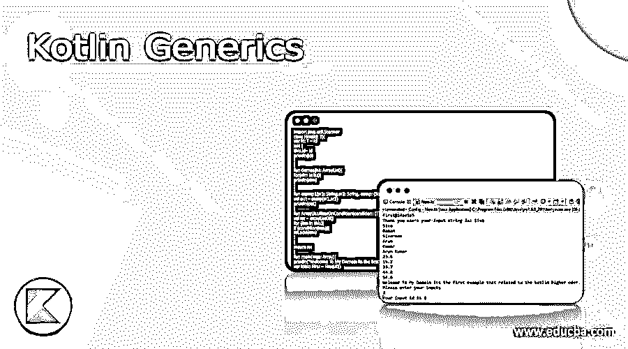
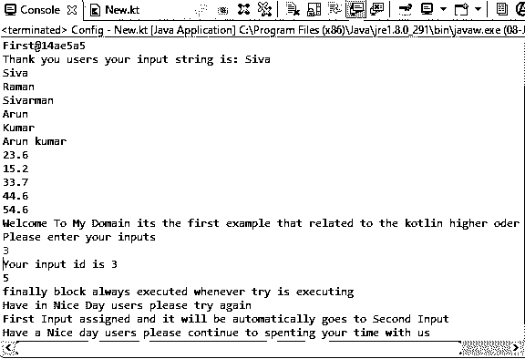
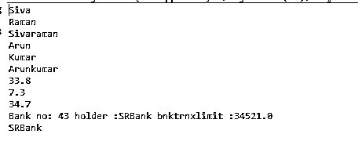
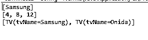

# 科特林仿制药

> 原文：<https://www.educba.com/kotlin-generics/>




## Kotlin 泛型简介

在 kotlin 中，泛型是允许定义用于访问不同类型的类、方法和属性的特性之一，可以在编译时检查类、方法的所有差异，泛型类型类或方法被声明为参数化类型，并且该类型是具有实际参数类型的泛型类型的实例。它可以用尖括号来声明，比如“<>”。泛型主要用在集合中，它只保存单一类型的对象，不接受多个对象。

**语法:**

<small>网页开发、编程语言、软件测试&其他</small>

kotlin 语言有许多默认的关键字、变量和其他函数，用于实现基于移动的应用程序。就像 kotlin generics 是关键字之一，它被表示为菱形符号<>,用于在应用程序上声明和使用它。

```
fun main(args:Array){
var vars=first(parameters)
---some logic codes depends on the requirement---
}
class first(parameters){
----some logic codes---
}
```

上述代码是实现泛型的基本语法，泛型被定义为模板，由 kotlin 编译器动态确定，因此数据类型作为泛型类型传递，同样的数据类型将在 main 方法上调用。

### Kotlin 中的泛型是如何工作的？

使用了 kotlin a 类和一个类型，它们在包中任何需要的地方被调用，它们将作为其他类方法中的参数被传递。在 kotlin 中，提供了更高阶的变量类型，它被称为泛型类型。类型安全只允许保存单一类型的对象，不允许存储其他对象。它还具有其他特性，除了不需要类型转换之外，泛型代码是在编译时检查的，因此可以避免在运行时出现任何问题。当我们想要将泛型类型分配给它的任何超类型时，我们可以使用像“out”这样的关键字，以便它想要将另一个泛型类型分配给它的任何子类型，然后我们需要使用像“in”这样的关键字来引用参数的输入类型。它具有具体化的类型参数，允许您在运行时引用在内联函数调用中用作类型实参的特定类型。它不充当普通的类函数，因为实参类型在运行时被删除。

### Kotlin 泛型的例子

下面是一些例子:

#### 示例#1

**代码:**

```
import java.util.Scanner
class First(id: T){
var id: T = id
init {
this.id= id
println(id)
}
}
fun demos(lst: ArrayList){
for(elm in lst){
println(elm)
}
}
fun examp1(sr1: String,sr2: String, exmp: (String,String) -> String): Unit {
val out = exmp(sr1,sr2)
println(out)
}
fun ArrayList.filterOnCondition(condition: (T) -> Boolean): ArrayList{
val rst = arrayListOf()
for (itm in this){
if (condition(itm)){
rst.add(itm)
}
}
return rst
}
fun main(args: Array){
println("Welcome To My Domain its the first example related to the kotlin generics")
var idInt: First = First(41)
var idString: First = First("41")
println(idString)
val strlst: ArrayList = arrayListOf("Siva","Raman","Sivarman","Arun","Kumar","Arun kumar")
val s: String = strlst[0]
println("Thank you users your input string is: $s")
demos(strlst)
val st1: ArrayList = arrayListOf(23.6f,15.2f,33.7f,44.6f,54.6f)
demos(st1)
try {
val inps = Scanner(System.`in`)
println("Welcome To My Domain its the first example that related to the kotlin higher oder function")
println("Please enter your inputs")
var id1 = inps.nextInt()
println("Your input id is "+id1)
val la: (Int) -> Unit= {sts: Int -> println(sts) }
val inpr = 25 / 5
println(inpr)
}
catch (e: NullPointerException) {
println(e)
} finally {
println("finally block always executed whenever try is executing")
}
println("Have in Nice Day users please try again")
val exmp:(String,String)->String={st1,st2->"$st1 assigned and it will be automatically goes to $st2"}
examp1("First Input","Second Input",exmp)
var lst1 = arrayListOf()
lst1.add("January is the first month")
lst1.add("February is the second month`")
lst1.add("March is the third month")
lst1.add("April is the fourth month")
lst1.add("May is the fifth month")
lst1.add("June is the sixth month")
lst1.add("July is the seventh month")
lst1.add("August is the eigth month")
lst1.add("September is the ninth month")
lst1.add("October is the tenth month")
lst1.add("November is the eleventh month")
lst1.add("December is the twelth month")
var mfl = lst1.filterOnCondition { it.contains("seven") }
val mf2 = { print("Have a Nice day users please continue to spenting your time with us") }
frt(mf2)
}
fun frt(mf2: () -> Unit) {
mf2.invoke()
}
fun samp(inp1: Int, inp2: Int,lamb: (Int) -> Unit){
val result = inp1 + inp2
println(result)
}
```

**输出:**




在上面的例子中，我们使用了 kotlin generics 基础知识以及用于执行任务的集合和其他定制方法。

#### 实施例 2

**代码:**

```
fun main(args: Array){
val strlst: ArrayList = arrayListOf("Siva","Raman","Sivaraman","Arun","Kumar","Arunkumar")
strlst.printValue()
val flist: ArrayList = arrayListOf(33.8f,7.3f,34.7f)
flist.printValue()
Bank()
var bnk= Bank()
bnk.insert(43,"SRBank",34521f)
println("${bnk.name}")
}
fun ArrayList.printValue(){
for(elm in this){
println(elm)
}
}
class Bank {
var id: Int = 0
var name: String = ""
var bnktrnxlimit: Float = 0.toFloat()
fun insert(ac: Int,n: String, am: Float ) {
id=ac
name=n
bnktrnxlimit=am
println("Bank no: ${id} holder :${name} bnktrnxlimit :${bnktrnxlimit}")
}
}
```

**输出:**




在第二个示例中，我们使用集合概念以及的通用概念来存储银行名称详细信息。

#### 实施例 3

**代码:**

```
data class TV(val tvName: String)
class tvBrand(val lst: List) {
fun tvBrand(): List {
return lst.filterIndexed { id, _ -> id % 2 == 1 }
}
}
fun main() {
val lststr = listOf("eAirtec", "Samsung", "Vu")
val rslt: tvBrand = tvBrand(lststr)
println(rslt.tvBrand())
val lstInt = listOf(2, 4, 6, 8, 10, 12)
val rstInt = tvBrand(lstInt)
println(rstInt.tvBrand())
val tvlst = listOf(
TV("eAirtec"),
TV("Samsung"),
TV("Vu"),
TV("Onida"),
TV("Airtel")
)
var out = tvBrand(tvlst).tvBrand()
println(out)
}
```

**输出:**




最后一个例子，我们使用泛型类型创建并列出电视列表。

### 结论

在 kotlin 语言中，我们使用了许多默认的类、方法和变量来实现基于 kotlin mobile 的应用程序。在泛型中，有一种类型可以用来执行泛型所使用操作，只要需要，就可以调用其他区域的关键字和操作符。

### 推荐文章

这是 Kotlin 泛型的指南。在这里，我们还将讨论 kotlin 中泛型的定义和工作原理。以及不同的示例及其代码实现。您也可以看看以下文章，了解更多信息–

1.  [科特林布尔](https://www.educba.com/kotlin-boolean/)
2.  [科特林静态函数](https://www.educba.com/kotlin-static-function/)
3.  [科特林阵](https://www.educba.com/kotlin-array/)
4.  [科特林·塔克菲夫](https://www.educba.com/kotlin-takeif/)


