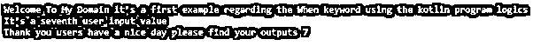
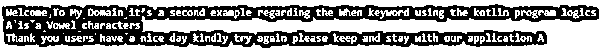
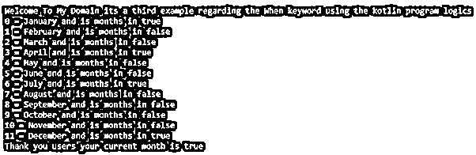

# 科特林什么时候

> 原文：<https://www.educba.com/kotlin-when/>


## 科特林介绍当

kotlin when 是其中一个表达式，它用在条件语句上，后者已经返回值，它有替换的另一个特性，叫做 switch 语句。“when”关键字通常使用，但在条件的多个分支中使用 when 语句时，它也不是强制性的。它可以与逗号分隔符分开，因为它需要运行和使用由程序员为多个选择实现的相同逻辑。它与表达式一起使用，还检查输入范围；它提供了用户输入条件，范围由运营商考虑。

**语法:**

<small>网页开发、编程语言、软件测试&其他</small>

在 kotlin 语言中，它有许多默认的关键字、变量和函数来实现应用程序。其中一个默认关键字可用于表达式和非表达式场景。

```
fun main(args: Array<String>){
val variablename;
when(variablename)
{
---some coding logics it depends upon the requirement---
}
}
```

以上代码是在 kotlin 代码上使用 when 关键字的基本语法。我们希望根据函数对子函数的要求来编写表达式，或者在应用程序上实现继承概念。

### Kotlin 中的 when 语句是如何工作的？

一般“当”是其中一个关键词，表达和非表达都用；在 kotlin 中，它还会根据基于用户需求的计算来检查有效的条件语句，并与这些条件语句相结合。在 kot Lin 中，它可以被视为 switch case 语句的替代语句，与其他语言类似，它会将关键字用作表达式，并验证条件，例如匹配整体表达式的值。如果条件语句中，单个分支的值总是被忽略，每个分支可以是块的，并且它的值是块值的最后一个表达式。

如果没有其他分支并且布尔条件语句满足条件，则评估 Else 循环；否则，循环是强制性的，除非编译器能够证明循环条件涵盖了所有可能的情况。变量的作用域是用关键字 for 引入的，当主题被限制到这个关键字 for when 表达式的主体时。我们可以在编译和运行时使用 kotlin 操作符中的特定类型来检查和验证条件。在条件语句的帮助下，循环将使用控件，并根据需要执行其他条件。

### 科特林的例子

以下是科特林的例子:

#### 示例#1

**代码**:

```
package one;
fun main(args: Array<String>){
println("Welcome To My Domain it’s a first example regarding the When keyword using the kotlin program logics")
var first = 7
var second = when(first) {
1 -> "It’s a first user input value"
2 -> "It’s a second user input value"
3 -> "It’s a third user input value"
4 -> "It’s a four user input value"
5 -> "It’s a fifth user input value"
6 -> "It’s a sixth user input value"
7 -> "It’s a seventh user input value"
8 -> "It’s a eight user input value"
9 -> "It’s a ninth user input value"
10 -> "It’s a tenth user input value"
else -> "Please try again"
}
println("$second")
var third = when(second) {
"Eleven" -> "It’s an eleventh user input value"
"Twelve" -> "It’s a twelfth user input value"
"Thirteen" -> "It’s a thirteen user input value"
"Fourteen" -> "It’s a fourteenth user input value"
"Fifteen" -> "It’s a fifteenth user input value"
"Sixteen" -> "It’s a sixteenth user input value"
"Seventeen" -> "It’s a seventeenth user input value"
"Eighteen" -> "It’s a eighteenth user input value"
"Nineteen" -> "It’s a nineteenth user input value"
"Twenty" -> "It’s a twenty user input value"
else -> "Please try again"
}
println("Thank you users have a nice day please find your outputs $first")
}
```

**输出:**




我们在使用 int、string、string 和 string 等基本格式的关键字时使用了上面的例子。我们可以在用户控制台屏幕上打印报表。

#### 实施例 2

**代码**:

```
package one;
fun main(args: Array<String>){
println("Welcome To My Domain it’s a second example regarding the When keyword using the kotlin program logics")
var first = 'A'
when(first){
'A', 'E', 'I', 'O', 'U' -> println("$first is a Vowel characters")
else -> println("$first is a Consonant characters")
}
println("Thank you users have a nice day kindly try again please keep and stay with our application $first")
var yrsage = 16
when(yrsage) {
in 18..100 -> {
val numlast = 100 - yrsage
println("Your marraige age is in $numlast years")
}
in 18..100 -> println("Thank you users for spending the time with our application please keep and stay with this.")
}
}
```

**输出:**




在第二个例子中，我们用来计算像 a，e，I，o，u 这样的元音字母，并以年份格式计算婚姻。

#### 实施例 3

**代码**:

```
package one;
enum class Third(val exampl: Boolean = false){
January(true),
February,
March,
April(true),
May,
June,
July(true),
August,
September,
October,
November,
December(true);
companion object{
fun demo(obj: Third): Boolean {
return obj.name.compareTo("April") == 0 || obj.name.compareTo("December") == 0
}
}
}
fun demos(th: Third) {
when(th) {
Third.January -> println("January")
Third.February->println("February")
Third.March ->    println("March")
Third.April ->  println("April")
Third.May ->   println("May")
Third.June ->     println("June")
Third.July ->println("July")
Third.August ->println("August")
Third.September ->println("September")
Third.October ->println("October")
Third.November ->println("November")
Third.December -> println("December")
}
}
fun main(){
println("Welcome To My Domain its a third example regarding the When keyword using the kotlin program logics")
for(eg in Third.values()) {
println("${eg.ordinal} = ${eg.name} and is months in ${eg.exampl}")
}
val demo1 = Third.April;
println("Thank you users your current month is ${Third.demo(demo1)}")
}
```

**输出:**




在最后一个示例中，我们使用布尔条件来计算当前月份的状态。我们使用 when 关键字在函数上打印枚举类值。

### 结论

在结论部分，kotlin when 是 if、else 等条件语句之一。when 关键字也支持非条件表达式，而不是 switch case 语句，这些语句将在每一步执行用户输入。它支持所有类型的用户浏览器，所以当关键字满足某些范围间隔时，它是兼容的，这取决于需求。

### 推荐文章

这是一个指南科特林当。在这里，我们将讨论 when 语句如何在 Kotlin 中工作，并给出示例和输出。您也可以看看以下文章，了解更多信息–

1.  [科特林循环](https://www.educba.com/kotlin-loops/)
2.  [科特林范围](https://www.educba.com/kotlin-range/)
3.  [科特林琴弦](https://www.educba.com/kotlin-string/)
4.  [Java 中的排序字符串](https://www.educba.com/sort-string-in-java/)


