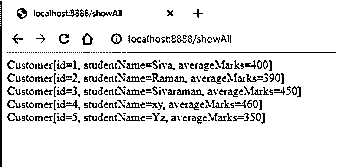
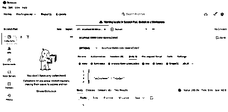

# 科特林暴露

> 原文：<https://www.educba.com/kotlin-exposed/>


## 科特林暴露简介

Kotlin exposed 是其中一个框架，它的开源库为一些关系数据库提供了惯用的 kotlin API，可以用来实现，同时使用超出范围的平滑接口，这是数据库供应商之间的差异，它拥有自己的 JDBC 连接库，它为我们提供了数据库类，允许多种连接处理数据模型的默认方法被映射每个表由个人表示 可以使用 table 类扩展的 kotlin 对象，参数也传递给表名。

**语法:**

<small>网页开发、编程语言、软件测试&其他</small>

在 kotlin 语言中，我们使用默认的类、方法和变量来实现应用程序。公开的 kotlin 是使用 kotlin 语言执行用户和数据事务的方法之一。

**Entities.kt:**

```
import javax.persistence.Entity
import javax.persistence.GeneratedValue
import javax.persistence.Id
@Entity
class name
{
@Id
val varname:datatype= value
}
Controller.kt:
import org.springframework.web.bind.annotation.*
@RestController
class name1(val eg: value){
@PostMapping("/values")
fun method(@RequestBody vars: entity)
{
}
}
Repositiories.kt:
import org.springframework.data.repository.CrudRepository
interface repositoryname : CrudRepository<Entity,datatype>
{
fun method(vars2:datatype) : Entity
}
main.kt:
class names2
fun main(args: Array<String>) {
runApplication<names2>(*args)
}
```

以上代码是使用数据库和 web 服务的基本语法和数据流。

### 在科特林是如何暴露作品的？

公开的 kotlin 是使用 Apache 许可的开源库，它为一些关系数据库实现提供了惯用的 kotlin API，同时平滑了其他数据库供应商之间的差异。它是一个框架，既可以作为使用 SQL 的高级 DSL 使用，也可以作为轻量级 ORM(对象-关系映射)使用，它将涵盖所有的用法。一般来说，它还不是像 Maven central 这样的工具，所以我们必须使用专用的存储库。像 h2 一样的内置数据库，用于存储和检索来自客户端-服务器事务的数据。为了连接数据库，我们可以使用默认的连接和驱动程序来传递 database 类中的参数，这样它将调用没有立即建立到数据库的连接的连接。如果我们想要添加额外的参数，那么该方法将使用 connect 方法的不同重载，该重载提供对数据库连接的获取的完全控制访问。连接的版本应该被命名为闭包参数，当它需要新的数据库连接时，它就会被公开来调用闭包。

#### 示例#1

**Entities.kt:**

```
package com.example.July30th
import javax.persistence.Entity
import javax.persistence.GeneratedValue
import javax.persistence.Id
@Entity
class Electrical
{
@Id
val id: Long=-1
val name: String =""
}
```

**电气控制器. kt:**

```
package com.example.July30th
import org.springframework.web.bind.annotation.*
@RestController
class ElectricalController(val repo: ElectricalRepositories){
@PostMapping("/elect")
fun addName(@RequestBody elect: Electrical)
{
repo.save(elect)
}
@GetMapping("/elect")
fun getName() : List<Electrical>
{
return repo.findAll().toList();
}
@GetMapping("/elect/{name}")
fun getElectricalByName(@PathVariable("name")name:String) = repo.findByName(name)
}
```

**Repositories.kt:**

```
package com.example.July30th
import org.springframework.data.repository.CrudRepository
interface ElectricalRepositories : CrudRepository<Electrical,Long>
{
fun findByName(name:String) : Electrical
}
```

**7 月 30 日应用程序. kt:**

```
package com.example.July30th
import org.springframework.boot.autoconfigure.SpringBootApplication
import org.springframework.boot.runApplication
@SpringBootApplication
class July30thApplication
fun main(args: Array<String>) {
println("Welcome To My Domain its the first example that related to the kotlin expose")
runApplication<July30thApplication>(*args)
}
```

**Pom.xml:**

```
<?xml version="1.0" encoding="UTF-8"?>
<project  xmlns:xsi="http://www.w3.org/2001/XMLSchema-instance"
xsi:schemaLocation="http://maven.apache.org/POM/4.0.0 https://maven.apache.org/xsd/maven-4.0.0.xsd">
<modelVersion>4.0.0</modelVersion>
<parent>
<groupId>org.springframework.boot</groupId>
<artifactId>spring-boot-starter-parent</artifactId>
<version>2.5.3</version>
<relativePath/> <!-- lookup parent from repository -->
</parent>
<groupId>com.example</groupId>
<artifactId>July30th</artifactId>
<version>0.0.1-SNAPSHOT</version>
<name>July30th</name>
<description>Demo project for Spring Boot</description>
<properties>
<java.version>1.8</java.version>
<kotlin.version>1.5.21</kotlin.version>
</properties>
<dependencies>
<dependency>
<groupId>org.springframework.boot</groupId>
<artifactId>spring-boot-starter-data-jpa</artifactId>
</dependency>
<dependency>
<groupId>org.springframework.boot</groupId>
<artifactId>spring-boot-starter-web</artifactId>
</dependency>
<dependency>
<groupId>com.fasterxml.jackson.module</groupId>
<artifactId>jackson-module-kotlin</artifactId>
</dependency>
<dependency>
<groupId>org.jetbrains.kotlin</groupId>
<artifactId>kotlin-reflect</artifactId>
</dependency>
<dependency>
<groupId>org.jetbrains.kotlin</groupId>
<artifactId>kotlin-stdlib-jdk8</artifactId>
</dependency>
<dependency>
<groupId>com.h2database</groupId>
<artifactId>h2</artifactId>
<scope>runtime</scope>
</dependency>
<dependency>
<groupId>org.springframework.boot</groupId>
<artifactId>spring-boot-starter-test</artifactId>
<scope>test</scope>
</dependency>
</dependencies>
<build>
<sourceDirectory>${project.basedir}/src/main/kotlin</sourceDirectory>
<testSourceDirectory>${project.basedir}/src/test/kotlin</testSourceDirectory>
<plugins>
<plugin>
<groupId>org.springframework.boot</groupId>
<artifactId>spring-boot-maven-plugin</artifactId>
</plugin>
<plugin>
<groupId>org.jetbrains.kotlin</groupId>
<artifactId>kotlin-maven-plugin</artifactId>
<configuration>
<args>
<arg>-Xjsr305=strict</arg>
</args>
<compilerPlugins>
<plugin>spring</plugin>
<plugin>jpa</plugin>
</compilerPlugins>
</configuration>
<dependencies>
<dependency>
<groupId>org.jetbrains.kotlin</groupId>
<artifactId>kotlin-maven-allopen</artifactId>
<version>${kotlin.version}</version>
</dependency>
<dependency>
<groupId>org.jetbrains.kotlin</groupId>
<artifactId>kotlin-maven-noarg</artifactId>
<version>${kotlin.version}</version>
</dependency>
</dependencies>
</plugin>
</plugins>
</build>
</project>
```

**输出:**

Post 方法的邮递员工具请求和响应:


**邮差工具对 Get 方法的请求和响应:**

在上面的例子中，我们使用 post man 工具添加和检索用户数据。


#### 实施例 2

**实体。kt:**

```
package com.example.July30th
import javax.persistence.Column
import javax.persistence.Entity
import javax.persistence.GeneratedValue
import javax.persistence.GenerationType
import javax.persistence.Id
import javax.persistence.Table
@Entity
@Table(name = "julyTest")
public class Student(
@Id
val id: Long = -1,
@Column(name = "studentName")
val studentName: String = "",
@Column(name = "averageMarks")
val averageMarks: Int
){
override fun toString(): String{
return "Customer[id=${id}, studentName=${studentName}, averageMarks=${averageMarks}]"
}
}
```

**知识库。kt:**

```
package com.example.July30th
import org.springframework.data.repository.CrudRepository
import com.example.July30th.Student
interface StudentRepository: CrudRepository<Student, Long>{
fun findByStudentName(studentName: String): List<Student>
}
```

**studentcontroller . kt:**

```
package com.example.July30th
import org.springframework.beans.factory.annotation.Autowired
import org.springframework.web.bind.annotation.RequestMapping
import org.springframework.web.bind.annotation.RequestParam
import org.springframework.web.bind.annotation.RestController
@RestController
class StudentController {
@Autowired
lateinit var repository: StudentRepository
@RequestMapping("/save")
fun studDetails(): String{
repository.save(Student(1, "Siva", 400))
repository.save(Student(2, "Raman", 390))
repository.save(Student(3, "Sivaraman", 450))
repository.save(Student(4, "xy", 460))
repository.save(Student(5, "Yz", 350))
return "Student details saved successfully"
}
@RequestMapping("/showAll")
fun showAll(): String{
var output = ""
for(stud in repository.findAll()){
output += stud.toString() + "</br>"
}
return output
}
@RequestMapping("/findById")
fun findById(@RequestParam("id") id: Long): String{
return repository.findById(id).toString()
}
@RequestMapping("/findByName")
fun findByName(@RequestParam("name") name: String): String{
var result = ""
for(stud in repository.findByStudentName(name)){
result += stud.toString() + "</br>"
}
return result
}
}
```

**7 月 30 日应用程序. kt:**

```
package com.example.July30th
import org.springframework.boot.SpringApplication
import org.springframework.boot.autoconfigure.SpringBootApplication
@SpringBootApplication
class July30thApplication
fun main(args: Array<String>) {
SpringApplication.run(July30thApplication::class.java, *args)
}
```

**输出:**




在第二个例子中，我们用来执行添加和显示数据。

#### 实施例 3

**Entities.kt:**

```
package com.example.July30th
import javax.persistence.Column
import javax.persistence.Entity
import javax.persistence.GeneratedValue
import javax.persistence.Id
@Entity
data class Colors(
@Id
@GeneratedValue
val id: Long = -1,
@Column(name = "colorName")
val colorName: String = "",
){
override fun toString(): String{
return "Color[id=${id}, colorName=${colorName}]"
}
}
```

**ColorController.kt:**

```
package com.example.July30th
import org.springframework.http.ResponseEntity
import org.springframework.web.bind.annotation.GetMapping
import org.springframework.web.bind.annotation.PostMapping
import org.springframework.web.bind.annotation.PutMapping
import org.springframework.web.bind.annotation.DeleteMapping
import org.springframework.web.bind.annotation.PathVariable
import org.springframework.web.bind.annotation.RequestBody
import org.springframework.web.bind.annotation.RequestMapping
import org.springframework.web.bind.annotation.RestController
import org.springframework.web.bind.annotation.*
import javax.validation.Valid
import com.example.July30th.ColorRepository
@RestController
@RequestMapping("/color")
class ColorController( val colorService: ColorService, val repo:ColorRepository) {
@PostMapping("/color")
fun addColor(@Valid @RequestBody color:Colors): ResponseEntity<Colors> = colorService.addColor(color)
@GetMapping("/color")
fun getColorsById(@PathVariable(value="id") id: Long): ResponseEntity<Colors> =
colorService.getColorsById(id)
@DeleteMapping("/{id}")
fun deleteColor(@PathVariable(value="id") id: Long):ResponseEntity<Void> = colorService.deleteColors(id)
}
```

**ColorService.kt:**

```
package com.example.July30th
import com.example.July30th.Colors
import com.example.July30th.ColorRepository
import org.springframework.http.HttpStatus
import org.springframework.http.ResponseEntity
import org.springframework.stereotype.Service
import org.springframework.web.bind.annotation.GetMapping
@Service
class ColorService(private val colorRepository: ColorRepository) {
fun addColor(color: Colors): ResponseEntity<Colors> =
ResponseEntity.ok(colorRepository.save(color))
fun getColorsById(id: Long): ResponseEntity<Colors> =
colorRepository.findById(id).map { color ->
ResponseEntity.ok(color)
}.orElse(ResponseEntity.notFound().build())
fun deleteColors(id: Long): ResponseEntity<Void> =
colorRepository.findById(id).map { color ->
colorRepository.delete(color)
ResponseEntity<Void>(HttpStatus.ACCEPTED)
}.orElse(ResponseEntity.notFound().build())
}
```

**知识库。kt:**

```
package com. example.July 30th
import org.spring framework.data.repository.CrudRepository
import com. example.July30th.Colors
interface ColorRepository: CrudRepository<Colors, Long>{
}
```

**输出:**





在最后一个示例中，我们还执行了删除操作。

### 结论

在 kotlin 中，它有许多功能来执行应用程序级别的操作。在这些被暴露的框架库中，框架库使用被暴露的框架来概述和收集所有数据，例如数据库连接，它可以是用于在应用中执行该操作的任何数据库工具。

### 推荐文章

这是科特林暴露指南。在这里我们讨论一下引言，语法，如何在 Kotlin 中暴露作品？代码实现示例。您也可以看看以下文章，了解更多信息–

1.  [科特林代表](https://www.educba.com/kotlin-delegate/)
2.  [科特林拉姆达](https://www.educba.com/kotlin-lambda/)
3.  [科特林布尔](https://www.educba.com/kotlin-boolean/)
4.  [科特林静态函数](https://www.educba.com/kotlin-static-function/)


