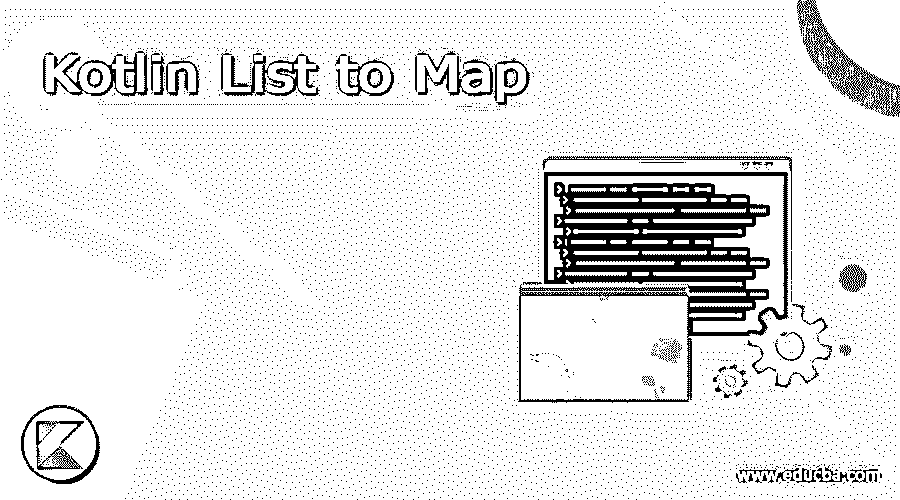
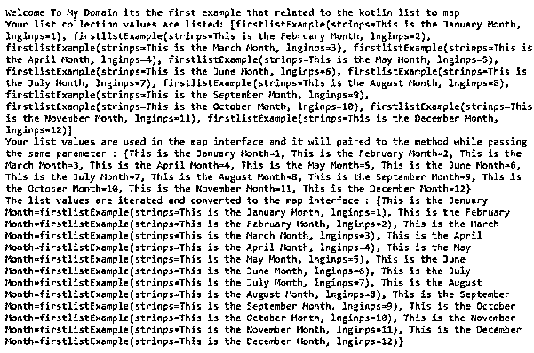
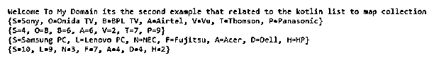

# 科特林列表到地图

> 原文：<https://www.educba.com/kotlin-list-to-map/>




## Kotlin 列表到地图的介绍

Kotlin list to map 是使用 to map()等内置方法来方便列表数据映射的功能之一，该方法提供了一个复杂对象列表，允许我们在内置方法的帮助下使用任何类型的值来映射列表中的元素。它要求我们将数组转换为对，然后稍后它会将数据传输到映射，因此如果我们已经对使用关联 API 实现的对值集合进行了操作，则该操作将执行特定的用法。

**语法:**

<small>网页开发、编程语言、软件测试&其他</small>

在 kotlin 语言中，我们使用许多默认的类、方法和变量来实现应用程序中的 kotlin 任务。要映射的列表是借助默认方法执行列表数据到映射数据的转换操作之一。

```
fun methodName()
{
val x= listOf(values)
val y= x.map{ -- logic codes--}.toMap()
--some logic operations based on the needs—
}
fun main()
{
}
```

上述代码是执行列表数据并将其转换为地图数据的基本语法。我们可以使用 lisOf()来传递列表格式的值，然后使用。map()和 toMap()方法将列表值转换为映射值。

### 如何在 Kotlin 中使用 list to map？

列表和映射是集合接口的类型，它用于从前端到后端存储和检索值，反之亦然。Kotlin 提供了便利，并执行将列表数据转换为 map 类型的操作，map 类型具有复杂对象的列表，允许我们将列表中的元素映射为任何类型的值。基本的映射函数是 map()方法，它将 lambda 类型的函数应用于每个后续元素，并返回 lambda 类型的函数列表。一般来说，kotlin 标准库为数据集合转换提供了一组扩展函数，这些函数根据库提供的数据转换规则从现有的事物中构建新的集合。映射转换将从元素上的每种类型的函数的列表结果创建集合，从一种类型的集合数据到另一种类型的集合数据。以便对每个后续元素应用 lambda 函数，并返回 lambda 结果列表。结果数据的顺序与元素的原始数据相同。

#### 示例#1

```
data class firstlistExample(var strinps: String, var lnginps: Long);
fun main(args: Array<String>) {
println("Welcome To My Domain its the first example that related to the kotlin list to map")
var lst: List<firstlistExample> = listOf(
firstlistExample("This is the January Month", 1),
firstlistExample("This is the February Month", 2),
firstlistExample("This is the March Month", 3),
firstlistExample("This is the April Month", 4),
firstlistExample("This is the May Month", 5),
firstlistExample("This is the June Month", 6),
firstlistExample("This is the July Month", 7),
firstlistExample("This is the August Month", 8),
firstlistExample("This is the September Month", 9),
firstlistExample("This is the October Month", 10),
firstlistExample("This is the November Month", 11),
firstlistExample("This is the December Month", 12)
);
println("Your list collection values are listed: $lst")
val maps : Map<String, Long> = lst.associate { Pair(it.strinps, it.lnginps) };
println("Your list values are used in the map interface and it will paired to the method while passing the same parameter : $maps")
val maps2 : Map<String, firstlistExample> = lst.associate { Pair(it.strinps, it) };
println("The list values are iterated and converted to the map interface : $maps2")
}
```

**输出:**




在上面的例子中，我们曾经列出并映射了不同场景中的操作。就这样，我们创建了一个数据类，带有字符串和长类型值之类的参数。在 main 方法中，我们用类类型创建 list 实例，并使用 listOf()方法传递带有参数值的类名。在这里，我使用了两种类型，如字符串和长整型。第一个参数是字符串类型值，即我们可以输入月份的详细信息作为第一个参数类型，另一个参数我们使用长整型来输入，它可能是数字。这样我就可以从 1 到 12 开始计算 12 个月，并作为列表集合输入。然后我创建了一个 map 作为另一个集合接口，参数是字符串和类名。associate 是 list 集合的另一个方法，传递类参数值并将它们存储为一个单独的变量。

#### 实施例 2

```
fun main() {
println("Welcome To My Domain its the second example that related to the kotlin list to map collection")
val tv = listOf("Samsung TV", "Onida TV", "BPL TV", "Airtec", "Airtel","Sony","Vu","Thomson","Panasonic")
println(tv.associateBy { it.first().toUpperCase() })
println(tv.associateBy(keySelector = { it.first().toUpperCase() }, valueTransform = { it.length }))
val computer = listOf("Samsung PC", "Lenovo PC", "NEC", "Fujitsu", "Apple","Dell","HCL","HP","Acer")
println(computer.associateBy { it.first().toUpperCase() })
println(computer.associateBy(keySelector = { it.first().toUpperCase() }, valueTransform = { it.length }))
}
```

**输出:**




在上面的例子中，我们使用了与前面相同的例子，这里我们在 main 方法中声明并创建了 list。没有为列表集合创建对象，相反，我们使用 listOf()方法来传递用户输入。现在我可以像世界上的电视制造商一样使用字符串输入。在使用 associateBy()方法输入输入后，我们可以迭代列表值并将其转换为地图集合。这样，我们可以创建并传递计算机制造商列表，使用相同的方法，我们可以迭代并传递列表值以进行映射转换。

### 结论

在 kotlin 语言中，我们使用了许多不同的概念和特性来实现具有用户需求的应用程序。基于此，SDLC 和 android 应用程序将在该列表中进行营销，以映射从应用程序执行用户数据操作的集合类型。

### 推荐文章

这是一个指南科特林列表地图。这里我们讨论一下 Kotlin 中的介绍、语法、如何列表来映射作品？和示例。您也可以看看以下文章，了解更多信息–

1.  [科特林内嵌函数](https://www.educba.com/kotlin-inline-function/)
2.  [科特林收藏馆](https://www.educba.com/kotlin-collections/)
3.  [科特林元组](https://www.educba.com/kotlin-tuple/)
4.  [科特林循环](https://www.educba.com/kotlin-loops/)


