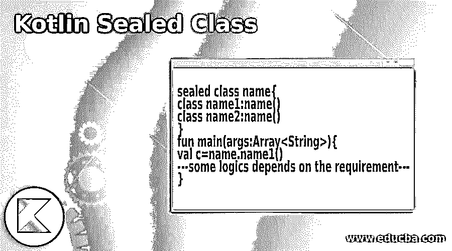
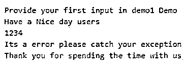
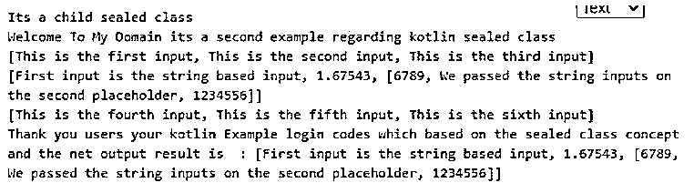
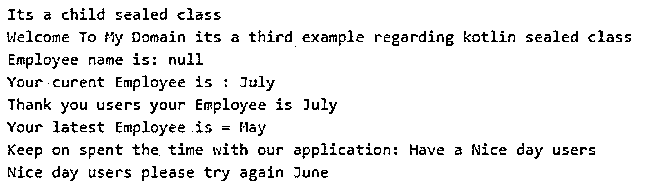

# 科特林密封类

> 原文：<https://www.educba.com/kotlin-sealed-class/>




## 科特林密封类介绍

kotlin 密封类是内置类之一，可用于限制用户继承该类。可以使用 sealed 关键字将其密封。如果我们用一个 sealed 关键字来使用和声明这个类，那么它会自动告诉编译器这个类是密封的，因此它不能像那样用其他子类来扩展；类似地，我们可以在方法中使用 sealed 关键字，这样它就不能被声明为基类中的虚拟部分。如果假设该类是从密封类派生的，它将抛出一个错误。

**kot Lin 密封类的语法**

<small>网页开发、编程语言、软件测试&其他</small>

kotlin 语言有许多用于实现基于移动设备的应用程序的特性，例如，密封类是一个名称，可以建议它只从有限的值集中取值，它不能被继承。

```
sealed class name{
class name1:name()
class name2:name()
}
fun main(args:Array<String>){
val c=name.name1()
---some logics depends on the requirement---
}
```

上述代码是用其他子类声明密封类的基本语法。密封的类不能被继承，因此我们可以借助它的引用来调用 main 方法上的方法。

### Kotlin 中的密封类是如何工作的？

*   可以表示的关键字的密封类，它可用于限制类及其层次结构，其中对象或值可以是有限值集中的同一类型。所有的子类和其他子类当是密封类时，可以知道在编译时没有其他子类可以出现在密封类编译的模块之后。密封类对在多平台 direct sub 中运行项目有一些限制，并且密封类的子类必须驻留在同一数据源集中。
*   主要是我们不能创建密封类的对象，所以密封类不能被实例化；此外，密封类的所有子类和子类必须在密封类声明的同一个文件中声明。此外，默认情况下，密封类的构造函数是私有的访问修饰符，我们不能将它设置为非私有的，如 public、protected 等。如果用户端需要，我们还可以对表达式求值，eval()方法可能用于对编码求值。如果错误即将发生，那么编译器会得到警告，而不会在表达式代码中添加逻辑。

### Kotlin 密封类的示例

下面给出了 Kotlin 密封类的示例:

#### 示例#1

**代码:**

```
package one;
sealed class Demo{
class demo1 : Demo()
class demo2 : Demo()
class demo3 : Demo()
}
fun eval(c: Demo) =
when (c) {
is Demo.demo1 -> println("Provide your first input in demo1 Demo")
is Demo.demo2 -> println("Provide your second input in demo2 Demo")
is Demo.demo3 -> println("Provide your third input in demo3 Demo")
}
fun main(arg: Array<String>) {
val out = Demo.demo1()
eval(out)
var a= "Welcome Users its a first example regarding sealed class"
var b = try { a.toInt() } catch (e: NumberFormatException) { "Have a Nice day users" }
println(b)
a = "1234"
b = try { a.toInt() } catch (e: NumberFormatException) { "Thank you users for giving your inputs" }
println(b)
try {
var d = 13 / 0
val f = ""
f.toInt()
} catch (e: ArithmeticException) {
println("Its a error please catch your exception")
} catch (e: Exception) {
println("Exception occurred please find the stacktrace print using e")
} finally {
println("Thank you for spending the time with us")
}
}
```

**输出:**




上面的例子是密封类的例子，执行了算术异常等异常。

#### 实施例 2

**代码:**

```
package one;
sealed class second {
class exam : second() {
fun show()
{
println("Welcome To My Domain its a second example regarding kotlin sealed class")
}
}
class sample : second() {
fun show()
{
println("Its a child sealed class")
}
}
}
fun main(args:Array<String>)
{
val eg = second.sample()
eg.show()
val eg1 = second.exam()
eg1.show()
var firsts = Triple("This is the first input", "This is the second input","This is the third input")
val result1: List<Any> = firsts.toList()
println(result1)
var second = Triple("First input is the string based input", 1.67543 ,
listOf(6789, "We passed the string inputs on the second placeholder", 1234556))
val result2: List<Any> = second.toList()
println(result2)
var third = Triple("This is the fourth input", "This is the fifth input","This is the sixth input")
val result3: List<Any> = third.toList()
println(result3)
println("Thank you users your kotlin Example login codes which based on the sealed class concept and the net output result is : " + result2)
}
```

**输出:**




在第二个例子中，我们结合密封类使用了集合概念。

#### 实施例 3

**代码:**

```
package one;
abstract class Employee(empname:String){
abstract var name: String
abstract fun empdetails()
init {
println("Employee name is: $name")
}
fun demo(){
println("Thank you the Employee name is")
}
}
interface Employer {
var vars: String
fun demo1():String
fun details2() {
println("Have a Nice day users")
}
}
class Employee1 : Employer {
override var vars: String = "May"
override fun demo1() = "June"
}
class Employee2(empname:String): Employee(empname) {
override var name: String = "July"
override fun empdetails() {
println("Thank you users your Employee is $name")
}
}
sealed class third {
class demo : third() {
fun show()
{
println("Welcome To My Domain its a third example regarding kotlin sealed class")
}
}
class demo1 : third() {
fun show()
{
println("Its a child sealed class")
}
}
}
fun main(args:Array<String>)
{
val eg = third.demo1()
eg.show()
val eg1 = third.demo()
eg1.show()
val m2 = Employee2("May")
println("Your curent Employee is : ${m2.name}")
m2.empdetails()
val j = Employee1()
println("Your latest Employee is = ${j.vars}")
print("Keep on spent the time with our application: ")
j.details2()
print("Nice day users please try again ")
println(j.demo1())
}
```

**输出:**




在最后一个例子中，我们使用了接口，抽象类和密封类连接在一起。在这里，我们存储和检索了雇员的详细信息。

### 结论

在 kotlin 中，语言类包含默认方法，它们的属性在应用程序实现中执行。像密封类是最强大的，扩展像枚举数据类型，它没有对象实例来调用主方法上的方法，所以我们可以继承子类来访问它。

### 推荐文章

这是科特林密封类的指南。这里我们讨论一下入门，一个密封的类在 kotlin 中是如何工作的？和示例。您也可以看看以下文章，了解更多信息–

1.  [科特林范围](https://www.educba.com/kotlin-range/)
2.  [科特林循环](https://www.educba.com/kotlin-loops/)
3.  [科特林构造函数](https://www.educba.com/kotlin-constructors/)
4.  [科特林琴弦](https://www.educba.com/kotlin-string/)


