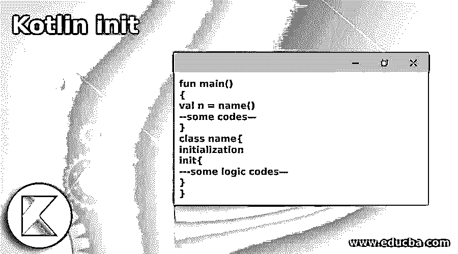
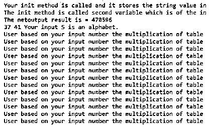
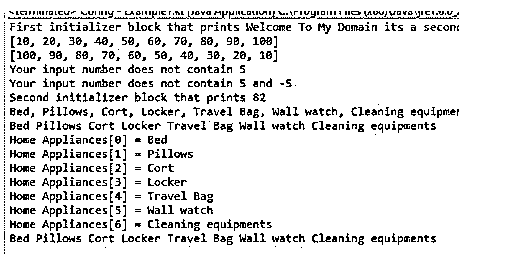

# 我的锅

> 原文：<https://www.educba.com/kotlin-init/>

## Kotlin init 简介

Kotlin init 是其中一个块，它用于执行类的实例化，每次用任何类型的构造函数实例化类时，都会运行 init 块，以创建对象，并在 main 方法或任何需要的地方调用多个初始化器块，这些初始化器块也是用类编写的，它们将按顺序执行，例如您可以将代码放在什么地方，这些代码将在属性初始化后运行，它们在类体中出现的顺序与属性初始化器的顺序相同或不同。

**语法:**

<small>网页开发、编程语言、软件测试&其他</small>

在 kotlin 语言中，有许多默认的类、方法、变量和其他自定义和内置的定义块。就像那样，init 是我们可以把代码放在类属性之前的独立区域中的块。

`fun main()
{
val n = name()
--some codes—
}
class name{
initialization
init{
---some logic codes—
}
}`

上述代码是在 kotlin 代码中使用 init 块的基本语法。我们也可以使用 n 个 init 块，这取决于需求，块在类属性之前被初始化。

### Kotlin init 是如何工作的？

*   kotlin init 是一个块，它可以放置在带有 init 关键字前缀的初始化代码中。在实例初始化过程中，初始化器块以相同的顺序执行，它们出现在类体中，与属性初始化器交错。当我们初始化构造函数时，需要更多的部分，比如主构造函数，参数可以用在初始化程序块中，也可以用在属性初始化程序中，这些初始化程序在类体中声明，用于声明属性，并从主构造函数初始化它们。
*   就像这个类有以构造函数为前缀的二级构造函数，它需要委托一级构造函数，或者直接或者间接地通过另一个二级构造函数。同一个类中另一个构造函数的委托是使用这个关键字完成的，这个关键字成为主构造函数的一部分。在 kotlin 语言中，委托是构造函数的主要角色，它发生在每个二级构造函数的第一个元素中，所以代码都是首先初始化的块，并提到在二级构造函数体之前执行的属性初始化器。

### Kotlin init 示例

下面是提到的例子:

#### 示例#1

**代码:**

`fun main(args: Array<String>) {
val frExam = firstExampleInit("joe", 25)
}
class firstExampleInit(str1: String, intno1: Int) {
val strs: String
var ints: Int
init {
strs = str1.capitalize()
ints = intno1
println("Your init method is called and it stores the string value in the first variable = $strs")
println("The init method is called second variable which is of the integer type = $ints")
val baseNumber = 7
var exp = 6
var out: Long = 4
while (exp != 0) {
out *= baseNumber.toLong()
--exp
}
println("The netoutput result is = $out")
val outpt = Math.pow(baseNumber.toDouble(), exp.toDouble())
var inpNumber = 35
val inpNum2 = 43
while (inpNumber < inpNum2) {
var flag = false
for (i in 2..inpNumber / 3) {
if (inpNumber % i == 0) {
flag = true
break
}
}
if (!flag)
print("$inpNumber ")
++inpNumber
}
val xy = 'S'
when {
(xy in 'a'..'z' || xy in 'A'..'Z') -> println("Your input $xy is an alphabet.")
else -> println("Your input $xy is not an alphabet.")
}
val nubers = 13
var i = 1
while (i <= 13) {
val tble = nubers * i
println("User based on your input number the multiplication of table is $nubers * $i = $tble")
i++
}
}
}`

**输出:**

**说明:**

*   在上面的例子中，我们在不同的序列中使用了 init { }块。首先，我们创建了这个类，并传递了一些参数，如字符串和整数类型的格式变量，它仅用于指定数据类型值。
*   然后，我们使用 init 关键字初始化块，因为我们可以用指定的格式和值来声明变量，而不是使用循环语句。数据被迭代并指定条件，如' a 中的 xy..z' || xy in 'A..使用这些字符格式，我们也使用管道符号和 or 条件来验证数据。
*   最后，使用 main 方法，我们可以创建该类的对象，并在控制台屏幕上打印方法值。

#### 实施例 2

**代码:**

`class MultiInit(name: String) {
init {
println("First initializer block that prints ${name}")
val nums = listOf(10, 20, 30, 40, 50, 60, 70, 80, 90,100 )
val ascOrder = nums.sorted()
println(ascOrder)
val descOrder = nums.sortedDescending()
println(descOrder)
val numLists = listOf(70, 40, 20, 10, 30, 50, 60, 80, 90,100 )
val outp = numLists.contains(5)
if (outp)
println("Your input number contains 5")
else
println("Your input number does not contain 5")
}
init {
println("Second initializer block that prints ${name.length}")
val HAppliance = listOf("Bed", "Pillows", "Cort", "Locker", "Travel Bag", "Wall watch", "Cleaning equipments")
for (k in HAppliance) {
print("$k, ")
}
println()
for (i in 0 until HAppliance.size) {
print("${HAppliance[i]} ")
}
println()
HAppliance.forEachIndexed({i, j -> println("Home Appliances[$i] = $j")})
val it: ListIterator<String> = HAppliance.listIterator()
while (it.hasNext()) {
val i = it.next()
print("$i ")
}
println()
}
}
fun main(args: Array<String>) {
var multi = MultiInit("Welcome To My Domain its a second example that related to the kotlin init concepts")
}
}`

**输出:**

**说明:**

*   在第二个例子中，我们在 kotlin 类中使用了多个 inits，它用于循环来迭代类中的用户数据。
*   这里，我们在一个 inits 块和另一个 init 块中使用了列表集合接口，我们执行了升序和降序操作。我们创建了一个实例并调用了 main 方法。

### 结论

在 kotlin 语言中，我们使用不同的概念来实现应用程序，例如 init 是块类型之一，它主要用于存储和执行数据。每次类被实例化时，init 块都用任何一种构造函数按顺序执行。

### 推荐文章

这是 Kotlin init 的指南。这里我们讨论一下入门，Kotlin init 是如何工作的？以及更好理解的例子。您也可以看看以下文章，了解更多信息–

1.  [科特林内嵌函数](https://www.educba.com/kotlin-inline-function/)
2.  [科特林收藏馆](https://www.educba.com/kotlin-collections/)
3.  [科特林元组](https://www.educba.com/kotlin-tuple/)
4.  [科特林循环](https://www.educba.com/kotlin-loops/)

