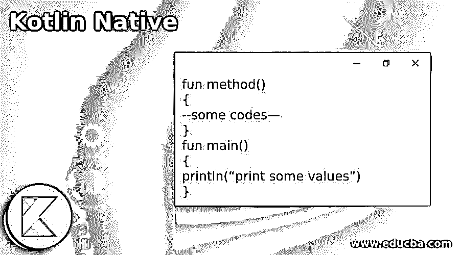
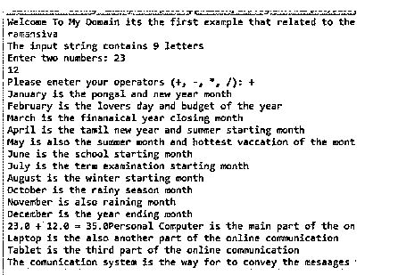
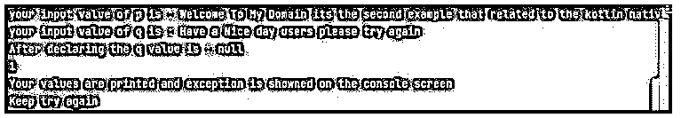

# 科特林本地人

> 原文：<https://www.educba.com/kotlin-native/>




## 科特林土著简介

Kotlin native 是一种可用于将 Kotlin 代码编译成本地二进制文件的技术，这种二进制文件可以在不使用虚拟机的情况下运行，如其基于 LLVM 的 kotlin 编译器后端和 kotlin 标准库的本地实现。主要是 kotlin 编译器允许编译 kotlin 平台，用于虚拟机不理想的情况，或可能的机器，如嵌入式或其他设备平台，如 iOS。它也开始升级，以便解决诸如修复 bug 的情况，然后开发人员需要生产自包含程序。

### Kotlin 本地语法

在 kotlin 语言中，它有许多默认的类、方法和其他变量来实现 kotlin 应用程序，以便通过使用 kotlin 运行时库来编译本机实现。对于在应用程序中应用本机概念，它有自己的语法和规则。

<small>网页开发、编程语言、软件测试&其他</small>

```
fun method()
{
--some codes—
}
fun main()
{
println(“print some values”)
}
```

以上代码是为应用程序编写 kotlin 语言的基本语法。在这种情况下，我们可以使用 Intellij ide 之类的 ide 来使用这些代码，将代码编译成二进制格式，并在控制台屏幕上显示出来。

### 科特林土著是如何工作的？

*   kotlin native 是主要设计之一，它用于允许 kotlin 编译器帮助编译 kotlin 平台，而虚拟机是不可取的，并且可以嵌入类似于 iOS、android 等其他格式设备的设备。它是 kotlin 编译器和 kotlin 标准库的其他本地实现的基于 LLVM 的后端。
*   我们使用 groovy 是最早支持的脚本语言之一，来构建工具以及动态类型和运行时特性的强大功能。有时候，维护 groovy 构建脚本会更困难。kotlin/native 的主要优势是 GUI 传感器、通知和所有针对 GUI、传感器、通知和其他设备的独特和指定的帮助，这些设备将不受限制地使用本地语言和运行时进行开发。
*   与其他编程语言相比，当障碍减少时，它有助于跨平台编程语言在应用程序开发中的应用。与其他跨平台工具相比，它侧重于共享执行所需的代码。

### 科特林土著的例子

下面是提到的例子:

#### 示例#1

**代码:**

```
import java.util.Scanner
open class firstExample {
open fun methd() {
println("Personal Computer is the main part of the online communication")
println("Laptop is the also another part of the online communication")
println("Tablet is the third part of the online communication")
}
}
abstract class Online : firstExample() {
override abstract fun methd()
}
class Communication: Online(){
override fun methd() {
println("The comunication system is the way for to convey the mesaages from one part to another part")
}
}
fun main() {
println("Welcome To My Domain its the first example that related to the kotlin native concepts:")
val nm = readLine()
nm?.replace(" ", "")?.let {
println("The input string contains ${it.length} letters")
} ?: error("We can read the datas successfully and if the data is null it can't be read.")
val rd = Scanner(System.`in`)
print("Enter two numbers: ")
val first = rd.nextDouble()
val second = rd.nextDouble()
print("Please eneter your operators (+, -, *, /): ")
val op = rd.next()[0]
val outputs: Double
when (op) {
'+' -> outputs = first + second
'-' -> outputs = first - second
'*' -> outputs = first * second
'/' -> outputs = first / second
else -> {
System.out.printf("Your entered operator is invalid")
return
}
}
println("January is the pongal and new year month")
println("February is the lovers day and budget of the year")
println("March is the finanaical year closing month")
println("April is the tamil new year and summer starting month")
println("May is also the summer month and hottest vaccation of the month")
println("June is the school starting month")
println("July is the term examination starting month")
println("August is the winter starting month")
println("October is the rainy season month")
println("November is also raining month")
println("December is the year ending month")
System.out.printf("%.1f %c %.1f = %.1f", first, op, second, outputs)
val lesser = firstExample()
lesser.methd()
val newer = Communication()
newer.methd()
}
```

**输出:**




**说明:**

*   上面的例子是像 class、abstract 和其他子类一样的基本概念，都是用父类继承的。这将用于利用本地类和其他功能。在这里，我们使用了一些操作，如加、减、乘、除来访问和操作各种场景中的用户数据。
*   使用 while 循环迭代数据，因为它只满足 true 条件。如果输入数据不满足，它将返回 false 语句，并存在循环。

#### 实施例 2

**代码:**

```
fun main(args: Array<String>){
var p: String = "Welcome To My Domain its the second example that related to the kotlin native concepts"
println("your input value of p is : $p")
var q: String? = "Have a Nice day users please try again"
println("your input value of q is : $q")
q = null
println("After declaring the q value is : $q")
try {
val vars = 41/ 23
println(vars)
}
finally {
println("Your values are printed and exception is showned on the console screen")
}
println("Keep try again")
}
```

**输出:**




**说明:**

*   在第二个例子中，我们使用了两个不同的变量来声明字符串类型。我们已经执行了不同的操作，比如利用变量 var 的算术运算。
*   在这里，我们使用 try，finally 块来执行这些操作，如果 try 块抛出任何异常，它将使用 catch 块来捕获，而我们不使用 catch 和 finally 块总是执行。

### 结论

kotlin 语言支持不同的类、变量和其他函数来实现应用程序。在 kotlin 中，native 是在不使用 LLVM 和虚拟机的情况下将代码翻译成二进制格式的特性之一，尽管它支持多平台库，为 kotlin 代码提供 API。

### 推荐文章

这是一本科特林土著指南。在这里我们讨论一下入门，科特林是如何本土工作的？以及更好理解的例子。您也可以看看以下文章，了解更多信息–

1.  [科特林内嵌函数](https://www.educba.com/kotlin-inline-function/)
2.  [科特林收藏馆](https://www.educba.com/kotlin-collections/)
3.  [科特林元组](https://www.educba.com/kotlin-tuple/)
4.  [科特林循环](https://www.educba.com/kotlin-loops/)


