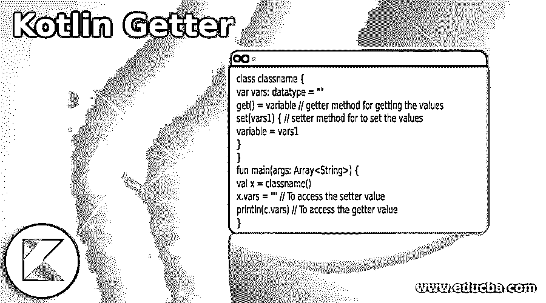
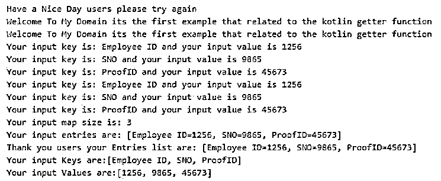
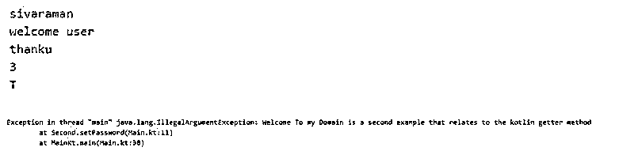
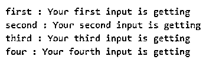

# 科特林吸气剂

> 原文：<https://www.educba.com/kotlin-getter/>

## Kotlin Getter 简介

kotlin getter 是使用 get()方法检索值的一个特性。getters 用于获取变量及其值。getters 是自动生成的代码，它们是在我们声明值及其属性时自动创建的。我们可以通过在基类中将变量定义为 open 来用一些扩展类覆盖 getter，然后我们可以在 override 关键字及其扩展类的帮助下使用和覆盖。属性值是可变的和不可变的，所以代码中的值是可变的和可读的格式。

**语法**

<small>网页开发、编程语言、软件测试&其他</small>

在 kotlin 应用程序中，我们可以使用 setter 和 getter 方法来存储和检索数据。因此，它属于执行和优化基于 web 的应用程序的数据库相关概念。

`class classname {
var vars: datatype = ""
get() = variable // getter method for getting the values
set(vars1) { // setter method for to set the values
variable = vars1
}
}
fun main(args: Array<String>) {
val x = classname()
x.vars = "" // To access the setter value
println(c.vars) // To access the getter value
}`

上述代码是在应用程序中使用 getter 和 setter 值的基本语法。它对存储和检索数据很有用。

### Kotlin 中的 Getter 函数是如何工作的？

*   getter 函数是 kotlin 语言中的并行函数之一，类似于设置和获取 db 或后端端口值。通常，setter 和 getter 方法是自动生成的，它用与对象的属性相同的名称定义自己的属性及其访问。我们可以通过 get()这样的方法得到字段值，它代表了要赋给特定变量的值。每当我们想修改代码中的变量值时，它也会被改变，而且，get()方法是多余的；第一，它提供了代码的默认值。
*   将 java 代码等其他语言转换为 kotlin 语言的时刻。我们可以在内部为 kotlin 语言中的可变属性生成默认的 getter 方法，也可以为只读属性生成 getter (only)。每当我们可以使用点符号访问或修改属性时，它就在内部调用 getters。批注指定映射到参数可能需要的指定批注的元素的代码；它必须是调用将与元素映射的函数的指定实例。

### 科特林吸气剂示例

以下是 Kotlin Getter 的示例:

#### 示例#1

**代码:**

`package one;
class demo{
var x: String = "Welcome To My Domain"
get() = field
set(eg) {
field = eg
}
}
interface first {
val test: Int
fun eg() : String
fun dem() {
println("Welcome To My Domain its the first example that related to the kotlin getter function")
}
}
class ex:first{
override val test:Int=14
override fun eg()="Please try again"
}
inline fun <reified T> sam(lt: List<Any>): Boolean {
lt.forEach {
if (it is T) {
System.out.println("Welcome To My Domain its the first example that related to the kotlin getter function")
return true
}
}
System.out.println("Thank you users kindly write the code that relates to the kotlin getter function")
return false
}
fun main(args: Array<String>) {
val p = demo()
p.x = "Have a Nice Day users please try again"
println(p.x)
val vars = ex()
vars.dem()
sam<String>(listOf("raman", 3, args))
val second = mapOf<String, Int>("Employee ID" to 1256, "SNO" to 9865, "ProofID" to 45673)
for ((k,v) in second) {
println("Your input key is: $k and your input value is $v")
}
second.forEach { (k, v) ->
println("Your input key is: $k and your input value is $v")
}
println("Your input map size is: ${second.size}")
println("Your input entries are: ${second.entries}")
println("Thank you users your Entries list are: " + second.entries)
println("Your input Keys are:" + second.keys)
println("Your input Values are:" + second.values)
}`

**输出:**

在第一个示例中，我们使用 inline 和 classes 来设置和获取值，如雇员详细信息等。

#### 实施例 2

**代码:**

`class Second( uname: String, pass: String, id: Int , city: Char) {
var ci: String = uname
get() {
return field.toLowerCase()
}
var password: String = pass
set(value){
field = if(value.length > 8) value else throw IllegalArgumentException("Welcome To my Domain is a second example that relates to the kotlin getter method")
}
var id: Int = id
set(value) {
field = if(value > 1 ) value else throw IllegalArgumentException("id is greater than ")
}
var city : Char = city
set (value){
field = if(value == 'T') value else throw IllegalArgumentException("city should be tiruppur")
}
}
fun main(args: Array<String>) {
val varss = Second("Sivaraman","thanku",3,'T')
println("${varss.ci}")
varss.ci = "Welcome User"
println("${varss.ci}")
println("${varss.password}")
println("${varss.id}")
println("${varss.city}")
varss.password = "thanku"
varss.id= 7
varss.city = 'C'
}`

**输出:**

在第二个例子中，我们在类中使用了 getter 和 setter，如果条件不满足，它还会检查并抛出一些错误和异常，如非法状态异常。

#### 实施例 3

**代码:**

`package one
class first{
var uname:String = "Welcome To My Domain its the first input"
}
class second{
var uname:String = "Welcome To My Domain its the second input"
get() = field
set(value) {
field=value
}
}
class third{
var uname:String = "Welcome To My Domain its the third input"
private set
fun setuName(uname:String){
this.uname=uname
}
}
class four{
var uname:String = "Welcome To My Domain its the four input"
get() = field.toUpperCase()
set(value) {
field="Your user name is $value"
}
}
fun main(){
val first=first()
first.uname="Your first input is getting"
println("first : ${first.uname}")
val second=second()
second.uname="Your second input is getting"
println("second : ${second.uname}")
val third=third()
third.setuName("Your third input is getting ")
println("third : ${third.uname}")
val four=four()
second.uname="Your fourth input is getting"
println("four : ${second.uname}")
}`

**输出:**

在第三个例子中，我们声明了四个不同的类，我们用它们的实例调用 main 方法中的类。在第三个类中，我们可以为第三和第二个类设置 setuName()和 get()，我们也可以在 main 中调用这些方法。

### 结论

在 kotlin 中，getter 是检索数据的默认方法之一，它已经在后端代码中设置好了，就像使用另一个名为 set()的方法一样。基于用户和项目需求，我们可以在 kotlin 编程语言上创建定制的 setter 和 getter 方法。

### 推荐文章

这是一个科特林 Getter 指南。这里我们讨论一下入门，kotlin 中的 getter 函数是如何工作的？和示例。您也可以看看以下文章，了解更多信息–

1.  [科特林范围](https://www.educba.com/kotlin-range/)
2.  [科特林循环](https://www.educba.com/kotlin-loops/)
3.  [科特林构造函数](https://www.educba.com/kotlin-constructors/)
4.  [科特林琴弦](https://www.educba.com/kotlin-string/)

