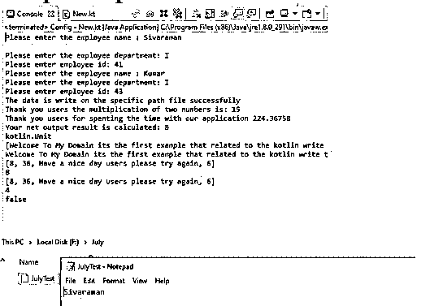
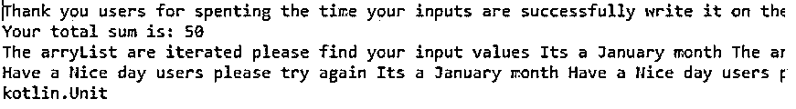
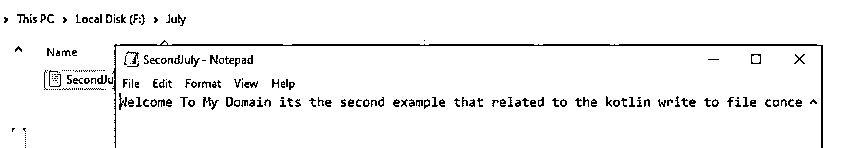

# Kotlin 写入文件

> 原文：<https://www.educba.com/kotlin-write-to-file/>

## Kotlin 写入文件简介

Kotlin 写入文件用于提供扩展功能，或者也可以使用现有的其他编程语言代码，通过使用 writeText()方法将内容写入文件，最有可能的是，它将字符串作为数据类型参数，并将其写入文件如果没有文件存在，将创建新文件错误并指定名称，如果文件已经存在，将替换文件数据首先使用 UTF-8 字符集格式进行编码这是默认设置，也可以指定其他字符集。

### Kotlin 写入文件的语法

Kotlin 语言有许多默认的关键字、变量和其他函数，用于在移动和基于 web 的应用程序中执行和实现 kotlin。它有一些功能，如文件创建和对应用程序的读写操作。

<small>网页开发、编程语言、软件测试&其他</small>

`import java.io.File
fun main()
{
val variablename=””
val vars2=File(variablename)
vars2.writeText(values)
--some logic codes depending on the requirement----
}`

以上代码是在文件概念中使用 writeText()方法的基本语法。我们可以创建文件并将数据写入文件。我们在代码中导入文件包，这样我们就可以利用文件特性。

### 如何在 Kotlin 中写入文件？

*   kotlin 语言的写文件功能是用来在文件中写入数据。方法 writeText()将字符串数据类型值作为参数，并将它们写入文件。如果假设文件没有创建，它将首先创建新文件，然后将数据写入文件。如果文件在那里，它将抛出文件存在错误，如果不在那里，意味着它不抛出指定名称的文件。
*   如果文件处于已经存在的状态，它将替换现有的文件数据。同样，给定的数据首先使用 UTF-8 字符集作为默认字符集进行编码，它也可以使用任何其他字符集进行指定。这是因为 writeText()方法将替换文件中存在的所有数据内容，它将防止当前数据丢失，在这种情况下，我们可以使用另一种方法，如 appendText()函数，而不是在 writeText()函数中写入数据。
*   我们使用了不同类型的 java 类，如 PrintWriter、writeText()、bufferedWriter()和 java.io.File.printWriter()及其方法来执行应用程序中的操作，每个类都希望创建一个单独的实例来调用 kotlin 应用程序中的写操作。

### Kotlin 写入文件的示例

以下是 Kotlin 写入文件的示例:

#### 示例#1

**代码:**

`import java.io.File
import java.nio.file.Files
import java.nio.file.StandardOpenOption
class first (lst:MutableList<Any>){
var vars:MutableList<Any> = lst
fun exam():Boolean = vars.isEmpty()
fun exam1():Int = vars.count()
override fun toString() = vars.toString()
fun enqueue(element:Any){
vars.add(element)
}
fun dequeue():Any?{
if (this.exam()){
return null
} else {
return vars.removeAt(0)
}
}
fun peek():Any?{
return vars[0] }
}
fun multopera(x: Int, y: Int): Int {
var num = x.times(y)
return num
}
fun Employee( empName: String , empdept: Char , empid: Int) {
println("Please enter the employee name : $empName")
println("Please enter the employee department: $empdept")
println("Please enter employee id: $empid")
}
fun main() {
val strinp = "F:/July/JulyTest.txt"
val a = File(strinp)
val b = "Welcome To My Domain its the first example that related to the kotlin write to file concept\n"
val empName = "Sivaraman\n"
val empid = 41
val empdept = 'I'
Employee(empName,empdept,empid)
Employee("Kumar",'I',43)
Files.write(a.toPath(), b.toByteArray(), StandardOpenOption.APPEND)
a.writeText(empName)
println("The data is write on the specific path file successfully")
var mult = multopera(3,5)
println("Thank you users the multiplication of two numbers is: $mult")
val s = 05.43f
val s1 = 41.32f
val out = s * s1
println("Thank you users for spenting the time with our application $out")
var temp = 0
var count = 5642381
while (count != 0) {
count /= 7
++temp
}
println("Your net output result is calculated: $temp")
var x1 = first(mutableListOf("Welcome To My Domain its the first example that related to the kotlin write to file concept",8,36,"Have a nice day users please try again"))
println(x1.enqueue(6))
println(x1)
println(x1.dequeue())
println(x1)
println(x1.peek())
println(x1)
println(x1.exam1())
println(x1.exam())
}`

**输出:**

在上面的例子中，我们使用 write()和 writeText()方法将数据写入文件。

#### 实施例 2

**代码:**

`import java.io.File
import java.nio.file.Files
import java.nio.file.StandardOpenOption
class Test {
fun secondMethod(){
val m=7432
println(m)
var aLs=ArrayList<String>()
aLs.add("Welcome Users please entered your first input element")
aLs.add("Welcome Users please entered your second input element")
aLs.add("Welcome Users please entered your third input element")
aLs.add("Welcome Users please entered your fourth input element")
aLs.add("Welcome Users please entered your fifth input element")
}
}
fun secondMethod(vararg num: Int): Int
{
var a = 0
num.forEach {num -> a += num}
return a
}
fun main() {
val fN = "F:/July/SecondJuly.txt"
val finput = File(fN)
val inps = "Welcome To My Domain its the second example that related to the kotlin write to file concept"
finput.writeText(inps)
println("Thank you users for spenting the time your inputs are successfully write it on the file")
println("Your total sum is: ${secondMethod(5, 10, 15, 20)}")
var ls=ArrayList<String>()
L.add("This month is July month")
for(i in ls)
print("your inputs are iterated and $i ")
println()
ls.set(5,"Thank you users have a nice day your input months are validated and stored it on the arraylist")
for(j in ls)
print("Have a Nice day users please try again $j ")
val te=Test()
println(te.secondMethod())
}`

**输出:**

在第二个示例中，我们使用 writeText()方法将数据写入文件。

#### 实施例 3

**代码:**

`import java.io.File
fun main() {
val fpath = "f:July/third.txt"
val floc = File(fpath)
floc.printWriter().use { wrt ->
wrt.println("Your first input")
wrt.println("Your second input")
}
floc.bufferedWriter().use { wrt ->
wrt.write("Your third input\n")
wrt.write("Your fourth input\n")
wrt.write("Your fifth input\n")
}
println("Your inputs are successfully written in the file")
}`

**输出:**

在最后一个示例中，我们使用 printWriter()和 bufferedWriter()方法将数据写入文件。

### 结论

在 kotlin 语言中，我们使用了许多默认的类及其方法来实现应用程序。每一个方法都有不同的行为和特性，例如文件写入是使用默认方法在文件中写入用户输入和输出数据的特性之一。

### 推荐文章

这是一个 Kotlin 写文件的指南。在这里我们讨论一下入门，如何用 Kotlin 写文件？和示例。您也可以看看以下文章，了解更多信息–

1.  [科特林内嵌函数](https://www.educba.com/kotlin-inline-function/)
2.  [科特林收藏馆](https://www.educba.com/kotlin-collections/)
3.  [科特林元组](https://www.educba.com/kotlin-tuple/)
4.  [科特林循环](https://www.educba.com/kotlin-loops/)

