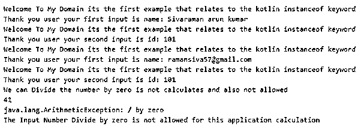
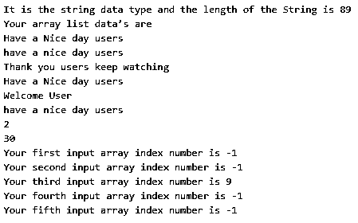
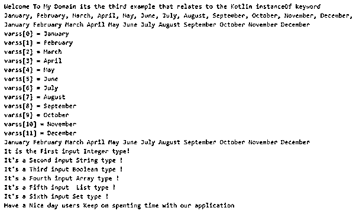

# Kotlin instanceof

> 原文：<https://www.educba.com/kotlin-instanceof/>

## Kotlin 实例简介

instanceof 是 java 语言中的操作符，我们在 kotlin 中使用的是和！是关键字，用于执行类似 instanceof 的操作，即属性的类型是否可用。它是类似类型检查的功能，用于检查特定实例或其他不同变量的类型，而运行时用于分离不同对象的工作流。对于其他语言，这里的转换是可能的。kotlin 使用一些智能转换，使用类似 is 的运算符执行相同的操作，并调用转换值的方法。

**语法:**

<small>网页开发、编程语言、软件测试&其他</small>

kotlin 语言有默认的类及其方法，用于创建应用程序的操作符。我们用了‘是’和‘是’！is”运算符来检查智能转换的变量值。

趣味演示(Any:Any):String？{

退回任何东西？线

—一些登录代码—

}

fun main(args:Array

{

在哪里？

if 或任何其他条件语句(vars 是数据类型)

{

——一些代码—

}

if(vars.isInstance(任何东西))

{

—一些代码—

}

}

以上代码是使用“是”和“是”的基本语法！is”运算符在 kotlin 语言上执行 instanceof 操作。我们可以在不同的操作符中实现实例化操作，比如 is！是，并且作为运算符。

### Kotlin 中 instanceof 函数是如何工作的？

instanceof()方法将用于将数据从一种类型转换为另一种类型。这可能是属于通用类型和另一种类型的铸造的原因。这里我们用的是和！is 运算符来实现和执行 kotlin 语言中的 instanceof 运算。我们使用带有类似 T 字符的泛型类来执行这项任务。不仅仅是类，我们还可以有其他的参数类型来实现这些操作，并且放在每个函数的名字之前。instanceof 将用于其他操作，如数组、集合类型(如 map、list 等)。我们可以使用任何条件循环来迭代描述操作实例的值。一旦迭代完成，就进入用户逻辑所遵循的其他步骤。我们可以传递参数，如具体化的类型参数，以允许并引用具有内联函数中的参数的数据类型，其他类型称为声明-站点差异，允许特定于泛型类型作为类型参数，每个泛型类型的超类型和子类型具有相同的基类型和不同的参数集。

#### 示例#1

`package one
fun demo(x: Int, y: Int) : Any {
return try {
x/y
}
catch(e:Exception){
println(e)
"The Input Number Divide by zero is not allowed for this application calculation"
}
}
fun main(args: Array<String>) {
var name = "Sivaraman arun kumar "
var id = 101
var email = "ramansiva57@gmail.com"
var mobile = 8863752
val details: List<Any> = listOf(name, id, email, mobile)
for (example in details) {
println("Welcome To My Domain its the first example that relates to the kotlin instanceof keyword")
when (example) {
is String -> println("Thank you user your first input is name: $example ")
is Int -> println("Thank you user your second input is id: $id")
is String -> println("Thank you user your third input is email: $email")
is Int -> println("Thank you user your third input is email: $mobile")
else -> println("Have a Nice day users kindly keep on spending time with our application")
}
}
try{
var vara = 123 / 0
}
catch(e: ArithmeticException){
println("We can Divide the number by zero is not calculated and also not allowed")
}
var out1 = demo(123,3)
println(out1)
var out2 = demo(123,0 )
println(out2)
}`

**输出:**

在上面的例子中，我们使用 is 操作符来执行 instanceof 操作符，我们可以计算算术运算和错误抛出，并使用 try-catch 块进行捕获。

#### 实施例 2

`package one
fun main(args: Array<String>) {
val st1: String? = "Welcome To My Domain its the second example that relates to the kotlin instanceof keyword"
var st2: String? = null
if(st1 !is String) {
println("It is the another data type and also the string value is null")
}
else {
println("It is the string data type and the length of the String is ${st1.length}")
}
var lst = ArrayList<String>()
lst.add("Have a Nice day users")
lst.add("have a nice day users")
println("Your array list data’s are")
for(i in lst)
println(i)
lst.add( 1 , "Welcome User")
println("Thank you users keep watching")
for(i in lst)
println(i)
val varss = listOf(2, 15, 17, 132, 30, 23, 12, 16, 33, 45)
val x = varss.get(0)
println(x)
val y = varss[4] println(y)
val eg1 = varss.indexOf(1)
println("Your first input array index number is $eg1")
val eg2 = varss.lastIndexOf(1)
println("Your second input array index number is $eg2")
val eg3 = varss.lastIndex
println("Your third input array index number is $eg3")
val eg4 = varss.lastIndexOf(3)
println("Your fourth input array index number is $eg4")
val eg5 = varss.indexOf(5)
println("Your fifth input array index number is $eg5")
}`

**输出:**

在第二个示例中，我们计算 if 条件语句中的 is 运算符，以验证带有集合的用户数据。

#### 实施例 3

`package one
fun demo(any: Any) = when (any){
is Int -> println("It is the First input Integer type!")
is String -> println("It's a Second input String type !")
is Boolean -> println("It's a Third input Boolean type !")
is Array<*> -> println("It's a Fourth input Array type !")
is List<*> -> println("It's a Fifth input  List type !")
is Set<*> -> println("It's a Sixth input Set type !")
else -> println("Have a Nice day users Keep on spenting time with our application")
}
fun main (args: Array <String>) {
println("Welcome To My Domain its the third example that relates to the Kotlin instanceOf keyword")
val varss = listOf("January", "February", "March", "April", "May", "June", "July", "August","September",
"October", "November", "December")
for (vart in varss) {
print("$vart, ")
}
println()
for (i in 0 until varss.size) {
print("${varss[i]} ")
}
println()
varss.forEachIndexed({i, j -> println("varss[$i] = $j")})
val it: ListIterator<String> = varss.listIterator()
while (it.hasNext()) {
val j = it.next()
print("$j ")
}
println()
demo(65)
demo("Third Example")
demo(true)
demo(arrayOf(3, 6))
demo(listOf(2, 4))
demo(setOf(4, 8))
demo(7.0)
}`

**输出:**

我们使用的最后一个例子是具有不同数据类型的操作符，它使用数组列表计算月份的详细信息。

### 结论

总之，part kotlin 使用了许多概念和特性来实现类似 android 的移动应用程序。例如，instanceof 是 java 等其他语言中使用的特性和关键字之一，但在 kotlin 中，我们可以使用 is 关键字在 kotlin 应用程序上实现此操作。

### 推荐文章

这是一份科特林实例指南。在这里，我们讨论了函数 instanceof 在 Kotlin 中是如何工作的，并给出了例子和输出。您也可以看看以下文章，了解更多信息–

1.  [科特林范围](https://www.educba.com/kotlin-range/)
2.  [科特林算子](https://www.educba.com/kotlin-operators/)
3.  [科特林函数](https://www.educba.com/kotlin-functions/)
4.  [安装 Kotlin](https://www.educba.com/install-kotlin/)

