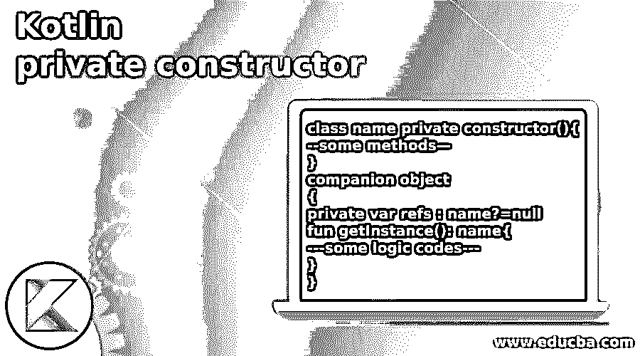
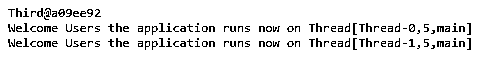
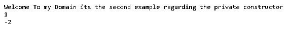

# 科特林私有构造函数

> 原文：<https://www.educba.com/kotlin-private-constructor/>

## Kotlin 私有构造函数简介

kotlin 私有构造函数是构造函数类型之一，它用于在不需要的情况下停止对象创建；如果用户决定相应地为自己创建对象，那么内存将被分配给特定的实例以及用于引用主方法实例的类方法。私有构造函数也被称为 singleton 模式。构造函数使用构造函数括号在类头中提供自定义可见性。默认函数将直接应用于与 kotlin 语言上的标准库相关的对象。

**语法:**

<small>网页开发、编程语言、软件测试&其他</small>

在 kotlin 语言中有许多默认函数、变量和关键字，比以往任何时候都多。类是声明的主要角色，这些类变量和方法将使用构造函数在 main 方法上调用它。这里构造函数将使用私有修饰符。

`class name private constructor(){
--some methods—
}
companion object
{
private var refs : name?=null
fun getInstance(): name{
---some logic codes---
}
}`

上面的代码是实现私有构造函数的基本语法，就像调用类属性的单例模式一样。Kotlin Instance()方法用于调用和执行私有构造函数对象。

### 私有构造函数在 Kotlin 中是如何工作的？

在 kotlin 语言中，我们使用类、方法和变量来实现应用程序用户定义的逻辑。每当创建对象时，kotlin 中的类都用默认的构造函数调用。基本上，柯特林用不同的方式创造这个物体。在这种情况下，我们使用 private constructor 作为与 kotlin 类一起使用的关键字。主构造函数具有可在初始化器块中使用的参数实参，以及要在类体中初始化的属性。

如果类构造函数有注释等修饰符和二级构造函数需要的参数，这就需要直接委托给主构造函数或者通过二级构造函数间接委托给主构造函数。委托概念涉及相同和不同类的构造函数，在构造函数中使用这个关键字来完成。构造函数参数，用于使类具有创建嵌套内部和外部类实例的可见性。我们可以使用 kotlin 代码中的父类和子类关系，因此继承适用于同一个包中的 public 和 private。但是 singleton 实例是在 getInstance()方法的帮助下执行操作的。

### Kotlin 私有构造函数的示例

下面提到了不同的例子:

#### 示例#1

**代码:**

`class new private constructor() {
companion object {
fun demo() {
println("Welcome To My Domain its a first example related to the kotlin private constructor")
var vars = "Please enter your input values"
}
var p: Int = 3
var empid:Int = 2021
var empName:String="sivaraman"
var empSalary:Int=25000
var empAddress:String="Flat 12C, Sathya Enclave, Sathyamoorthy Nagar, Muthamizh Theru, chengalpattu district, chennai-600063"
fun details(){
println("Your details are: $p")
p++
}
fun empdetails(){
println("Welcome To My Domain this is the first example regarding the kotlin private constructor and also the employee details are needed for their security purpose")
println("${this.empid}")
println("${this.empName}")
println("${this.empSalary}")
println("${this.empAddress}")
println("We have entered the student details like employee id, employee name, employee salary, employee Address etc the information’s are encrypted and it is stored in the separated database server")
}
}
}
class new1{
fun exam() = println("Have a nice day users please keep on continue to spent with our application")
var stdid:Int = 83
var stdName:String="sivaraman"
var stdRollno:Int=41
var stdAddress:String="Flat 12C, Arvind Enclave, Sathyamoorthy street, Srinivasa nagar, chengalpattu district, chennai-600063"
fun stddets(){
println("Welcome To My Domain this is the second example regarding the kotlin private constructor")
println("${this.stdid}")
println("${this.stdName}")
println("${this.stdRollno}")
println("${this.stdAddress}")
println("We have entered the student details like student id, student name, student roll number, student Address etc the information’s are encrypted and it is stored in the database server")
}
}
fun main(args: Array<String>) {
var s = "Your companion object is called and used on this variable regarding the kotlin private constructor"
val ob=new1()
println(ob.exam())
println(ob.stddets())
println(s)
}`

**输出:**

在上面的例子中，我们使用了一个带有伴随对象的私有构造函数来调用 main 方法。我们无法为私有构造函数创建对象。

#### 实施例 2

`open class SecPrCon private constructor() {
fun example(): String {
return "Please enter your inputs"
}
companion object {
private var vars : SecPrCon? = null
fun getInstance(): SecPrCon {
if (vars == null) {
println("Please enter your valid inputs, still you are not entered valid inputs")
vars = SecPrCon()
println("Thank you users your inputs are successfully entered")
}
return vars as SecPrCon
}
}}
fun main(arg:Array<String>)
{
println("Welcome To my Domain its the second example regarding the private constructor")
val bls = mutableListOf('j', 'u', 'n', 'e')
println(bls.binarySearch('u'))
bls.remove('e')
val sr = bls.binarySearch('u')
val cresult = -(sr + 1)
println(cresult)
bls.add(cresult, 'd')
println(bls)
data class eg(val st: String)
val va = listOf("J", "uly", "Month wise datas", "Please provide", "correct datas")
val qa = va.map { eg(it) }
val fnd = "eg"
val out = qa.binarySearch { String.CASE_INSENSITIVE_ORDER.compare(it.st, fnd) }
if (out >= 0) {
println("st at $out is ${qa[out]}")
} else {
println("eg with st=$fnd was not found in the data list please enter correct results")
}
}`

**输出:**

在第二个例子中，我们使用二进制和堆排序，搜索私有构造函数元素。

#### 实施例 3

**代码:**

`import Third.Companion.tdemo
class Third private constructor() {
companion object {
fun tdemo() = Third()
}
}
class th1: Thread() {
public override fun run() {
println("Welcome Users the application runs now on ${Thread.currentThread()}")
}
}
class th2: Runnable {
public override fun run() {
println("Welcome Users the application runs now on ${Thread.currentThread()}")
}
}
fun main()
{
//val ins1 = Third()
val ins2 = tdemo()
println(ins2)
val thread = th1()
thread.start()
val runnable = th2()
val thread1 = Thread(runnable)
thread1.start()
}`

**输出:**

在最后一个例子中，我们另外使用了多线程的概念，在这里使用私有构造函数，我们可以通过使用私有构造函数类的伴随对象来创建对象。

### 结论

在 kotlin 中，构造函数对于对象创建很重要，因为它有不同的类型，如公共、默认和私有构造函数。public 被指定为 normal，它可以用于内部和外部的所有类型的包。但是，如果我们没有使用构造函数，代码会自动采用默认值；私有构造函数不能在包外部实现。

### 推荐文章

这是一个 Kotlin 私有构造函数的指南。这里我们讨论私有构造函数在 Kotlin 中是如何工作的，以及代码和输出的例子。您也可以看看以下文章，了解更多信息–

1.  [科特林 kclass](https://www.educba.com/kotlin-kclass/)
2.  [釜用 JSON](https://www.educba.com/kotlin-json/)
3.  [科特林群比](https://www.educba.com/kotlin-groupby/)
4.  [科特林构造函数](https://www.educba.com/kotlin-constructors/)

