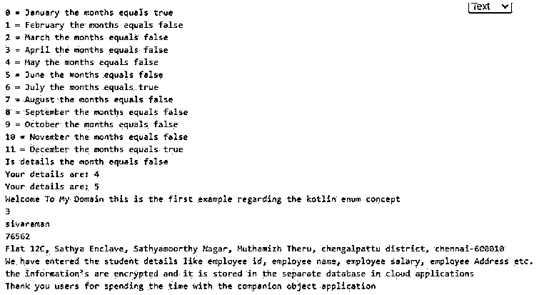
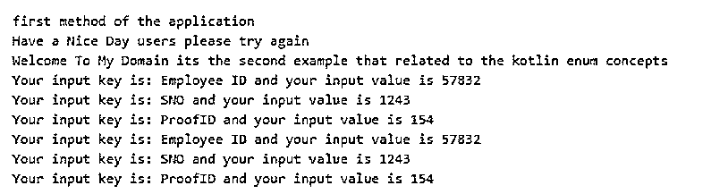
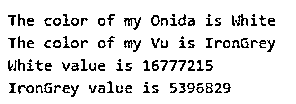

# 科特林枚举

> 原文：<https://www.educba.com/kotlin-enum/>

## 科特林枚举简介

kotlin 枚举是可以保存的数据类型之一，用于为每个数据类型设置数据常数。每个常数都是一个独立的对象。常量之间用逗号或其他运算符等分隔符分隔。所以枚举也作为一个独立的对象，类似于类。只要代码中需要枚举实例的方法，就会调用它们。enum 常量也充当匿名类及其相应的方法，并且类似于重写基方法。枚举类用成员定义，用分号运算符定义。

**科特林枚举的语法**

<small>网页开发、编程语言、软件测试&其他</small>

Kotlin 语言有许多默认的概念，如类、方法、枚举等。Enum 还充当类、变量和其他已定义的方法数据类型。

`enum class name{
---some declaration codes and methods if requires—
}
fun main()
{
-----Condition loops like if, for,… to iterate the enum values ----
}`

上述代码是声明枚举常量的基本语法，它们可以在 main 方法上使用和迭代。我们也可以使用枚举名称来调用枚举值。该值和它可以存储为一个单独的变量引用。

### Kotlin 中的 enum 是如何工作的？

*   kotlin 枚举类还与 static 关键字及其功能一起用于保存引用变量值。Enum 也充当接口；它不是从类中派生出来的，但是我们可以利用和调用这些值，并将它们存储为单独的变量。因为 java 枚举在 kotlin 枚举中被更多地使用，所以枚举被作为类使用，所以它也作为匿名类使用，同时它实现自己的函数和属性，这些函数和属性被用在特定的逻辑上，如覆盖和重载概念。当我们使用覆盖时，类的抽象函数将在子类中实现。
*   最重要的是每个枚举常量都有一个单独的引用，用于在内存位置保存值。这些常量与 enum 类中定义的自然和排序顺序的可比接口进行比较。kotlin 的枚举类只定义了一个新的类型，它们可以有自己的属性和函数来实现应用程序。这些属性可以是默认值，但是，它没有提供应使用其自身的属性值定义的其他常数。

### 科特林枚举的示例

以下是 Kotlin enum 的示例:

#### 示例#1

**代码:**

`package one;
enum class Months(val years: Boolean = false){
January(true),
February,
March,
April,
May,
June,
July(true),
August,
September,
October,
November,
December(true);
companion object{
fun details(mnths: Months): Boolean {
return mnths.name.compareTo("July") == 0 || mnths.name.compareTo("January") == 0
}
}
}
class first
{
var stdid:Int = 12
var stdName:String="arunkumar"
var stdRollno:Int=1234
var stdAddress:String="Sathyamoorthy street, moorthy nagar, chengalpattu district, chennai"
fun stddets(){
println("Welcome To My Domain this is the first example regarding the kotlin enum concept")
println("${this.stdid}")
println("${this.stdName}")
println("${this.stdRollno}")
println("${this.stdAddress}")
println("We have entered the student details like student id, student name, student roll number, student Address etc. the information’s are encrypted and it is stored in the separate database in cloud applications")
}
companion object Test{
var x: Int = 4
var empid:Int = 3
var empName:String="sivaraman"
var empSalary:Int=76562
var empAddress:String="Flat 12C, Sathya Enclave, Sathyamoorthy Nagar, Muthamizh Theru, chengalpattu district, chennai-600010"
fun details(){
println("Your details are: $x")
x++
}
fun empdetails(){
println("Welcome To My Domain this is the first example regarding the kotlin enum concept")
println("${this.empid}")
println("${this.empName}")
println("${this.empSalary}")
println("${this.empAddress}")
println("We have entered the student details like employee id, employee name, employee salary, employee Address etc. the information’s are encrypted and it is stored in the separate database in cloud applications")
}
}
}
fun main(args:Array<String>){
for(vars in Months.values()) {
println("${vars.ordinal} = ${vars.name} the months equals ${vars.years}")
}
val details = Months.February;
println("Is details the month equals ${Months.details(details)}")
first.details()
first.Test.details()
first.Test.empdetails()
println("Thank you users for spending the time with the companion object application")
}`

**输出:**

在上面的例子中，我们使用枚举声明了月份细节。

#### 实施例 2

**代码:**

`package one;
enum class Second(var sec: String) {
demo("first method"){
override fun exam() {
println("first method of the application")
}
},
demo1("second method"){
override fun exam() {
println("second method of the application")
}
},
demo2("third method"){
override fun exam() {
println("demo2 method of the application")
}
};
abstract fun exam()
}
class example{
var x: String = "Welcome To My Domain"
get() = field
set(eg) {
field = eg
}
}
interface inf {
val test: Int
fun eg() : String
}
class ex:inf{
override val test:Int=132
override fun eg()="Please try again"
}
inline fun <reified T> sample(lst: List<Any>): Boolean {
lst.forEach {
if (it is T) {
System.out.println("Welcome To My Domain its the second example that related to the kotlin enum concepts")
return true
}
}
System.out.println("Thank you users kindly write the code that related to the kotlin enum")
return false
}
fun main(args: Array<String>) {
Second.demo.exam()
val u = example()
u.x = "Have a Nice Day users please try again"
println(u.x)
val vars = ex()
sample<String>(listOf("arun", 5, args))
val vt = mapOf<String, Int>("Employee ID" to 57832, "SNO" to 1243, "ProofID" to 154)
for ((k,v) in vt) {
println("Your input key is: $k and your input value is $v")
}
vt.forEach { (k, v) ->
println("Your input key is: $k and your input value is $v")
}
}`

**输出:**

在第二个例子中，我们使用类和枚举接口计算雇员的详细信息。

#### 实施例 3

**代码:**

`package one;
fun main(args: Array<String>) {
val tv: TV = TV("Onida",TVColor.White)
val tv2: TV = TV("Vu",TVColor.IronGrey)
println("The color of my "+tv.tvname+" is "+tv.color)
println("The color of my "+tv2.tvname+" is "+tv2.color)
println(tv.color.toString() + " value is "+tv.color.value)
println(tv2.color.toString() + " value is "+tv2.color.value)
}
data class TV(val tvname:String, val color: TVColor)
enum class TVColor(val value: Int) {
White(0xFFFFFF),
IronGrey(0x52595d),
}`

**输出:**

在最后一个例子中，我们可以在 enum 上使用电视要求，如颜色等。

### 结论

在 kotlin 语言中，他们使用不同的概念来实现具有用户需求的基于移动设备的应用程序。就像那样，enum 是其中一个特性，它用一些高级特性来定义和初始化常量，比如在实现接口时使用一些匿名类和 enum 来定义 enum 常量。

### 推荐文章

这是一个科特林枚举指南。这里我们讨论一下入门，在 kotlin 中 enum 是如何工作的？以及更好理解的例子。您也可以看看以下文章，了解更多信息–

1.  [科特林范围](https://www.educba.com/kotlin-range/)
2.  [科特林循环](https://www.educba.com/kotlin-loops/)
3.  [科特林构造函数](https://www.educba.com/kotlin-constructors/)
4.  [科特林琴弦](https://www.educba.com/kotlin-string/)

