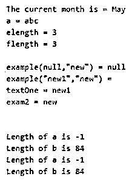
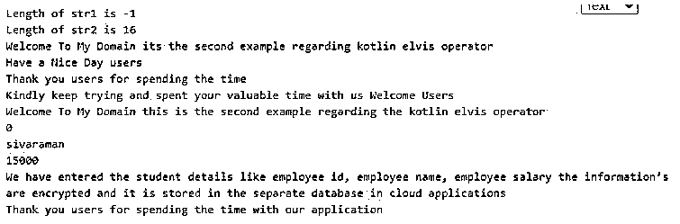
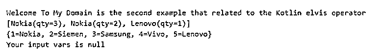

# 科特林·埃尔维斯操作员

> 原文：<https://www.educba.com/kotlin-elvis-operator/>

## 科特林猫王算子简介

kotlin elvis 是用于返回非空值的操作符之一，即使条件语句为空，它也主要用于检查空值的安全性。它还充当一个变量，因为每个变量在内存中都保存了一些引用，它可以用来从后端将值检索到 UI。变量引用也为空。从前端和后端对条件语句进行检查和验证。验证可以是任何数据类型，它不采用特定方式。如果数据类型值为空，将使用属性。否则，将使用其他非空值。

**语法:**

<small>网页开发、编程语言、软件测试&其他</small>

在 kotlin 语言中，许多运算符用于执行应用程序中的操作。比如，elvis 是一种仅当条件语句为空时才返回 not null 值的操作符。

`fun main(args:Array<String>)
{
var variable name: datatype?= null
var vars:datatype?=values
---some conditional statements if required based on the needs----
}`

以上代码是在 kotlin 语言中使用 Elvis 操作符的基本语法。即使条件语句为空。

### 猫王接线员在科特林是怎么工作的？

*   我们可以声明这些值，它们可以通过一些内存引用存储在后端。如果我们需要这些值，我们可以使用引用来检索它们；它可以被获取并显示在 UI 屏幕上。如果假设值为空，它也包含变量的引用，计算和验证使用一些条件语句代替它，我们可以使用 elvis 运算符，如“？:"用于验证值。借助于操作符来验证用户表达式；如果假设不为空，则运算符返回它；否则，无论用户端声明什么，都将返回相同的表达式。
*   该运算符还接收两个输入，如果第一组参数非空，它将只返回第一组参数，否则第二组输入将使用。Kotlin 有一些表达式，有时会被条件语句评估和验证；它抛出一个错误，并返回将在 Elvis 操作符右侧使用的表达式。这些运算符也与函数一起使用来执行逻辑；它们也可以用来验证论点。

### 科特林·埃尔维斯算子的例子

以下是 Kotlin Elvis 操作员的示例:

#### 示例#1

**代码:**

`package one;
class Demo (
var January: String,
var February: String?,
var March: String,
var April: String?,
var May:String
)
fun main(args: Array<String>){
var x: Demo? = null
x = Demo("Jan", null, "Mar",null, "May")
val y = x?.February ?: "May"
println("The current month is = $y")
val month: String = year()
println(month)
var a: String? = null
var b: String? = "Welcome To My Domain its the first example that related to the Kotlin Elvis operator"
var alength: Int = a ?.length ?: -1
var blength: Int = b ?.length ?: -1
println("Length of a is ${alength}")
println("Length of b is ${blength}")
var c: String? = null
var d: String? = "Welcome To My Domain its the first example that related to the Kotlin Elvis operator"
var clength: Int = if (c != null) c.length else -1
var dlength: Int = if (d != null) d.length else -1
println("Length of a is ${clength}")
println("Length of b is ${dlength}")
}
fun year(): String{
val a: String? ="abc"
val elength: Int = if(a!= null) a.length else -1
val flength: Int = a?.length ?: -1
var string = "a = $a\n"+
"elength = $elength\n"+
"flength = $flength\n\n"
fun example(exam1: String?, exam2: String?): String?{
val exam1 = exam1 ?: return null
val exam2 = exam2 ?: IllegalArgumentException("If the input is incorrect the exception is occured")
return "\ntextOne = $exam1\n"+
"exam2 = $exam2\n"
}
string += "example(null,\"new\") = ${example(null,"new")}\n" +
"example(\"new1\",\"new\") = ${example("new1","new")}\n"
return string
}`

**输出:**

在上面的例子中，我们使用了一些基本的概念，比如包含在 Elvis 操作符中的类。

#### 实施例 2

**代码:**

`package one;
fun Second(exam: (id: String)->Unit, id: String){
println("Welcome To My Domain its the second example regarding kotlin elvis operator")
println("Have a Nice Day users")
exam(id)
}
inline fun Exam(exam: (id: String)->Unit, id: String){
println("Welcome To My Domain its the second example regarding kotlin elvis operator")
println("Have a Nice Day users please try again")
exam(id)
}
class Fun {
companion object eg{
var p: Int = 1
var empid:Int = 0
var empName:String="sivaraman"
var empSalary:Int=15000
fun details(){
println("Your details are: $p")
p++
}
fun empdetails(){
println("Welcome To My Domain this is the second example regarding the kotlin elvis operator")
println("${this.empid}")
println("${this.empName}")
println("${this.empSalary}")
println("We have entered the student details like employee id, employee name, employee salary the information’s are encrypted and it is stored in the separate database in cloud applications")
}
}
}
fun main() {
var str1: String? = null
var str2: String? = "Employee Details"
var strlen1: Int = if (str1 != null) str1.length else -1
var strlen2: Int = if (str2 != null) str2.length else -1
println("Length of str1 is ${strlen1}")
println("Length of str2 is ${strlen2}")
Second({ id: String ->
println("Thank you users for spending the time")
println("Kindly keep trying and spent your valuable time with us $id")
}, "Welcome Users")
Fun.eg.empdetails()
println("Thank you users for spending the time with our application")
}`

**输出:**

在第二个例子中，我们通过 Elvis 操作符使用了内联和密封类。

#### 实施例 3

**代码:**

`package one;
sealed class Mobile
data class Nokia(val qty: Int) : Mobile()
data class Lenovo(val qty: Int) : Mobile()
fun main() {
val lst:List<Mobile> = listOf(Nokia(3),Nokia(2), Lenovo(1))
println("Welcome To My Domain is the second example that related to the Kotlin elvis operator ")
println(lst)
val hmp = HashMap<Int, String>()
hmp.put(1, "Nokia")
hmp.put(2, "Siemen")
hmp.put(3, "Samsung")
hmp.put(4, "Vivo")
hmp.put(5, "Lenovo")
println(hmp)
val vars1:String?=null
val vars2:String?="Have a nice day users"
if(vars1 != null) vars1.length
else {
println("Your input vars is null")
}
if(vars2 != null) vars2.length
else {
println("Your input vars2 is null")
}
}`

**输出:**

在最后一个例子中，我们可以使用集合概念计算移动数量，包括 Elvis 操作符。

### 结论

在 kotlin 中，elvis 算子是用于验证非空条件的常用算子之一。它还保存内存位置中的空引用和变量引用的地址，这也通过使用 Elvis 操作符进行验证。

### 推荐文章

这是一个指南科特林猫王运营商。这里我们讨论一下入门，猫王算子在科特林是如何工作的？和示例。您也可以看看以下文章，了解更多信息–

1.  [科特林范围](https://www.educba.com/kotlin-range/)
2.  [科特林循环](https://www.educba.com/kotlin-loops/)
3.  [科特林构造函数](https://www.educba.com/kotlin-constructors/)
4.  [科特林琴弦](https://www.educba.com/kotlin-string/)

