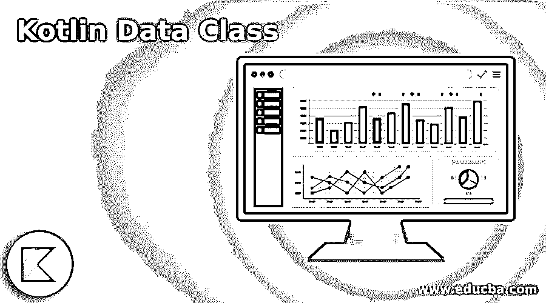
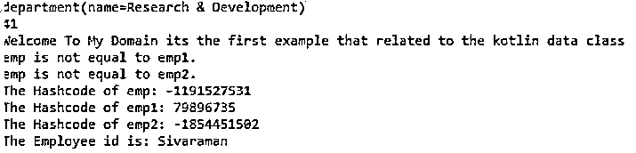
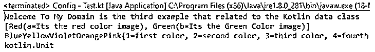

# 科特林数据类

> 原文：<https://www.educba.com/kotlin-data-class/>

## Kotlin 数据类简介

kotlin 数据类是用于保存用户输入数据和状态的类型和功能之一。在这种情况下，我们使用一些标准函数来导出数据，以确保一致性，并且生成代码是一种有意义的行为。 它有主构造函数，帮助并需要传递至少一个参数，这些参数都有主构造函数，需要标记为 val 或 var 类型。数据类不能是抽象的，它也是一个开放的密封或内部类型。

**kot Lin 数据类的语法**

<small>网页开发、编程语言、软件测试&其他</small>

在 kotlin 语言中，我们使用类、方法和其他预定义的关键字来创建基于移动设备的应用程序。例如，在数据类中有一个概念和特性，用于在一些标准关键字和方法的帮助下存储和保存数据和状态。

`fun main(args:Array<String>)
{
data class classname(val name: datatype, var name1:datatype,…)
------some logics and codes which based on the requirement---
}`

上面的代码是在 kotlin 语言的 main 方法中使用数据类的基本语法。我们可以传递 n 个参数，这有助于在整个包中调用和声明数据类。

### Kotlin 中的数据类是如何工作的？

*   数据类是开发应用程序的特性和概念之一，它有助于并行存储和保存数据和状态。比较类是最好的方法之一，它是避免锅炉板代码的更好的解决方案。它还修改了类的修饰符数据；它将自动生成默认方法，如 toString()、equals()等。我们主要可以使用 toString()方法将输入转换为字符串格式，并检查字符串输入和哈希内存中的存储。数据类不能扩展，所以它看起来和抽象概念相似。在使用 getter 和 setter 方法访问数据时，它只包含字段和其他 crud 方法。
*   它看起来也像其他类使用的数据的简单容器，它不包含任何附加功能，并且不能在操作它们所拥有的数据时独立处理。如果我们想要继承数据类，我们可以使用 open 关键字来继承它。数据类是编译器自动编译的标准功能，如 equals()、toString()等。，当数据类加载到编译器上时。它还分离了主构造函数的至少一个参数；它应该是 val 或 var 关键字。它只在接口的帮助下实现。

### Kotlin 数据类的示例

以下是 Kotlin 数据类的示例:

#### 示例#1

**代码:**

`package one;
sealed class Month
data class Date(val a: Int) : Month()
data class Year(val b: Int) : Month()
data class Employee(val name: String, val id: Int)
fun main(args: Array<String>)
{
data class department(val name: String)
{
var empid: Int = 0;
}
val out=department("Research & Development")
out.empid = 41
println(out.toString());
println(out.empid);
println("Welcome To My Domain its the first example that related to the kotlin data class")
val emp = Employee("Sivaraman", 31)
val emp1 = Employee("Siva", 32)
val emp2 = Employee("Raman", 29)
if (emp.equals(emp1) == true)
println("emp is equal to emp1.")
else
println("emp is not equal to emp1.")
if (emp.equals(emp2) == true)
println("emp is equal to emp2.")
else
println("emp is not equal to emp2.")
println("The Hashcode of emp: ${emp.hashCode()}")
println("The Hashcode of emp1: ${emp1.hashCode()}")
println("The Hashcode of emp2: ${emp2.hashCode()}")
val id=emp.component1()
println("The Employee id is: $id")
fun new()
{
val listss:List<Month> = listOf(Date(17),Year(2021), Year(2021))
println("Welcome To My Domain is the first example that related to the Kotlin data class ")
println(listss)
val mapss = HashMap<Int, String>()
mapss.put(1, "siva")
mapss.put(2, "raman")
mapss.put(3, "arun")
mapss.put(4, "kumar")
mapss.put(5, "dhanajay kumar prasad")
mapss.put(6, "arul")
mapss.put(7, "devendran redim kumar tharun")
mapss.put(8, "daisy sran kumar yadav")
mapss.put(9, "Alan nirmal williamson")
mapss.put(10, "varadhaman vishal jain")
println(mapss)
}
}`

**输出:**

在上面的例子中，我们使用带有数据类的集合；另外，我们使用了一个基本的方法，比如 Hash code()等。用于从内存中检索哈希引用。

#### 实施例 2

**代码:**

`package one;
data class Textile(var name: String, var brandName: String = "Derby", var Quality: Long = 2345, var Qunatity: Int = 10, var cost: Int = 500)
data class User(var name: String, var age: Int)
fun main(args: Array<String>) {
var Textile = Textile("Sivaraman","Derby", 2345, 10, 500)
println(Textile)
Textile = Textile("Welcome To My Domain its the Second Example that related to the Kotlin data class")
println(Textile)
Textile = Textile("Jockey",cost = 800)
println(Textile)
Textile = Textile("Allensolly","DSP",Qunatity = 15, cost = 1200)
println(Textile.toString())
Textile = Textile("Viking","Poomex",Qunatity = 27)
println(Textile.toString())
println("We can copy the data class datas into the separate variable and while calling the copy() function for to store it")
val res = User("Siva", 32)
println(res)
val result = res.copy()
println(result)
}`

**输出:**

在第二个例子中，我们使用带有预定义方法(如 copy()方法)的数据类来执行主方法的复制操作。

#### 实施例 3

**代码:**

`package one;
import java.io.Serializable
import kotlin.reflect.full.superclasses
sealed class Colors
data class Red(val a: String) : Colors()
data class Green(val b: String) : Colors()
class Test:Serializable{
fun demo()
{
val lst:List<Colors> = listOf(Red("Its the red color image"),Green("Its the Green Color image"))
println("Welcome To My Domain is the third example that related to the Kotlin data class ")
println(lst)
val lst1: List<String> = listOf("Blue", "Yellow", "Violet", "Orange", "Pink")
val arrayres: Array<String> = lst1.toTypedArray()
arrayres.forEach { System.out.print(it) }
val mp = HashMap<Int, String>()
mp.put(1, "first color")
mp.put(2, "second color")
mp.put(3, "third color")
mp.put(4, "fourth color")
mp.put(5, "fifth color")
mp.put(6, "sixth color")
mp.put(7, "seventh color")
mp.put(8, "eigth color")
mp.put(9, "ninth color")
mp.put(10, "tenth color")
println(mp)
}
}
fun main(args: Array<String>) {
val nm= Test()
println(nm.demo())
}`

**输出:**

在最后一个例子中，我们还使用了集合概念，比如 map，一个包含数据类的列表。

### 结论

在 kotlin 中，语言类是蓝图模型之一，它可以存储所有的方法和默认变量。如果我们调用类中的特定方法，我们可以创建实例并调用特定的方法。这里，数据类与普通类有些不同；它不能使用默认方法扩展和存储数据/状态。

### 推荐文章

这是 Kotlin 数据类的指南。这里我们讨论一下入门，kotlin 中的数据类是如何工作的？和示例。您也可以看看以下文章，了解更多信息–

1.  [科特林范围](https://www.educba.com/kotlin-range/)
2.  [科特林循环](https://www.educba.com/kotlin-loops/)
3.  [科特林构造函数](https://www.educba.com/kotlin-constructors/)
4.  [科特林琴弦](https://www.educba.com/kotlin-string/)

