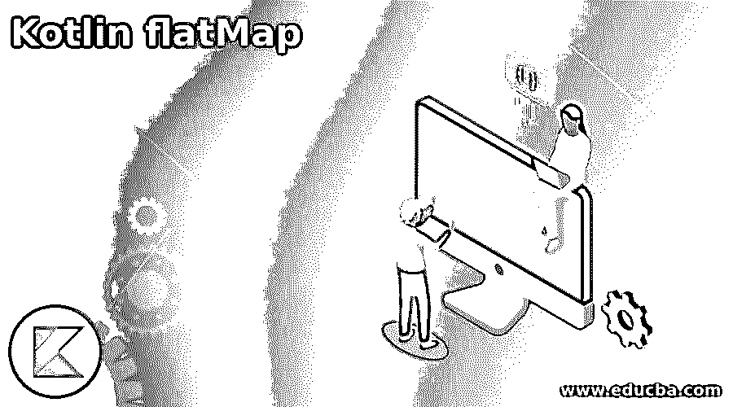
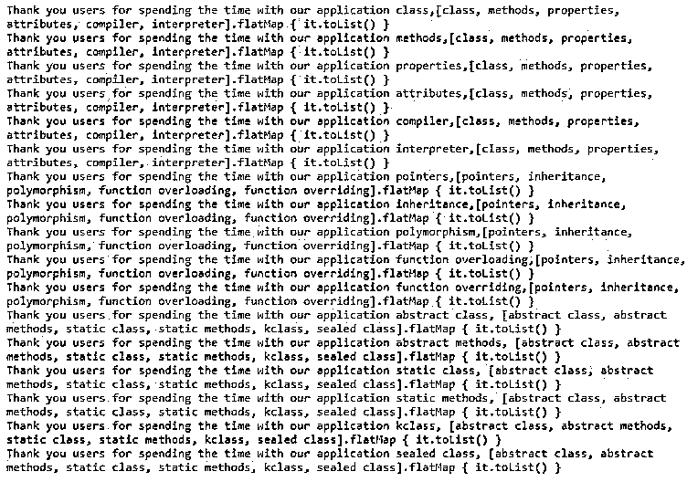
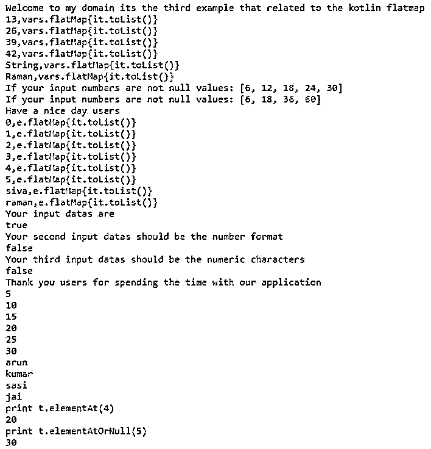

# 科特林平面地图

> 原文：<https://www.educba.com/kotlin-flatmap/>

## Kotlin 平面地图简介

下面的文章提供了 Kotlin 平面图的概要。平面图是其中的一个功能，它用于与两个不同的集合相结合，并与集合一起返回生成的所有元素的单个列表，并通过应用某些条件从结果中检索数据，以检查原始集合的每个元素。元素/项目被转换，并通过可观察的方式发送到指定的序列中。列表项可以是任何数据类型，如字符串、整数。每个值元素都必须与单独的内存引用、传输的数据以及在原始映射的单独条目上调用的函数的结果一起存储。

**kot Lin 平面图的语法**

<small>网页开发、编程语言、软件测试&其他</small>

在 kotlin 语言中，集合是最重要的 util 包之一，因为一些预定义的类，如 map、list 等。flatMap()是用于从输入结果创建单个列表条目集的方法之一。

`fun main(args:Array<String>)
{
val varss= listOf(“”) // Instead of listOf() method we can use any other collection methods like hashmap etc.
vars.flatMap{
----some logic codes which depends on the user input requirement---
}
}`

上面的代码是在带有 kotlin 集合的程序中使用 flatMap()方法的基本语法。

### 在 Kotlin 中 flatMap 是如何工作的？

*   平面图是实现单个集合列表的默认方法之一，可以从其他多个集合转换而来。主要是将可观察对象发出的项转换成可观察对象，并将数据保存在其他类似的集合数据中，如 hashmap、list 等。不同的集合如 map、arraylist 是分开的，它被解析成一个单级数据集。它可以是字符串、整数、浮点、小数等。该方法支持任何数据类型来存储和检索数据。
*   平面图用于组合所有的集合行项目，以及可以按特定顺序排序的数据，每个值将有一个特定的索引，并且这些索引范围与集合使用的其他数据类型不同。映射索引和过滤器最有可能在收集包中用于过滤和减少代码；应避免使用锅炉板代码。
*   如果用例已经通过使用平面图使用转换的数据进行了排序，一些元素应该被忽略，这样我们就有了在使用平面图之前添加过滤器的解决方法，缺点是它破坏了一些智能转换。对于在 flatMap()方法执行操作期间使用的元素，我们可以使用其他方法，如 sequenceOf()方法。

### 科特林平面图示例

以下是 Kotlin 平面图的示例:

#### 示例#1

**代码:**

`package one;
open class Language
{
fun Java()
{
println("Welcome To My Domain Thank you for learning the java language")
}
fun Cpluspluslang()
{
println("Welcome To My Domain Thank you for learning the C++ language")
}
fun Kotlin()
{
println("Welcome To My Domain Thank you for learning the Kotlin language")
}
fun Python()
{
println("Welcome To My Domain Thank you for learning the Python language")
}
fun Go()
{
println("Welcome To My Domain Thank you for learning the Go language")
}
fun Clang()
{
println("Welcome To My Domain Thank you for learning the C language")
}
fun DotNet()
{
println("Welcome To My Domain Thank you for learning the DotNet language")
}
}
fun main(args:Array<String>)
{
val ls1 = listOf("Java", "C", "C++", "Kotlin","Python","Go","DotNet","JavaScript")
println(ls1.flatMap { it.toList() })
val ls2 = listOf("Monday", "Tuesday", "Wednesday", "Thrusday","Friday","Saturday","Sunday")
println(ls2.flatMap { it.toList() })
val ls3 = listOf("January", "February", "March", "April","May","June","July","August","September","October","November","December")
println(ls3.flatMap { it.toList() })
val ls4 = listOf("HP", "Lenovo", "HCL", "Apple","Wipro","Samsung","Thinkpad","Dell")
println(ls4.flatMap { it.toList() })
val ls5 = listOf("Information Technology", "Accounts", "Finance", "Sales and Marketing","Support","Research and Development","Hosting","Management")
println(ls5.flatMap { it.toList() })
}`

**输出:**

在上面的例子中，我们在类上使用了不同的方法，并在数组列表集合中调用和使用了 flatMap()方法。

#### 实施例 2

**代码:**

`package one;
interface Second {
val sec: Int
fun eg() : String
fun demo() {
println("Welcome To My Domain its the Second example that related to the kotlin FlatMap")
}
}
class secn : Second {
override val sec: Int = 41
override fun eg() = "Have a Nice day users"
}
interface third {
fun eg1() {
println("We have discussed about the kotlin FlatMap on this example")
}
}
interface four {
fun eg2() {
println("Based on the requirement we used list, map and set interfaces and eventhough we used other default collection methods")
}
}
fun main(args: Array<String>) {
val vars = listOf("class","methods","properties", "attributes", "compiler","interpreter")
for(x in vars){
println("Thank you users for spending the time with our application $x,$vars.flatMap { it.toList() }")
}
val vars1 = listOf("pointers","inheritance","polymorphism", "function overloading", "function overriding")
for(y in vars1){
println("Thank you users for spending the time with our application $y,$vars1.flatMap { it.toList() }" )
}
val vars2 = listOf("abstract class","abstract methods","static class", "static methods", "kclass","sealed class")
for(z in vars2){
println("Thank you users for spending the time with our application $z, $vars2.flatMap { it.toList() }" )
}
}`

**输出:**

在第二个例子中，我们使用类和接口来实现用户逻辑，并在数组列表中调用 flatmap()方法。

#### 实施例 3

**代码:**

`package one;
fun main(args : Array<String>) {
println("Welcome to my domain its the third example that related to the kotlin flatmap")
var vars = setOf(13,26,39,42,"String","Raman")
for(x in vars){
println("$x,vars.flatMap{it.toList()}")
}
val b = setOf(3, 6, 9, 12, 15)
println("If your input numbers are not null values: "+b.mapNotNull
{ if ( it == 1) null else it * 2 })
println("If your input numbers are not null values: "+b.mapIndexedNotNull
{ c, value -> if (c == 0) null else value * c })
val d: Set<Any> = setOf(0,1,2,3,4,5,"siva","raman")
val e = setOf(6,12,18,24,30)
println("Have a nice day users")
for(y in d){
println("$y,e.flatMap{it.toList()}")
}
println("Your input datas are")
println(d.contains("siva"))
println("Your second input datas should be the number format")
println(d.contains(41))
println("Your third input datas should be the numeric characters")
println(d.containsAll(e))
val t: Set<Any> = setOf(5,10,15,20,25,30,"arun","kumar","sasi","jai")
println("Thank you users for spending the time with our application")
for(v in t){
println(v)
}
println("print t.elementAt(4)")
println(t.elementAt(3))
println("print t.elementAtOrNull(5)")
println(t.elementAtOrNull(5))
}`

**输出:**

在最后一个示例中，我们在 setof()集合中使用了 flatMap()方法，该集合将被拆分并在控制台中显示数据。

### 结论

在 kotlin 语言中，我们使用了一组不同的类和方法来实现具有用户需求的应用程序，并且最有可能的是，它满足了前端和后端这样的用户需求。所以在这里，flatMap()是集合中的默认方法，可以将多个集合集合成一个集合。因此，它降低了复杂性，提高了性能。

### 推荐文章

这是科特林平面地图指南。这里我们讨论一下入门，flatMap 在 kotlin 中是如何工作的？和示例。您也可以看看以下文章，了解更多信息–

1.  [科特林内嵌函数](https://www.educba.com/kotlin-inline-function/)
2.  [科特林收藏馆](https://www.educba.com/kotlin-collections/)
3.  [科特林元组](https://www.educba.com/kotlin-tuple/)
4.  [科特林循环](https://www.educba.com/kotlin-loops/)

