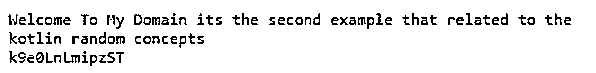
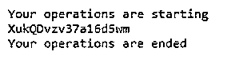

# 科特林随机

> 原文：<https://www.educba.com/kotlin-random/>

## 科特林·兰登简介

kotlin random 是抽象类类型之一，它是用随机数生成器算法实现的。伴随对象也为 Random 类的默认实例执行该区域；随机生成器的植入实例将使用随机函数。类的实例将生成伪随机数流。random 的两个实例是用相同的种子创建的，使用和调用相同的方法序列进行生成，它将返回一个随机类的唯一相同的序列号 util 包，这个随机类在 random 生成器中称为多线程设计。

**kot Lin Random 的语法**

<small>网页开发、编程语言、软件测试&其他</small>

在 kotlin 语言中有许多默认的类、方法和关键字，用于实现应用程序。Like Random 是抽象类类型之一，用于生成伪随机数生成器；它有自己的关键字和语法来执行代码中的操作。

`fun name()
Assert.assertTrue((0..1000).all{   //(0..1000) it’s a number range we can fix it with any number ranges
(0..10).contains((0..10).random())
}
)
Assert.assertFalse(((0..1000).all{
(0..10).contains((0..10).random())
}
}
fun main(args:Array<String>)
{
--some logic codes depends on the requirement---
}`

上述代码是利用 random 类及其方法计算伪随机数生成的基本语法。

### 随机在科特林是如何工作的？

*   随机数生成就像一个伪数列；它以自动和随机方式生成。它返回一个可重复的序列顺序，带有数据类型的种子，就像两个具有相同种子的生成器为序列号范围生成相同版本的 kotlin 运行时多态性。在随机数生成器算法的帮助下，数字被计算出来，生成序列。而在 JVM 机器上，随机数生成器不是线程安全的，它不能用多线程序列调用它；它也是同步安排的。
*   以便两个种子可以在 kotlin 运行时版本中产生相同的值序列。根据该算法，用户输入被接受，初始范围可以是种子或键，因此我们以序列方式应用该种子，并进行一些数学运算，以生成输出结果。因此，我们将其命名为随机数使用的输出也将产生随机数，它将给出下一组迭代以继续其任务。所以不可能产生真正的随机数。所以它有两种类型，像非确定性随机数发生器和真随机数发生器。非确定性随机数发生器也称为伪随机数发生器。

### 科特林随机的例子

以下是 Kotlin Random 的示例:

#### 示例#1

**代码:**

`package one;
import java.util.Random
val rd = Random()
object Tests {
var infos = "Welcome To My Domain its the first example that related to the kotlin random function"
}
fun main(args: Array<String>) {
val vars = arrayOf("'Your first inputs' - Its the Monday", "'The second inputs' - Its the tuesday", "'The third inputs' - Its the Wednesday", "'The fourth inputs' - Its the Thursday", "'The fifth inputs' - Its the Friday", "'The sixth inputs' - Its the Saturday ","'The seventh inputs' - Its the Sunday", "'Every object has the separate attributes and its elements' - Programming language")
val vars1 =  arrayOf("'Your eight inputs'- programming concepts and its implemnetations","'The most important things in the life are the day you are born and the day you find out why'- what is the reason for this")
val vars2=arrayOf("'The life is more precious things and don’t wasted every single minute in a day you are born and the day you find out why.' - Great legend","'Great lengends are more powerful when compare to the others life are the day you also born with the silver spoon' - The Legendary things")
fun res(at1: Int, at2: Int) = rd.nextInt(at2-at1+1)+at1
println(vars1[res(0,(vars1.size)-1)])
println(vars[res(0,(vars.size)-1)])
println("Thank you users have a nice day users keep spending your valuable time with us")
}`

**输出:**

在上面的例子中，我们在变量中使用了 arrayOf()方法，我们验证了整数并随机生成它。

#### 实施例 2

**代码:**

`package one;
import java.util.Random
fun demo(strleng: Int) : String {
println("Welcome To My Domain its the second example that related to the kotlin random concepts")
val inpstr = "ABCDEFGHIJKLMNOPQRSTUVWXTZabcdefghiklmnopqrstuvwxyz0123456789"
return (1..strleng)
.map { inpstr.random() }
.joinToString("")
}
fun second(){
var lst=ArrayList<String>()
lst.add("The input is entered on the text box is: 0")
lst.add("The input is entered on the text box is: 1")
lst.add("The input is entered on the text box is: 2")
lst.add("The input is entered on the text box is: 3")
lst.add("The input is entered on the text box is: 4")
lst.add("The input is entered on the text box is: 5")
lst.add("The input is entered on the text box is: 6")
lst.add("The input is entered on the text box is: 7")
lst.add("The input is entered on the text box is: 8")
lst.add("The input is entered on the text box is: 9")
for(i in lst)
print("The arryList are iterated please find your input values $i ")
}
fun main() {
val strleng = 13
val res = demo(strleng)
println(res)
}`

**输出:**

在第二个示例中，我们为添加了名为 arrayList()的集合，以使用 random()方法存储和检索数据。

#### 实施例 3

**代码:**

`package one;
import java.util.Random
interface infy  {
fun third(strl:String) : String{
println("Welcome To My Domain its the third example that related to the kotlin random concepts")
val inpstr = "Valuable Inputs must be entered and its more important for validation with both front and back end"
return (inpstr)
.map { inpstr.random() }
.joinToString("")
}
}
class Test{
fun four(leng:Int):String
{println("Your operations are starting")
val chs = ('a'..'z') + ('A'..'Z') + ('0'..'9')
return (1..leng)
.map { chs.random() }
.joinToString("")
}
}
fun main() {
val num=17
val strs=Test()
println(strs.four(num))
println("Your operations are ended")
}`

**输出:**

在最后一个例子中，我们使用了额外添加的类和接口来执行 random()函数。

### 结论

在 kotlin 语言中，移动应用程序会根据软件需求间歇性地添加一些默认方法来执行用户任务。但是一些数学运算需要在不影响应用程序功能的情况下执行，比如 random 是执行这些运算的默认类和方法之一。

### 推荐文章

这是一个科特林随机指南。这里我们讨论一下入门，random 在科特林是如何工作的？和示例。您也可以看看以下文章，了解更多信息–

1.  [科特林内嵌函数](https://www.educba.com/kotlin-inline-function/)
2.  [科特林收藏馆](https://www.educba.com/kotlin-collections/)
3.  [科特林元组](https://www.educba.com/kotlin-tuple/)
4.  [科特林循环](https://www.educba.com/kotlin-loops/)

