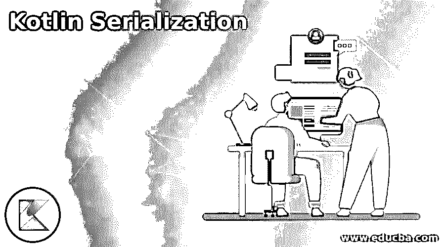
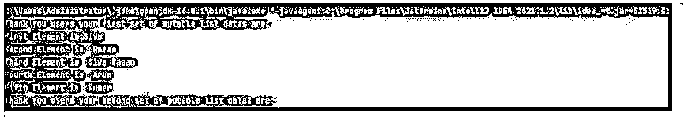
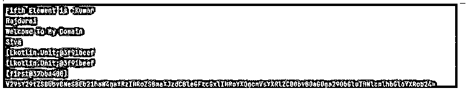
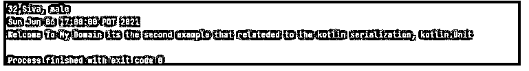
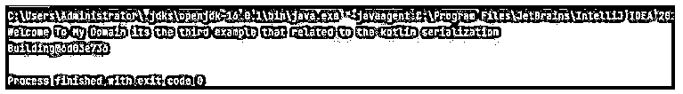

# 科特林序列化

> 原文：<https://www.educba.com/kotlin-serialization/>

## Kotlin 序列化介绍

kotlin 序列化是一种技术和过程，用于将应用程序数据转换为指定的格式，可以通过网络传输，并存储在数据库或外部文件中。它可以是任何格式，如 JSON、xml，并且遵循协议缓冲区。这里，kotlin 在一个单独的组件中提供了数据序列化工具，如“kotlinx.serialization ”,该包由安装在运行时库中的 gradle 插件组成。编译时的类型安全机制，用于将对象转换为支持多平台环境的数据格式。

**kot Lin 序列化的语法**

<small>网页开发、编程语言、软件测试&其他</small>

kotlin 语言有许多默认的类、方法、变量和其他关键字，用于实现基于移动设备的应用程序。序列化是将对象转换为数据流的过程，用于将其存储为单独的文件。

`@Serializable
data class className{
val name1: datatype
val name2: datatype
--------some declaration and logic codes---
}
fun main()
{
----Some main function codes depends on the above data class and the methods---
}`

以上代码是用 kotlin 语言创建和利用可序列化的基本语法。我们可以在编程代码的任何地方使用它，这取决于需求。

### Kotlin 中的序列化是如何工作的？

*   序列化是将对象数据转换为应用数据的过程，可以使用 json 和 xml 等格式以单独的文件存储。kotlin 具有内置功能，并且它完全与 kotlin/native 和 kotlin/js 支持的多平台一起使用。当我们使用基于非 kotlin 类型的文件格式(如 json 或基于 xml 的解析器库)时，会遭受某种类型的擦除数据，并且可能会丢失通用数据类型，因此应该借助令牌类型作为其序列化和反序列化函数中的参数来避免这种情况。
*   我们使用了其他序列化技术，如多态序列化、字符串可定制性、框架集成和多格式未来类型。序列化被忽略并使用可选字段，它可用于调整默认值，并且应该为 JSON 值格式重写它。在 kotlin 语言中，新的本地标准序列化库更类似于 java 语言概念，如 Android 开发中使用的反射。因此，将输入分解为文件流以存储编码格式的数据的过程。编码器转换要考虑另一种期望的格式，用于存储、处理数据和将数据转换成其他格式，这是基于类似的要求。

### Kotlin 序列化示例

以下是 Kotlin 序列化的示例:

#### 示例#1

**代码:**

`import kotlinx.serialization.Serializable
import kotlinx.serialization.json.*
import kotlinx.serialization.*
import java.util.Base64
@Serializable
class first(val n: String, @SerialName("lang") val lang: String)
{
fun demo()
{
val sn="Its the first string"
var ml = mutableListOf<String>()
ml.add("First Element is:Siva")
ml.add("Second Element is :Raman")
ml.add("Third Element is :Siva Raman")
ml.add("Fourth Element is :Arun")
ml.add("Fifth Element is :Kumar")
var ma = mutableListOf<String>("Welcome To My Domain","Siva")
var mb = mutableListOf<String>("Welcome To My Domain","Raman")
var mc = mutableListOf<String>("Welcome To My Domain","SivaRaman")
println("Thank you users your first set of mutable list datas are:")
for(vars in ml){
println(vars)
}
println("Thank you users your second set of mutable list datas are:")
println(ml[2])
ml.add(2,"Sachin")
println(" We can modify the first set mutable list ml.add(2,\"Sachin\")")
for(vars in ml){
println(vars)
}
ml.add("Rajdurai")
println("Again we can add the list values ml.add(\"Rajdurai\")")
for(vars in ml){
println(vars)
}
ml.addAll(1,mb)
println("We can add all the list values to single list: ml.addAll(1,mb)")
for(vars in ml){
println(vars)
}
ml.addAll(ma)
println("We can add all the values and make it to the single list: ml.addAll(ma)")
for(vars in ml){
println(vars)
}
ml.remove("Salman")
println("We can remove the specified values: ml.remove(\"Salman\")")
for(vars in ml){
println(vars)
}
}
}
fun main() {
val data = first("kotlinx.serialization", "Kotlin")
var ref=first("Thank you for spenting the time with the serialization concept","Kotlin with Maven")
var dt=ref.demo()
var s= arrayOf(dt)
for(ars in sequenceOf(s))
{
println(ars)
}
var l= listOf(data)
println(s)
println(l)
val str = "Welcome To My Domain its the first example that related to the kotlin serialization"
val out: String = Base64.getEncoder().encodeToString(str.toByteArray())
println(out)
}`

**输出:**

上面的例子是可以关联到@Serializable 注释的基本例子，它将类作为序列化的类来操作，并且在 main 方法中操作它来完成操作。

#### 实施例 2

**代码:**

`import kotlinx.serialization.*
import kotlinx.serialization.*
import java.util.Date
import java.text.SimpleDateFormat
@Serializable
class Test() {
var age: Int = 0
var name: String = ""
var sex: String = ""
fun demo2(){
val s="32,Siva, male"
println(s)
}
}
enum class Second(var sec: String) {
demo("first method"){
override fun exam() {
println("Java is the higher leve language")
}
},
demo1("second method"){
override fun exam() {
println("C, C++ is the middle level language")
}
},
demo2("third method"){
override fun exam() {
println("dotnet is the high level language")
}
};
abstract fun exam()
fun demo1(stringValue: String): String{
return "Welcome"
}
}
fun main()
{
val d = Test()
var s=d.demo2()
println(SimpleDateFormat("yyyy-MM-ddX").parse("2021-06-07+00"))
println("Welcome To My Domain its the second example that relateded to the kotlin serialization, $s")
}`

**输出:**

在第二个例子中，我们使用了 serializable 概念和附加的枚举来声明可以在具有 serializable 类的 main 上执行的不同方法。

#### 实施例 3

**代码:**

`import kotlinx.serialization.Serializable
import kotlinx.serialization.SerialName
@Serializable
@SerialName("Building")
class Building(val structure: String){
var s1="Pyramid"
var s2="V-Structure"
var s3="Fire-Resistive"
var s4="Hut"
var s5="Wood frame"
}
@Serializable
@SerialName("Types")
class Types<T>(val details: T)
fun main() {
val res = "Welcome To My Domain its the third example that related to the kotlin serialization"
println(res)
var out=Building("Eiffel Tower")
println(out)
}`

**输出:**

在最后一个示例中，我们使用了@Serializable 和@SerialName 这两个注释，它们可用于对这两个类执行序列化操作。因此，我们创建了两个类，并且每个类都分配了 SerialName 注释和 Serializable。

### 结论

在 kotlin 语言中，序列化是其中一个概念，它用于对数据进行编码，从而对用户输入进行加密，使用反序列化可以对其进行解密。因此它有不同的内置方法，并用于根据需求在应用程序级别执行操作。

### 推荐文章

这是 Kotlin 序列化的指南。这里我们讨论一下引言，kotlin 中序列化是如何工作的？和示例。您也可以看看以下文章，了解更多信息–

1.  [科特林内嵌函数](https://www.educba.com/kotlin-inline-function/)
2.  [科特林收藏馆](https://www.educba.com/kotlin-collections/)
3.  [科特林元组](https://www.educba.com/kotlin-tuple/)
4.  [科特林循环](https://www.educba.com/kotlin-loops/)

