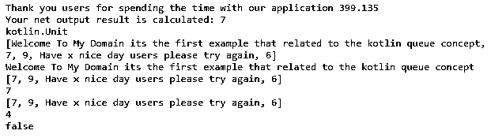
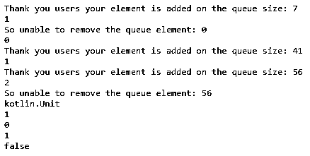
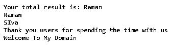

# 科特林队

> 原文：<https://www.educba.com/kotlin-queue/>


## 科特林队列简介

kotlin 队列是数据结构概念之一。它适用于 FIFO(先进先出)操作，所以每当我们想添加新元素到列表中。它也将被添加到内存列表的后端；如果我们移除任何元素，它首先移除也要从列表中移除的列表索引的前面，它跟随要插入元素的入队，并且从元素中移除出列。kotlin 队列接口添加了与类和其他方法相关联的集合框架。

**语法:**

<small>网页开发、编程语言、软件测试&其他</small>

在 kotlin 语言中有许多默认的类，它的方法为每一个框架集合接口都会实现应用程序。因此队列什么也不是，但是它可以使用先进先出(FIFO)格式将值插入内存列表中。

```
import  java.util.Queue
import java.util.LinkedList
fun main()
{
val variablename: Queue<datatype> = LinkedList<datatype>()
variablename.add(values based on the datatype)
-----somecodes depends on the logic---
}
```

上面的代码是在 kotlin 应用程序中实现队列接口的基本语法。我们可以添加像 add()、remove()等默认方法。，基于队列集合接口和类。

### Kotlin 中的队列是如何工作的？

kotlin 队列的工作原理类似于先进先出操作的 FIFO 概念，因此数据将使用 add()操作存储在后端。如果假设当我们想要删除列表中的数据时，我们可以使用 remove()操作，数据将在前端被删除。每当我们想要添加或删除队列列表中的元素时，都应该验证队列是否为空字符串。为了计算队列大小，应该确定队列长度，以便根据它在应用程序中用于执行操作的逻辑对其进行验证。每个元素都有一个单独的索引，用于存储和检索数据库中的数据。在队列概念中，元素也与单独的索引一起存储在内存位置上，因此我们将检查队列是否包含作为单独索引的所有元素，并使用索引值查找索引。我们可以在不移除操作的情况下获得队列内存前面的元素，所以他们使用了名为 element()和 peek()的操作。这些方法将执行单独的操作；它有一些不同，比如如果队列为空，element()方法将抛出错误，但是当我们使用 peek()方法时，它只抛出空值。所以这两种方法更一致地用在队列集合接口上。

### 科特林队列示例

下面提到了不同的例子:

#### 示例#1

```
class month (lst:MutableList<Any>){
var <u>vars</u>:MutableList<Any> = lst
fun demo():Boolean = <u>vars</u>.isEmpty()
fun demo1():Int = <u>vars</u>.count()
override  fun toString() = <u>vars</u>.toString()
fun enqueue(element:Any){
<u>vars</u>.add(element)
}
fun dequeue():Any?{
if (this.demo()){
return null
} else {
return <u>vars</u>.removeAt(0)
}
}
fun peek():Any?{
return <u>vars</u>[0]
}
}
fun main(<u>args</u>: Array<String>) {
val fr = 32.45f
val sc = 12.3f
val res = fr * sc
println("Thank you users for spending the time with our application $res")
var <u>ex</u> = 0
var <u>n1</u> = 123456789
while (<u>n1</u> != 0) {
<u>n1</u> /= 15
++<u>ex</u>
}
println("Your net output result is calculated: $<u>ex</u>")
var <u>x</u> = month(mutableListOf("Welcome To My Domain its the first example that related to the kotlin queue concept",7,9,"Have x nice day users please try again"))
println(<u>x</u>.enqueue(6))
println(<u>x</u>)
println(<u>x</u>.dequeue())
println(<u>x</u>)
println(<u>x</u>.peek())
println(<u>x</u>)
println(<u>x</u>.demo1())
println(<u>x</u>.demo())
}
```

**输出:**




在上面的例子中，我们使用了队列概念，并加入了一个可变列表接口来存储和检索数据操作。

#### 实施例 2

```
class SecondExam {
private val sizes = 8
private var <u>arraqueues</u>: IntArray = IntArray(this.sizes)
private var <u>varfirst</u> = 1
private var <u>varlast</u> = -1
private var <u>latestsize</u> = 0
fun enqueue(ex: Int) {
if (exam()) {
println("Welcome Users your queue is fill you want to increase the queueu sizes")
exam()
}
<u>varlast</u>++
if (<u>varlast</u> >= <u>arraqueues</u>.size && <u>latestsize</u> <u>!==</u> <u>arraqueues</u><u>.</u><u>size</u>) {
<u>varlast</u> = 0
}
<u>arraqueues</u>[<u>varlast</u>] = ex
<u>latestsize</u>++
println("Thank you users your element is added on the queue size: $ex")
}
fun dequeue() {
if (isQueueEmpty()) {
println("Your queue element is not able to empty")
} else {
<u>varfirst</u>++
if (<u>varfirst</u> > <u>arraqueues</u>.size - 1) {
System.out.println("So unable to remove the queue element: " + <u>arraqueues</u>[<u>varfirst</u> - 1])
<u>varfirst</u> = 0
} else {
System.out.println("So unable to remove the queue element: " + <u>arraqueues</u>[<u>varfirst</u> - 1])
}
<u>latestsize</u>--
}
}
fun peek():Int? {
if (isQueueEmpty()) {
println("Your queue element is  not removed so queue memory is not empty")
return null
} else {
return <u>arraqueues</u>[<u>varfirst</u>]
}
}
fun size():Int {
return <u>latestsize</u>
}
private fun exam(): Boolean {
var <u>status</u> = false
if (<u>latestsize</u> <u>===</u> <u>arraqueues</u><u>.</u><u>size</u>) {
<u>status</u> = true
}
return <u>status</u>
}
fun isQueueEmpty(): Boolean {
var <u>status</u> = false
if (<u>latestsize</u> <u>=== 0</u>) {
<u>status</u> = true
}
return <u>status</u>
}
private fun eample() {
val latestsize = this.<u>arraqueues</u>.size * 3
val latestArray = IntArray(latestsize)
var <u>queuevalues</u> = <u>varfirst</u>
var <u>index</u> = -1
while (true) {
latestArray[++<u>index</u>] = this.<u>arraqueues</u>[<u>queuevalues</u>]
<u>queuevalues</u>++
if (<u>queuevalues</u> == this.<u>arraqueues</u>.size) {
<u>queuevalues</u> = 0
}
if (<u>latestsize</u> <u>===</u> <u>index</u> <u>+ 1</u>) {
break
}
}
this.<u>arraqueues</u> = latestArray
System.out.println("Have a Nice day users your latest queue size is: " + this.<u>arraqueues</u>.size)
this.<u>varfirst</u> = 0
this.<u>varlast</u> = <u>index</u>
}
}
fun main(<u>args</u>: Array<String>) {
val outs = SecondExam()
outs.enqueue(7)
println(outs.size())
outs.dequeue()
println(outs.size())
outs.enqueue(41)
println(outs.size())
outs.enqueue(56)
println(outs.size())
println(outs.dequeue())
println(outs.size())
println(outs.peek())
println(outs.size())
println(outs.isQueueEmpty())
}
```

**输出:**




在第二个例子中，我们使用默认方法执行队列操作。

#### 实施例 3

```
import java.util.PriorityQueue
fun main(<u>args</u>: Array<String>) {
val ints: PriorityQueue<String> = PriorityQueue<String>()
ints.add("SIva")
ints.add("Raman")
ints.add("Welcome To My Domain")
ints.add("Thank you users for spending the time with us")
println("Your total result is: " + ints.peek())
while (!ints.isEmpty()) {
println(ints.remove())
}
}
```

**输出:**




在最后一个例子中，我们使用 priority queue 类及其方法在队列中添加元素。

### 结论

在 kotlin 中，语言队列是集合接口之一，它使用 FIFO 概念来存储和删除数据。数据存储在最后一侧，即数组索引的后部位置，使用前部位置删除数据。

### 推荐文章

这是科特林队列指南。在这里，我们还将讨论 kotlin 中的介绍和队列是如何工作的？以及不同的示例及其代码实现。您也可以看看以下文章，了解更多信息–

1.  [科特林群比](https://www.educba.com/kotlin-groupby/)
2.  [科特林减少](https://www.educba.com/kotlin-reduce/)
3.  [科特林 kclass](https://www.educba.com/kotlin-kclass/)
4.  [科特林内嵌函数](https://www.educba.com/kotlin-inline-function/)


