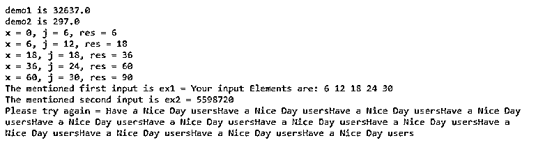

# 科特林接口

> 原文：<https://www.educba.com/kotlin-interface/>


## Kotlin 接口介绍

kotlin 接口是可以用来声明没有主体的方法的方法之一，并且它可以被抽象和非抽象方法接受，以便它包含抽象方法的定义以及非抽象方法的实现；interface 关键字用于定义接口，它可以由类或对象实现，接口的自定义类型名称后面跟有操作符，如冒号和将由子类实现的接口名称，方法也可以被覆盖。

**kot Lin 接口的语法**

<small>网页开发、编程语言、软件测试&其他</small>

在 kotlin 语言中，用于实现应用程序的类、接口、方法和其他默认关键字。接口可以有函数的实现，通过定义它们的 getters 和 setters 方法，它可以有非抽象的属性。

```
interface name{
fun demo(): datatype
var variable: datatype
---some logic codes depends on the requirement----
}
class name1:name
{
override var variable
override fun demo(): datatype{
--some logic codes—
}
}
fun main()
{
var v = name1()
v.demo()
}
```

上述代码是利用 kotlin 代码接口的基本语法。这里我们声明了一个接口，它可以使用类来实现。

### Kotlin 中的接口是如何工作的？

*   kotlin 接口包含函数和属性的定义；它也是一个自定义类型，并且不能通过代码直接实例化。但是，通过接口，我们可以定义具体类型必须遵循和实现的一组属性和方法。通常，kotlin 语言中的接口定义以 interface 关键字开始。接下来是接口名以及像花括号这样的操作符，接口的成员驻留在主函数中。主要的区别是成员们没有自己语言的定义。
*   这些定义将由类或对象可以实现接口的一致性类型提供。当我们实现接口时，必须为符合的类型提供其所有成员的定义。要实现一个接口，自定义类型的名称后跟冒号运算符和要实现的接口的名称。默认值将作为接口方法中的参数传递；如果函数调用时未提供参数，则使用默认值。所以这些方法有默认的实现；这些在方法不被重写的情况下使用。

### Kotlin 接口示例

以下是 Kotlin 接口的示例:

#### 示例#1

**代码:**

```
interface Sample {
val x : Int
val y : String
get() = "Welcome To My Domain its the first example that related to the kotlin interface"
}
interface Demo {
fun Sample1()
}
class Example : Sample, Demo {
override val x : Int
get() = 41
override fun Sample1()
{
println("Have a Nice Day users please try again")
}
private val nm = "Sample Example"
fun eg() = "This is the first example we discussed regarding kotlin interface"
}
class NewEmployees
{
var ename: String = ""
var eid: Int = 0
var sex: Char = 'M'
var salary: Double = 0.toDouble()
fun enteredNewEmployees(n1: String, q: Int, gen: Char, sal: Double) {
ename = n1
eid = q
sex = gen
salary = sal
println("Please see the below new employee name: $ename")
println("Please see the NewEmployees id: $eid")
println("Your sex is: $sex")
println("The Cross salary of the new employees is : $salary")
}
fun insertName(n1: String) {
this.ename = n1
}
}
fun main()
{
val ob = Example()
ob.Sample1()
var ob1 = NewEmployees()
var ob2 = NewEmployees()
ob1.enteredNewEmployees("Siva", 41, 'M', 30000.00)
ob2.insertName("Raman")
println("ename of the new NewEmployees: ${ob2.ename}")
val s = Example()
println(s)
println(s.eg())
}
```

**输出:**


在上面的例子中，我们使用了接口和类来实现接口和它们的方法。该类还重写接口的方法。

#### 实施例 2

**代码:**

```
interface dime {
val len : Double
val bre : Double
val heigh : Double
}
interface operation : dime {
fun demo1()
fun demo2()
}
class Example : operation {
override val len : Double
get() = 23.0
override val bre : Double
get()= 33.0
override val heigh : Double
get() = 43.0
override fun demo1()
{
println("demo1 is ${len * bre * heigh}")
}
override fun demo2()
{
println("demo2 is ${3*(len+bre+heigh)}")
}
}
fun main()
{
val ob = Example()
ob.demo1()
ob.demo2()
val ls = listOf(6, 12, 18, 24, 30)
ls.fold(0, {
x: Int, j: Int ->
print("x = $x, j = $j, ")
val res = x + j
println("res = $res")
res
})
val ex1 = ls.fold("Your input Elements are:", { x, j -> x + " " + j })
val ex2 = ls.fold(6, Int::times)
println("The mentioned first input is ex1 = $ex1")
println("The mentioned second input is ex2 = $ex2")
val ex3: String.(Int) -> String = { p -> this.repeat(p) }
val ex4: (String, Int) -> String = ex3
fun demo3(f: (String, Int) -> String): String {
return f("Have a Nice Day users", 12)
}
val res = demo3(ex3)
println("Please try again = $res")
}
```

**输出:**




在第二个例子中，我们使用 kotlin 集合的接口及其默认方法来实现应用程序。

#### 实施例 3

**代码:**

```
interface Third {
fun demo() {
println("Thank you for declaring the first interface with the method")
}
}
interface Exam {
fun demo1() {
println("Its the second interface for declaring the method and this kotlin codes")
}
}
class Sample: Third, Exam
fun main(args: Array<String>) {
println("Welcome To My Domain its the third example that related to the kotlin interface")
val ob = Sample()
ob.demo()
ob.demo1()
}
```

**输出:**


在最后一个例子中，我们使用类声明了两个接口和可以实现的方法。但是接口方法不会被覆盖。

### 结论

在 kotlin 语言中，我们使用不同的概念及其特性来实现应用程序。在这些接口中，最主要作用是降低编码的复杂性，即使程序员通过使用类来实现特定的接口方法，这也取决于用户和项目的需求。

### 推荐文章

这是一个 Kotlin 接口指南。这里我们讨论一下入门，Kotlin 中的接口是如何工作的？以及更好理解的例子。您也可以看看以下文章，了解更多信息–

1.  [科特林内嵌函数](https://www.educba.com/kotlin-inline-function/)
2.  [科特林收藏馆](https://www.educba.com/kotlin-collections/)
3.  [科特林元组](https://www.educba.com/kotlin-tuple/)
4.  [科特林循环](https://www.educba.com/kotlin-loops/)


