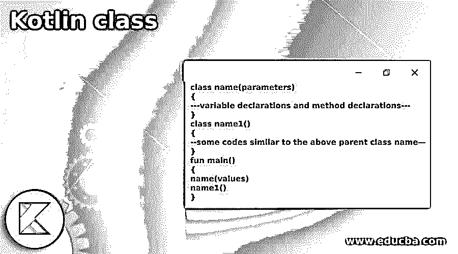
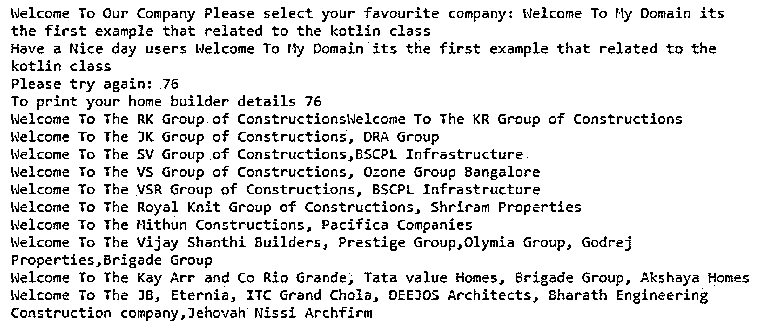
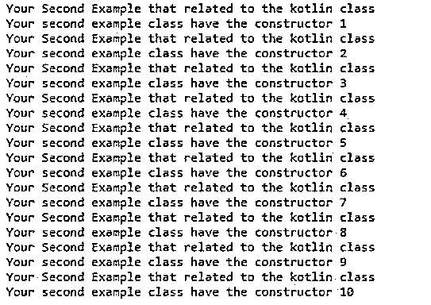
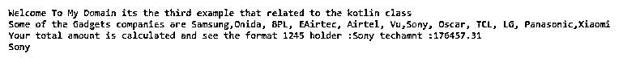

# 科特林级

> 原文：<https://www.educba.com/kotlin-class/>




## 科特林类简介

kotlin 类是关键字之一，它是使用指定其参数类型的类头来声明的。它在用花括号分隔的类体周围创建了主构造函数。头文件和体文件都是可选的。如果类没有主体，那么脚本上省略了花括号；kotlin 类有主构造函数和次构造函数；主构造函数是类头部分。它直接指向用主构造函数的可见性修饰符注释的类名和可选类型参数。

**kot Lin 类的语法**

<small>网页开发、编程语言、软件测试&其他</small>

在 kotlin 语言中有许多默认的关键字、变量和函数用于实现应用程序。就像那样，类是语言的主要角色，它是在一个类似于 java 语言的单独文件中创建的。

```
class name(parameters)
{
---variable declarations and method declarations---
}
class name1()
{
--some codes similar to the above parent class name—
}
fun main()
{
name(values)
name1()
}
```

以上代码是 kotlin 语言中类声明的基本语法。我们可以在文件中创建多个类，以便在主函数中创建对象。

### 科特林的班级是怎么运作的？

*   kotlin 中的类是使用关键字 like class 声明的，它由一个名称组成，是运行时实体的蓝图，对象是使用其状态创建的。对象状态包括行为和状态；声明由类头和花括号包围的类体组成，这与 java 类似。
*   它允许创建类对象并包含其类成员和函数；它可以使用不同的关键字来控制类成员变量的可见性。因此，我们将能够创建一个类及其对象，通过它我们将访问该类的不同数据成员。类包含许多类型，如嵌套类、内部类和已创建的匿名内部类，将使用默认静态关键字，因此无需创建该类类型的任何对象即可访问它。
*   类似地，内部类也是其中一种类型，它被标记为内部类，然后它将被称为内部类，外部类的数据成员可以访问这个类。类似地，与其他类型的类相比，匿名内部类是一个非常好的概念，它使编写代码变得容易。

### 科特林类的例子

下面给出了 Kotlin 类的例子:

#### 示例#1

**代码:**

```
open class firstclas {
open fun clasmethd() {}
}
abstract class subClas : firstclas() {
abstract override fun clasmethd()
}
class firstExample(home: String) {
val homeNames = "Welcome To Our Company Please select your favourite company: $home".also(::println)
init {
println("Have a Nice day users ${home}")
}
val second = "Please try again: ${home.length}".also(::println)
init {
println("To print your home builder details ${home.length}")
}
class nestedclss {
fun mthd() = "Welcome To The RK Group of Constructions"
fun mthd1() = "Welcome To The KR Group of Constructions"
fun mthd2() = "Welcome To The SV Group of Constructions,BSCPL Infrastructure"
fun mthd3() = "Welcome To The VS Group of Constructions, Ozone Group Bangalore"
fun mthd4() = "Welcome To The VSR Group of Constructions, BSCPL Infrastructure"
fun mthd5() = "Welcome To The Royal Knit Group of Constructions, Shriram Properties"
fun mthd6() = "Welcome To The Mithun Constructions, Pacifica Companies"
fun mthd7() = "Welcome To The JK Group of Constructions, DRA Group"
fun mthd8() = "Welcome To The Vijay Shanthi Builders, Prestige Group,Olymia Group, Godrej Properties,Brigade Group"
fun mthd9() = "Welcome To The Kay Arr and Co Rio Grande, Tata value Homes, Brigade Group, Akshaya Homes"
fun mthd10() = "Welcome To The JB, Eternia, ITC Grand Chola, DEEJOS Architects, Bharath Engineering Construction company,Jehovah Nissi Archfirm"
}
}
fun main() {
firstExample("Welcome To My Domain its the first example that related to the kotlin class ")
val demo = firstExample.nestedclss().mthd()
print(demo)
val demo1 = firstExample.nestedclss().mthd1()
println(demo1)
val demo2 = firstExample.nestedclss().mthd7()
println(demo2)
val demo3 = firstExample.nestedclss().mthd2()
println(demo3)
val demo4 = firstExample.nestedclss().mthd3()
println(demo4)
val demo5 = firstExample.nestedclss().mthd4()
println(demo5)
val demo6 = firstExample.nestedclss().mthd5()
println(demo6)
val demo7 = firstExample.nestedclss().mthd6()
println(demo7)
val demo8 = firstExample.nestedclss().mthd8()
println(demo8)
val demo9 = firstExample.nestedclss().mthd9()
println(demo9)
val demo10 = firstExample.nestedclss().mthd10()
println(demo10)
}
```

**输出:**




在上面的例子中，我们使用了具有嵌套类类型的类，并在创建对象后调用了 main 方法。

#### 实施例 2

**代码:**

```
class secondExample {
init {
println("Your Second Example that related to the kotlin class")
}
constructor(x: Int) {
println("Your second example class have the constructor $x")
}
class subclas
{
fun add()
{
var c: Int = 12
var a : Int = 13
var b :Int = 15
c= a + b
print(c)
}
}
}
fun main() {
secondExample(1)
secondExample(2)
secondExample(3)
secondExample(4)
secondExample(5)
secondExample(6)
secondExample(7)
secondExample(8)
secondExample(9)
secondExample(10)
}
```

**输出:**




在第二个示例中，我们使用创建声明类并使用的构造函数在 main 中创建对象。

#### 实施例 3

**代码:**

```
fun main(args: Array<String>) {
var tech1 :techDevice = object:techDevice {
override fun Gadgets() {
println("Welcome To My Domain its the third example that related to the kotlin class ")
println("Some of the Gadgets companies are Samsung,Onida, BPL, EAirtec, Airtel, Vu,Sony, Oscar, TCL, LG, Panasonic,Xiaomi")
}
}
tech1.Gadgets()
Technology()
var t= Technology()
t.techmeth(1245,"Sony",176457.32f)
println("${t.techName}")
}
interface techDevice {
fun Gadgets()
}
class Technology {
var techno: Int = 0
var techName: String = ""
var techamnt: Float = 0.toFloat()
fun techmeth(i: Int,str: String, flt: Float ) {
techno=i
techName=str
techamnt=flt
println("Your total amount is calculated and see the format ${techno} holder :${techName} techamnt :${techamnt}")
}
}
```

**输出:**




在最后一个例子中，我们用创建类、接口和一些方法来创建 main 中的对象并调用它。

### 结论

在 kotlin 语言中，我们使用了很多方法、变量和其他关键字，比如 class 是关键字，这与 java 语言类似。因此，通过使用类，我们可以声明方法、变量和其他关键字；此外，我们可以在 kotlin 代码中使用其他默认和定制的方法。

### 推荐文章

这是科特林课堂指南。这里我们讨论一下入门，kotlin 中的类是如何工作的？以及更好理解的例子。您也可以看看以下文章，了解更多信息–

1.  [科特林内嵌函数](https://www.educba.com/kotlin-inline-function/)
2.  [科特林收藏馆](https://www.educba.com/kotlin-collections/)
3.  [科特林元组](https://www.educba.com/kotlin-tuple/)
4.  [科特林循环](https://www.educba.com/kotlin-loops/)


