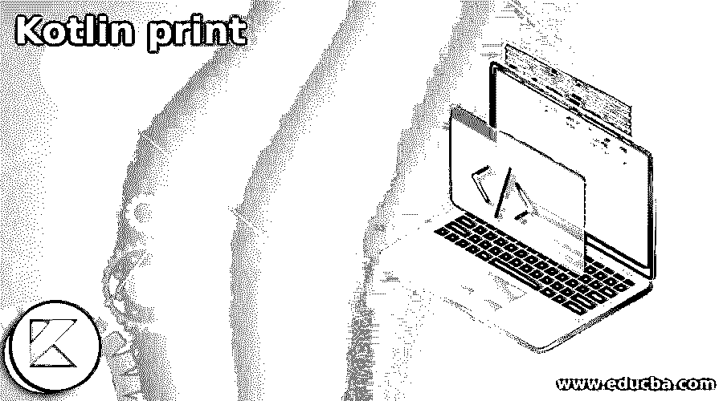
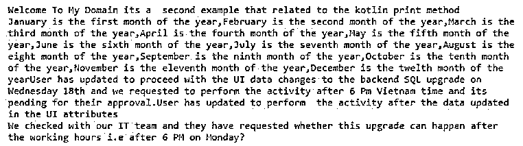

# 科特林印花

> 原文：<https://www.educba.com/kotlin-print/>




## 科特林版画简介

Kotlin print 是其中一种方法，它用于打印语句。当我们使用 println()方法时，它将所有用户数据和其中的所有内容打印到屏幕上，然后它打印语句。在输出的末尾附加一个换行符。打印变量比其他语言容易比较。我们还可以在任何变量前添加$符号，print 和 println()函数用于在控制台屏幕上打印输出。与其他语言相比，打印变量很容易。

**语法:**

<small>网页开发、编程语言、软件测试&其他</small>

在 kotlin 语言中，我们使用了许多默认函数、类、变量和其他默认类型，但是无论我们在代码逻辑中使用什么，我们都需要借助 print()、println()方法检查输出控制台。

```
fun main(args: Array<String>)
{
val vars
print(values)
---some logic codes---
}
```

以上代码是在 kotlin 代码中使用 print()方法的基本语法，只要它在语言上有要求。通过使用 print()方法，我们可以在屏幕上连续打印值，打印输出值时没有单独的空格和行缩进。

### 印刷在科特林是如何工作的？

*   Print 方法是用于在输出控制台中打印值的 kotlin 语句。对于一些应用程序，如任何绘图应用程序，页面布局应用程序和其他默认应用程序，侧重于任何图形输出，将用于创建美丽和美化打印页面作为编程语言的关键功能。
*   我们可以打印文档、图像和另一个 html 文档，用于打印这些类型的应用程序的输出，这需要对源代码下涵盖的所有内容进行更精确的控制，包括字体、文本流、分页符、页眉、页脚和其他定制元素。kotlin 语言有一些打印类型，如普通字符串，打印这些类型的变量和表达式，用于分离和打印用户数据。
*   如果我们使用直接管理打印过程的应用程序，行分隔符将使用标准输出流。我们可以看到在打印的语句中使用的所有内容都没有后缀，这样其他数据类型与其他方法之间的区别。数据类型，如 long、int、string 和其他数据类型，关键字用于识别输入值，即使字节已转换为 int 和其他数据类型，以在控制台屏幕上打印值。

### Kotlin 科特林印花示例

下面是提到的例子:

#### 示例#1

**代码:**

```
class Second {
fun show()
{
val jan = "January is the first month of the year"
val feb = "February is the second month of the year"
val mar = "March is the third month of the year"
val apr = "April is the fourth month of the year"
val may = "May is the fifth month of the year"
val jun = "June is the sixth month of the year"
val jul = "July is the seventh month of the year"
val aug = "August is the eight month of the year"
val sep = "September is the ninth month of the year"
val oct = "October is the tenth month of the year"
val nov = "November is the eleventh month of the year"
val dec = "December is the twelth month of the year"
print("$jan,$feb,$mar,$apr,$may,$jun,$jul,$aug,$sep,$oct,$nov,$dec")
print("User has updated to proceed with the UI data changes to the backend SQL upgrade on Wednesday 18th and we requested to perform the activity after 6 Pm Vietnam time and its pending for their approval.")
println("User has updated to perform the activity after the data updated in the UI attributes")
println("We checked with our IT team and they have requested whether this upgrade can happen after the working hours i.e after 6 PM on Monday?")
}
}
fun main(args: Array<String>){
println("Welcome To My Domain its a second example that related to the kotlin print method")
var sec = Second()
sec.show()
}
```

**输出:**




上面的例子是在 kotlin 语言中使用 print 方法的基本例子。在这里，我们创建了 second 类，并声明了我们创建的 show()方法，因为我们可以将输入声明为字符串类型，如月份详细信息。在这里，我们从 1 月到 12 月开始，然后使用 print()方法，我们可以在控制台屏幕中打印月份详细信息。这里我们使用逗号(，)作为每个输入语句的分隔符。接下来使用 main()方法，我们可以创建类的对象，并在函数中调用特定的方法。

#### 实施例 2

**代码:**

```
fun main(args: Array<String>) {
print("Welcome To My Domain its the second example that related to the kotlin print method")
print(43)
print(7875756L)
print(0b00001111)
print(14.56)
print(34.987F)
print('n')
print(false)
print("Penetration Testing and Ethical hackers knowing concepts like Footprinting,Shodan,HTTrack,google hacking database,whois,Banner Grabbing,the Harvester[Pentest tool],Footprinting Countermeasures,network scanning[nmap, Hping],ping command")
print("nmap,netdiscover,nslookup,dig,hping3,enumeration[NetBios][snmp,dns,smtp,ldap,smb][smbclient,netbios,dns]")
print("vulnerabilities-weakness,designflaws,vulnerability phases,tools,phases-pre,assessment,post vulnerability,Types of password attacks and defense")
print("Bruteforce ,keylogger,hash injection,guessing,wire sniffing,Rainbow Table,distributed network,Medusa-password cracking tool,privilege escalation")
print("Malware Keyloggers,Malware Rootkits[sniffers,backdoor,log,ddos]")
print("Malware Trojans,Virus[Self-replicating,host needed,data alteration/corruption],virus lifecycle:")
print("design,replication,launch,detection,incorporation,elimination,Malware Type of viruses")
print("Bootsector virus,malware worms,sniffing[monitor,captures,wiretap],Injecting packets,ARP,MACflooding,DNS,ARC poisoning,sniffing attacks,sniffing tools")
print("wireshark[packet capture tool]winpcap,filters,ethernet,IEE 802.1,bluetooth,tcpdump/windump")
print("DDOS,bandwidth attack-ddos attack, botnet floods with ICMP,synflood attack -3 way handshake not completed, listen queue is 75 seconds,ICMP Flood attack[ICMP Packets,Reflection networks],P2P")
print("dereil,pandora,loic,hoic,doshttp,andosid -ddos tools,Session Hijacking[TCP session],seesion sniffing,xss,mitm,network level session hijacking - hijacking protocol")
print("IDS and Firewall Evasion Technique,Fragmentaion,IP address spoofing,Source routing,Proxy servers,Encryption,Flooding,SSH tunneling,Encryption")
}
```

**输出:**


在第二个例子中，我们在各种数据类型格式输入中使用了 print()方法。像第一个一样，我们可以用整数类型打印它，long 类型作为第二个打印语句，六进制和二进制与第三个打印语句结合。第四个 print 语句为 double，第五个为 float 数据类型。第六个是字符，第七个是布尔条件。该任务结束时的最后一条字符串类型的打印语句。

### 结论

根据编程语言，无论用户给出什么输入，都可以得到作为应用逻辑的输出。在这里，我们可以使用像用户语言这样的代码作为中介，它将编译器和运行时响应转换为机器语言，只有在输出控制台上使用这些打印语句才能识别。

### 推荐文章

这是 Kotlin 打印指南。在这里我们讨论一下入门，印刷在科特林是如何工作的？以及更好理解的例子。您也可以看看以下文章，了解更多信息–

1.  [科特林内嵌函数](https://www.educba.com/kotlin-inline-function/)
2.  [科特林收藏馆](https://www.educba.com/kotlin-collections/)
3.  [科特林元组](https://www.educba.com/kotlin-tuple/)
4.  [科特林循环](https://www.educba.com/kotlin-loops/)


