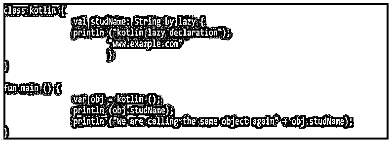
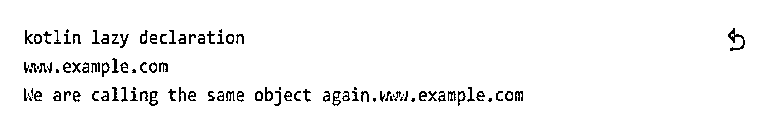
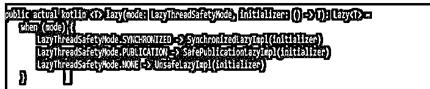
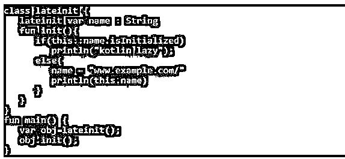

# Kotlin Lazy

> 原文：<https://www.educba.com/kotlin-lazy/>


## 科特林懒入门

Kotlin lazy 包含了很多特性；通过使用这个特性，我们可以利用编写更好的应用程序。kotlin lazy 是属性初始化的一个非常有用和重要的特性；我们知道何时使用哪种属性。在 kotlin 中，有许多类的对象初始化非常繁重，这将花费时间导致整个类进程创建的延迟。有时我们需要构造包含繁琐初始化的对象。kotlin 惰性初始化的概念旨在防止进程初始化不必要的对象。

### 什么是科特林懒？

Kotlin lazy 只不过是一个函数，它接受一个 lambda 并返回一个 lazy 的实例，这个实例可以实现 lazy 的属性。get 的第一个调用是执行 lambda，它是通过 lazy 函数传递的，我们需要记住结果。后续的调用将返回记忆的结果。lazy 的属性的计算是同步的，如果不需要初始化来允许多个线程同时执行 lazy 的参数，则仅在一个线程中计算该值。

<small>网页开发、编程语言、软件测试&其他</small>

### 它是如何工作的？

为了有效地管理内存，kotlin 引入了新的特性名称 lazy initialization。使用 lazy 关键字时，对象是在被调用时创建的；否则，它将不会包含对象的任何创建。惰性函数将获取 lambda 并返回惰性实例，该实例为我们正在应用的惰性属性的委托提供服务。这用于防止对象不必要的初始化。Lazy 与非空变量一起使用。kotlin lazy 中不允许变量 only val 或 var。我们只能初始化对象一次；之后，我们从缓存的内存中接收值。该对象直到在应用程序中未被使用时才被初始化。

下面的例子展示了如何在我们的应用程序中使用 kotlin lazy。在下面的例子中，我们将惰性变量声明为 studName，我们可以看到这个变量的调用只在值初始化时发生一次；我们需要记住，值是通过使用惰性初始化来赋值的，我们不能重新赋值。在下面的例子中，我们将类名定义为 kotlin。

**代码:**

```
`class kotlin {
val studName: String by lazy {
println ("kotlin lazy declaration");
"www.example.com"
}
}
fun main () {
var obj = kotlin ();
println (obj.studName);
println ("We are calling the same object again" + obj.studName);
}`
```

**输出:**







在下面的例子中，我们将类名定义为 lazy 然后我们需要在某个名为 lazy1 的 order 类中创建一个 lazy 的对象。

**代码:**

```
class lazy1 {
     private val lazyObject: lazy = lazy ()
}
```

我们正在创建惰性对象，这将导致惰性类的创建缓慢和延迟。可能有很多情况下我们不需要懒惰对象。同样的情况下，lazy 关键字更有帮助。

**代码:**

```
class lazy1 {
    private val lazyObject: lazy by lazy {
    lazy ()
} }
```

在 kotlin 中使用 lazy 的好处是，对象只有在被调用时才会被创建；否则，不会创建它。使用 lazy 的另一个好处是，一旦我们初始化了对象，我们就可以在程序中再次使用同一个对象。基本上，lazy 只在我们想要访问只读的某个属性时使用，因为我们始终可以访问同一个对象。

### 科特林懒惰使用属性

在科特林，对象创建是一个繁重的过程；当我们创建一个类对象时，该类的所有私有和公共属性都将被初始化到构造函数中。类初始化中的每个变量都需要一定的时间来为堆分配内存并将其引用保存到堆栈中。有时我们不需要在创建类的时候初始化所有的对象，因为对象属性依赖于另一个对象来首先初始化并使用这个引用。

在 kotlin 中，我们有多种特性可以帮助我们根据需要延迟对象初始化。惰性初始化是我们第一次调用任何对象时的对象创建委托。创建了对象的引用，但没有创建对象。第一次访问对象时创建对象，下次使用相同的引用。Lazy 是在 kotlin 包中定义的函数，它将 lambda 或更高阶的函数作为参数，并返回 lazy 的对象。传递的 lambda 或更高阶的函数正在返回惰性对象。默认情况下，lazy 属性是同步的，这意味着单个线程正在计算它的值，而所有线程都使用相同的值，如下所示。我们使用 synchronized 来保证线程的安全；只有一个线程正在初始化该值。

**代码:**

```
public actual kotlin
{
    …..
}
```

**输出:**




### 《懒惰与迟到》中的科特林

kotlin 库为属性声明提供了两种不同类型的访问修饰符。为了创建 latentit 变量，我们需要添加关键字名称 lateinit 作为该变量的访问修饰符。

下面是在 kotlin 中使用 lateinit 需要遵循的一组条件:

*   将 lateinit 使用到 mutable 的变量中，这意味着我们需要将 var 关键字与 lateinit 一起使用。
*   非空数据类型中允许 Lateinit。
*   Lateinit 不处理原语的数据类型。
*   当变量属性不包含 setter 和 getter 方法时，使用 Lateinit。

下面的例子展示了 lazy 和 lateinit 的 kotlin，如下所示。我们使用 laze 方法如下。

**代码:**

```
class lateinit
{
  lateinit var name : String
  fun init ()
  {
  if (this::name.isInitialized)
  println ("kotlin lazy");
else {
  name = "www.example.com/"
  println(this.name)
  }
  }
}
fun main() {
var obj=lateinit();
obj.init ();
}
```

**输出:**




### 结论

Kotlin lazy 只不过是一个函数，它接受一个 lambda 并返回一个 lazy 的实例，这个实例可以实现 lazy 的属性。kotlin lazy 是属性初始化的一个非常有用和重要的特性；我们知道何时使用哪种属性。

### 推荐文章

这是一本关于科特林懒惰的指南。这里我们讨论一下入门、工作和科特林懒用属性。您也可以看看以下文章，了解更多信息–

1.  [科特林内部](https://www.educba.com/kotlin-internal/)
2.  [科特林印花](https://www.educba.com/kotlin-print/)
3.  [科特林常数](https://www.educba.com/kotlin-const/)
4.  [科特林模式匹配](https://www.educba.com/kotlin-pattern-matching/)


