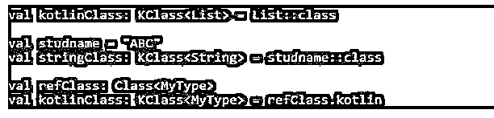
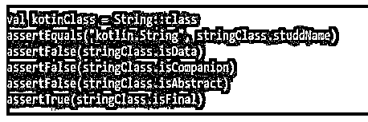
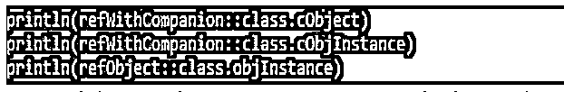
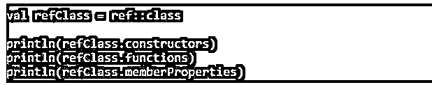
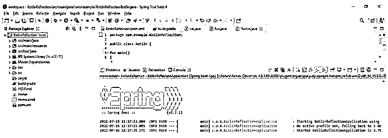

# 科特林反射

> 原文：<https://www.educba.com/kotlin-reflection/>


## 科特林反射简介

Kotlin reflection 是一组库和语言特性，允许我们自省程序结构。性能和功能是科特林的一等公民，这是自省的能力。它是一个提供内省给定程序的特性的特性。它用于在运行时利用其函数、属性和构造函数的成员和类。通过使用 java 的反射 API，kotlin 提供了一套简单的函数形式的反射 API，这在 kotlin 语言中是非常有用和重要的。

### 什么是科特林反射？

java 反射的标准构造在 kotlin 中也是可用的，通过使用它的代码，它将完美地工作。反思会考察能力的名称；它将在运行时与字段、方法和类进行交互。它包含大量的用途，这取决于我们正在开发什么。几乎所有框架的库都利用了幕后权力的反映。kotlin 反射将使我们能够在运行时引用统计定义的函数、类和接口。我们可以使用它来访问访问修饰符类的属性和功能。

<small>网页开发、编程语言、软件测试&其他</small>

### Kotlin 反射类引用

为了在运行时获取 kotlin 中的类引用，我们需要使用类引用的操作符。此外，引用类是从实例的类中获得的。类的引用称为有界类的引用。使用实例，我们可以获得对象在继承的情况下将确认的确切类型的引用。基本上，类引用用于获取引用类对象，用于在 kclass 中统计地获取引用对象。我们需要使用类文本。type 类的引用值是 kclass。Kotlin 类引用不同于 java 类的引用。我们通过使用 java 的 kclass 引用和属性来获取 java 类的引用。

下面的语法显示了类的引用，如下所示:

**语法:**

```
val p1 = string::class
val p2 = kotlinclass::class
```

引用 API 允许访问引用类，我们可以在 kotlin 类中使用同样的方法，它将提供对 java 类的引用。我们可以使用::操作符来访问 kotlin 类的扩展方法，如下所示。

**代码:**

```
val kotlinClass: Kclass <List> = List::class
val studname = "ABC"
val stringClass : KClass<String> = studname::class
val refClass: Class<MyType>
val kotlinClass: KClass<MyType> = refClass.kotlin.
```

**输出:**




一旦我们获得了 kclass 的对象，我们很容易发现我们的类是 final 或 abstract。我们还可以发现，我们的类是一个数据类或伴生类。

**代码:**

```
val kotinClass = String::class
assertEquals ("kotlin.String", stringClass.studdName)
assertFalse (stringClass.isData)
assertFalse (stringClass.isCompanion)
assertFalse (stringClass.isAbstract)
assertTrue (stringClass.isFinal)
```

**输出:**




Kotlin 将添加获取 companion 和任意类的类层次结构对象的能力，如下所示。

**代码:**

```
println(refWithCompanion::class.cObject)
println(refWithCompanion::class.cObjInstance)
println(refObject::class.objInstance)
```

**输出:**




在下面的例子中，我们使用引用类创建了一个新的实例类，如下所示。

**代码:**

```
val kotlinClass = ArrayList::class
val kotlin = kotlinClass.createInstance()
assertTrue(list)
```

**输出:**


在下面的例子中，我们访问构造函数来显式地使用它，如下所示。

**代码:**

```
val refClass = ref::class
println(refClass.constructors)
println(refClass.functions)
println(refClass.memberProperties)
```

**输出:**




获取对一个 kotlin 类的引用的最基本的特性。从统计学上获得参考被称为科特林类。我们可以通过使用 receiver 对象，使用::class 语法获取特定对象的类引用，如下所示。

```
val ref: ref = ….
assert (ref is ref) { "Bad ref: ${ref::class.studName}" }
```

我们将获得对象引用或错误引用的确切类的引用，而不是接收方表达式的类型，即引用。对构造函数、属性和函数的引用称为函数类型实例。

下面的示例显示了如下的类引用:

**代码:**

```
class kotlin {
fun main()
{
   val ref = kotlinref::class
   ……
   val obj = kotlinref();
   …….
   } }
```

**输出:**




### 科特林反射的特征

反射是在运行时修改和分析运行时类的能力的过程。它用于操作类及其成员，包括函数属性和构造函数。

*   我们用它来创建类实例；使用 kotlin 反射，我们可以实现这个类。
*   使用它，我们可以调用查找函数并在我们的程序中使用它。
*   我们可以使用它来检查注释。
*   我们可以使用它来发现参数并找到通用属性。
*   使用 kotlin，我们可以使用两种类型的反射 java 反射 AP 和 kotlin 反射 API。
*   当我们使用存在 java 反射的 Java 库时，我们使用 Java 反射 API。
*   科特林的倒影存在于科特林的包装里。反思。
*   使用它，我们可以访问 java 中没有的可空类型和属性。
*   我们可以说它不是 java 反射的替代品，但是它包含了额外的特性。
*   我们可以用它来访问用语言编写的 JVM 代码。
*   通过使用 kotlin 引用，我们可以为 kotlin 中定义的每个命名函数获取一个函数引用。我们可以通过在函数名前面加上::操作符来做到这一点。
*   函数引用用作其他函数的参数；在这种情况下，我们可以显式指定重载函数，也可以隐式指定函数，这由内容决定。
*   在其中，我们还可以以与使用::操作符类似的方式获得属性引用，该属性属于 kotlin 反射类。

### 结论

通过使用 java 的反射 API，kotlin 将其反射 API 集提供给函数风格，这很简单；科特林反射在科特林语言中非常有用和重要。Kotlin reflection 是一个库和语言特性集，允许我们自省程序结构。

### 推荐文章

这是科特林反思指南。这里我们分别讨论简介、kotlin 反射类的引用和特性。您也可以看看以下文章，了解更多信息–

1.  [Kotlin Web 框架](https://www.educba.com/kotlin-web-framework/)
2.  [科特林内部](https://www.educba.com/kotlin-internal/)
3.  [科特林印花](https://www.educba.com/kotlin-print/)
4.  科特林队列


