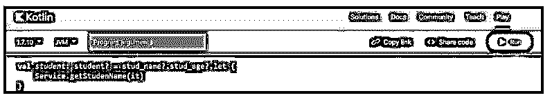
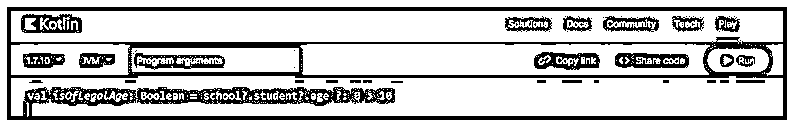
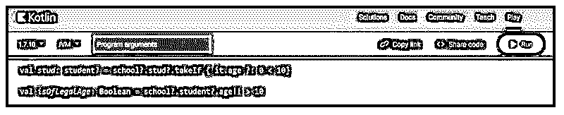
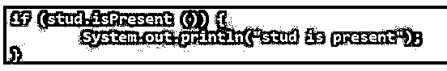
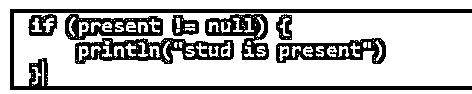

# Kotlin Optional

> 原文：<https://www.educba.com/kotlin-optional/>


## 科特林简介可选

Kotlin optional 用于优雅地处理程序中的空值或 null 值。这种类型基本上在执行用于返回空值的 API 调用时使用。这个新类是在 java 可选类型中引入的，允许我们的变量返回空值。许多编程语言中最常见的陷阱是访问空引用的成员会导致空引用的异常。我们用 null 代替 java。我们使用一个可选的关键字来处理这种情况。这是非常重要和有用的。

### Kotlin 可选概述

科特林 NPE 的可能原因是，它是一个显式调用抛出空指针异常。在 kotlin 中，类型系统区分持有空值的引用。Kotlin 将在创建可选类型时支持可空类型以及它将提供的所有 API。基本上，kotlin 支持可空类型；它将使可空类型成为可选类型，也将提供所有的 API。在 kotlin 中，可选类型将比较并转换为 kotlin 中的可空类型；在 kotlin 中，我们使用可空类型。

<small>网页开发、编程语言、软件测试&其他</small>

### Kotlin 可选类型

以下是 kotlin 中可用的可选类型。它包含可选的和可空的属性。

#### 1.可选属性和可空类型

使用 optional 作为字段类型和可空类型，返回类型的函数在 kotlin 中被认为是有效的和惯用的。我们不会在 kotlin 中使用可选类型，而是将字段的 null 属性声明如下。在下面的例子中，我们将接口名称声明为 student，并为接口提供了两个值。

**代码:**

```
interface student {
  val stud_name: String
  val stud_no: Int?
}
```

**输出:**


#### 2.安全呼叫接线员

在下面的例子中，stud_name 和 stud_age 是可选的；在检索学生的年龄时，我们被迫使用平面图方法。在 kotlin 中，我们使用安全调用操作符来访问可空类型属性。下面的例子显示了如下的安全调用操作符。

**代码:**

```
interface school {
  val stud: student
}
val stud_name: stud_name? = getNextstudIfPresent ()
val stud_age: Int? = stud_name?.stud?.age
```

**输出:**


#### 3.Let 函数

在 kotlin 中，我们使用 let 函数来调用安全类操作符中的外部函数。下面的例子展示了 kotlin 中的 let 函数，如下所示。

**代码:**

```
val student: student? = stud_name?.stud_age?.let {
  Service.getStudenName(it)
}
```

**输出:**




#### 4.Elvis 操作员

在链的时候，map 调用返回非空的 age，否则，它将提供回退值为零。以下示例显示了 kotlin 中的 Elvis 运算符，如下所示。

**代码:**

```
val isOfLegalAge: Boolean = school?.student?.age ?: 0 > 10
```

**输出:**




#### 5.断言运算符和 Take If 函数

在 kotlin 中，我们使用断言操作符，而不是 java 中使用的可选 get 函数。此外，我们在 kotlin 中使用 take if 函数，而不是在 java 中使用可选的 filter 方法。以下示例显示了 kotlin 中的 as 断言运算符和 take if 函数。

**代码:**

```
val stud: student? = school?.stud?.takeIf { it.age ?: 0 < 10}
val isOfLegalAge: Boolean = school?.student?.age!! > 10
```

**输出:**




### 科特林可选方案

在将项目从 java 迁移到 kotlin 时，我们需要检查我们在项目中使用的可选对象。

以下是我们在科特林使用的替代方案:

1.在分配空值的 kotlin 等价物中，我们需要如下分配空值。

**Java:**

**代码:**

```
Optional<String> stud = Optional.empty ();
```

**输出:**


**中的“T1”**

**代码:**

```
val stud: String? = null
```

**输出:**


2.在 java 中，如果值存在，则 of 方法会创建可选的。在 kotlin 中，我们使用 throw 方法抛出异常。

**Java:**

**代码:**

```
Optional<String> stud1 = Optional.of ("ABC");
Optional<String> stud2 = Optional.of (null);
```

**输出:**


**中的“T1”**

**代码:**

```
val stud1: String? = "ABC"
 val stud2: String? = null
 ?: throw NullPointerException ()
```

**输出:**


3.可空方法的工作方式与方法的相同，而不是引发空指针的异常。空值将产生空的。

**Java:**

**代码:**

```
Optional<String> stud1 = Optional.ofNullable ("ABC");
Optional<String> stud2 = Optional.ofNullable (null);
```

**中的“T1”**

**代码:**

```
val stud1: String? = "ABC"
val stud2: String? = null
```

**输出:**


4.与空值相比，kotlin 的当前值测试方法是否容易，如下所示。

**Java:**

**代码:**

```
if (stud.isPresent ()) {
System.out.println("stud is present");
}
```

**输出:**




**代码:**

```
if (present != null) {
println("stud is present")
}
```

**输出:**




5.kotlin 中的可空类型没有包装到另一个类中。有一个与 get 方法等效的方法。

**Java:**

**代码:**

```
String stud1 = stud1.get ();
String stud2 = stud2.get ();
```

**输出:**


**中的“T1”**

**代码:**

```
val stud1 = stud1
val stud2 = stud2 ?: throw NoSuchElementException ()
```

**输出:**


在上面的例子中，我们可以看到在 kotlin 中我们使用的是空类型，而在 java 中我们使用的是可选类型。

### Kotlin 可选数据类字段

在 kotlin 中，数据类表示数据容器的对象。默认情况下，它将公开主构造函数，它需要如下所有字段。

**代码:**

```
class student(
  val studname: String,
  val surname: String,
  val studage: Number
)
```

**输出:**


默认情况下，在数据类中，主构造函数中的所有字段都是必需的。在下面的例子中，我们正在编写一个新的类，如下所示。

**代码:**

```
class student1 (
  val studname? = null,
  val surname? = null,
  val studage? = null
)
```

**输出:**


为了消除这一步中的空能力，我们将设置主构造函数的默认值。

**代码:**

```
class student2 (
  val studname: String = "",
  val surname: String = "",
  val studage: Number = Int.MIN_VALUE
)
```

**输出:**


代替默认值，现在我们用默认值创建第二个构造函数，如下所示。

**代码:**

```
class student3 (
  val studname: String
) {
  constructor() : this("", "ABC", Int.MIN_VALUE)
}
```

**输出:**


### 结论

在 kotlin 中，类型系统区分持有空值的引用。Kotlin 将天生支持可空类型。这种类型基本上在执行用于返回空值的 API 调用时使用。

### 推荐文章

这是一个科特林可选指南。这里我们分别讨论简介、类型、替代和 kotlin 可选数据类字段。您也可以看看以下文章，了解更多信息–

1.  [Kotlin Web 框架](https://www.educba.com/kotlin-web-framework/)
2.  [科特林内部](https://www.educba.com/kotlin-internal/)
3.  [科特林印花](https://www.educba.com/kotlin-print/)
4.  科特林队列


