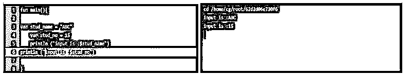
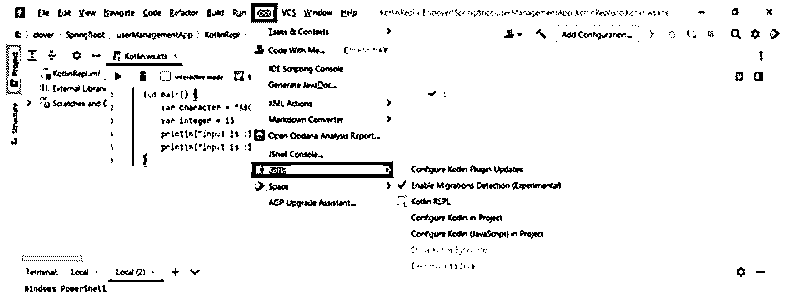
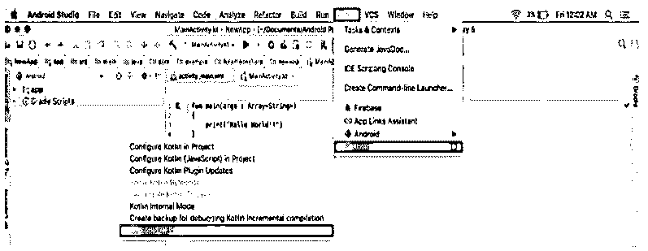
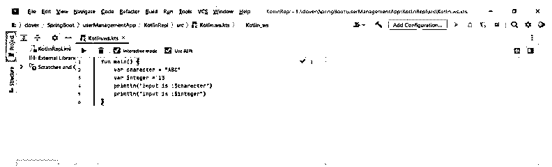

# 科特林·REPL

> 原文：<https://www.educba.com/kotlin-repl/>


## 科特林·REPL 简介

Kotlin repl 允许我们在 flyway 上执行代码，而不需要创建文件，或者我们不需要为它配置运行时环境。它接受简化的语法，因此我们可以更轻松地执行代码。而使用 kotlin repl 的时候，输入一行或多行代码，然后按 control+enter，然后将结果打印在控制台上。

### 什么是科特林·REPL？

Intellij 的想法是提供几种在项目之外执行代码片段的方法。当我们评估代码片段或一些原型改进时，这非常有用。kotlin 的代码通常组织在我们的项目中，我们通过使用文本编辑器或其他工具在 IDE 中工作。假设我们很快看到函数是如何找到一些表达式值的，那么我们不需要创建一个项目并构建它。repl 的缩写是 read eval print loop。它是一个交互式 shell 工具，用于快速运行各个部分。

<small>网页开发、编程语言、软件测试&其他</small>

### 如何使用科特林 REPL？

kotlin 中的 repl 是一个用户交互式编程环境，接受单个用户输入和表达式。我们可以从命令行界面访问它，并且我们可以利用这个环境来测试我们的程序。作为 repl，它是命令行的解释器；我们可以写 kotlin 的表达式来检查 kotlin 是如何工作的。

下面的例子显示了我们如何使用它:

#### 1.kotlin repl 中 println 函数的代码

在下面的例子中，我们只是在会话中使用 println 函数，它打印指定变量的值和我们传递给函数的字符串。

**代码:**

```
Fun main() {
var stud_name = “ABC”
var stud_no = 15
println (“input is :$stud_name”)
println (“input is :$stud_no”)
}
```

**输出:**




在上面的例子中，我们创建了两个变量名，stud_no 和 stud_name，并将值指定为 ABC 和 15。变量 stud_name 存储 ABC 值，stud_no 存储我们调用 println 函数打印变量值后的 15 个值。

#### 2.使用 kotlin repl 执行算术运算的代码

在下面的例子中，我们正在执行算术运算。

**代码:**

```
fun main() {
  var m = 15
  var n = 10
  var o = m+n
  println (o)
}
```

**输出:**


#### 3.在 kotlin repl 中创建类和类实例的代码

在下面的例子中，我们创建了类名作为 stud。在创建类的同时，我们也创建了构造函数。构造函数将类实例名作为 student。studname 的实例包含字符串形式的属性名，并且包含空值。然后，我们将变量声明为 studname，它将类名作为 stud 调用，将实例类的值初始化为 ABC。变量 studname 与类的实例一起使用。

**代码:**

```
fun main() {
  class stud (var student: String)
  var studname = stud("ABC")
  studname.student
}
```

**输出:**


### 外景地的科特林·REPL

它是一个交互式 shell，用于快速运行整个应用程序。这是一个计算机的交互式编程环境，它接受单个输入，然后对其进行评估，然后将结果提供给用户。

下图显示了它在 Intellij idea 中的位置。




要找到它在 Intellij idea 中的位置，我们需要打开 Intellij idea；打开 Intellij idea 后，我们需要转到 tools 选项卡；打开工具选项卡后，会显示 kotlin 选项卡。点击 kotlin 后，将显示 kotlin repl，我们必须将它添加到代码中。

下面的例子显示了它在 android studio 中的位置。在 android studio 中，它将显示与 Intellij idea 中相同的位置，如下所示。




要在 android studio 中找到它的位置，我们需要打开 Android studio；打开 android studio 后，我们需要进入工具选项卡；打开工具选项卡后，会显示 kotlin 选项卡。点击 kotlin 后，会显示 kotlin repl。

### 科特林·REPL 的例子

以下示例显示了如何执行算术运算，如下所示。在下面的例子中，我们执行加法、乘法、减法和除法运算如下。

#### 例 1:加法

**代码:**

```
fun main() {
var p = 15
var q = 10
var r = p+q
println (r)
}
```

**输出:**


#### 例 2:乘法

**代码:**

```
fun main() {
var p = 15
var q = 10
var r = p*q
println (r)
}
```

**输出:**


#### 例 3:除法

**代码:**

```
fun main() {
var p = 20
var q = 5
var r = p/q
println (r)
}
```

**输出:**


#### 例 4:减法

**代码:**

```
fun main() {
var p = 20
var q = 5
var r = p-q
println (r)
}
```

**输出:**


### Kotlin 代表常见问题

Kotlin 代表包含多个常见问题，以下是与 kotlin 代表常见问题相关的问答:

#### Q1。如何通过在暂存表中定义 repl 来运行 kotlin 代码？

**答案:**

我们可以通过使用一个草稿纸定义 use repl 按钮上的勾号来运行添加代码，如下所示。


#### Q2。哪些工具在支持它？

**答案:**

Intellij idea、android studio 和另一个框架将支持我们使用命令行界面。

#### Q3。如何使用 kotlin repl 和交互模式运行代码？

**答案:**

我们可以使用交互和 repl 模式运行代码，如下所示。我们可以用 android studio 的 Intellij。




### 结论

kotlin 中的 repl 是一个用户交互式编程环境，接受单个用户输入和表达式。接受输入后，它将对输入进行评估，并将输出返回给用户。intellij 的想法是提供几种在项目外部执行代码片段的方法。

### 推荐文章

这是一个科特林 REPL 指南。这里我们讨论一下科特林的介绍和如何使用 REPL？位置、示例和常见问题。您也可以看看以下文章，了解更多信息–

1.  [Kotlin Web 框架](https://www.educba.com/kotlin-web-framework/)
2.  [科特林内部](https://www.educba.com/kotlin-internal/)
3.  [科特林印花](https://www.educba.com/kotlin-print/)
4.  科特林队列


