# 科特林·格拉德勒

> 原文：<https://www.educba.com/kotlin-gradle/>


## 科特林·格拉德简介

Kotlin gradle 是一个常用于 Kotlin 和其他编程语言的构建系统。Gradle 是多平台和 kotlin 在系统构建时的默认选择。当时，包括许多 Intellij 想法，它自动生成必要的文件。我们也可以手动创建文件来理解项目结构。这是非常有用和重要的。

### 关键要点

*   编写插件代码是一项常规活动；这项活动通常包括编写插件的实现。
*   grad le 任务是由具有多个动作的默认任务定义的临时任务。
*   应用 gradle 插件时，相关的依赖项被添加到其中。

### kot Lin Gradle 是什么？

它包含了一个我们无法从其他构建工具中获得的非常重要的特性。它包含一个高度可定制的依赖关系解析引擎、调试工具和更多的工作避免机制。我们可以将 kotlin 的类型、安全性和优雅带到我们的应用程序中。使用兼容的 IDE 和 kotlin，我们可以构建脚本。gradle kotlin 中的 DSL 将在增强的编辑体验中为传统 groovy DSL 提供替代语法，这是 ide 所支持的。Gradle kotlin 提供了一个令人愉快的编辑体验。

<small>网页开发、编程语言、软件测试&其他</small>

### Kotlin Gradle 插件怎么用？

在下面的示例中，我们将项目名称创建为 Kotlin_Gradle，如下所示:

1.在第一步中，我们使用 Intellij idea 创建项目名为 Kotlin_Gradle，我们在创建 Kotlin 项目时提供了以下参数，如下所示。此外，我们正在添加示例代码。

name–kot Lin _ grad le
location–Documents
Language–kot Lin
Build system–Intellij
Jdk–Java version 11
Project–New Project

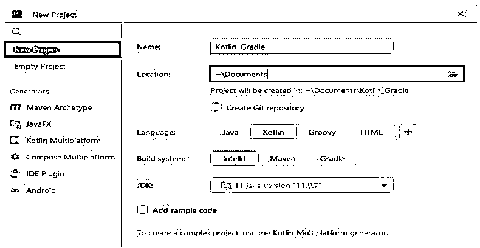


2.在本步骤中创建新项目之后，我们将检查新创建项目的项目结构，如下所示。

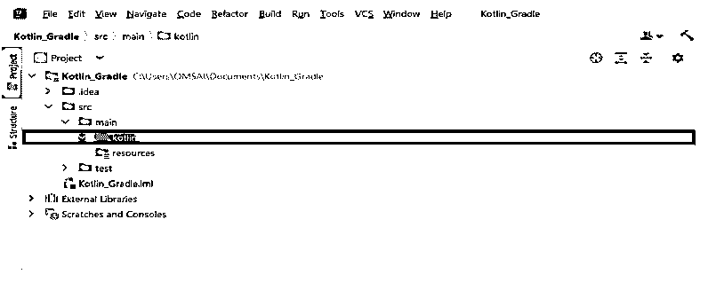


3.在这一步创建了项目及其结构之后，我们使用如下内容创建 build.gradle 插件文件。

**代码:**

```
plugins {
         kotlin("multiplatform") version "1.7.10"
}
repositories {
 mavenCentral()
}
kotlin {
 mingwX64("native") {
  binaries {
   executable()
  }
 }
}
tasks.withType <Wrapper> {
  gradleVersion = "6.7.1"
  distributionType = Wrapper.DistributionType.BIN
}
```

**输出:**

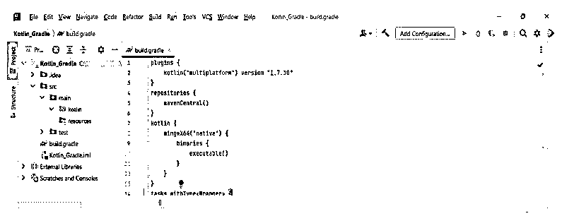


我们可以使用 minwX64、LinuxX64、iosX64、MacOSX64 等不同的目标来定义目标对应的平台；我们用的是 Windows 平台，所以用的是 minwX64 平台。现在的名字将描述我们正在编译代码的平台。该目标将呈现并可选地将目标的名称作为我们项目的本地参数。目标名称用于在项目中生成源路径和任务名称。

4.创建构建之后。格拉德文件。现在，在这一步，我们正在创建 settings.gradle 文件，如下所示。

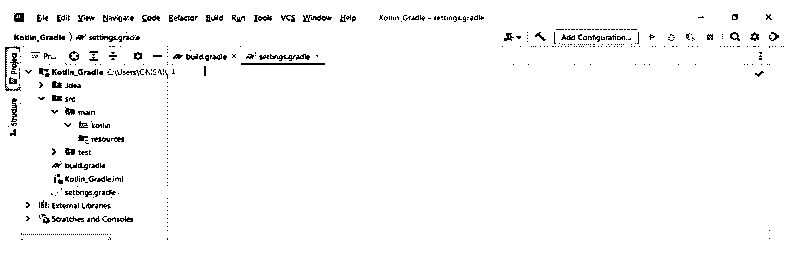


5.创建 settings.gradle 文件后，现在我们正在创建示例文件。我们将这个文件创建到项目的源文件夹中，如下所示。我们将文件名创建为 gradle.kt。创建文件后，我们将如下内容添加到该文件中，如下所示。

**代码:**

```
fun main() {
    ……..
}
```

**输出:**

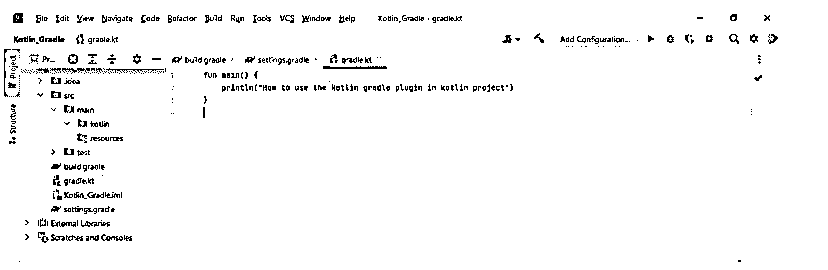


6.在这一步中创建了样本 kotlin 文件之后，我们将如下创建 kotlin 项目。

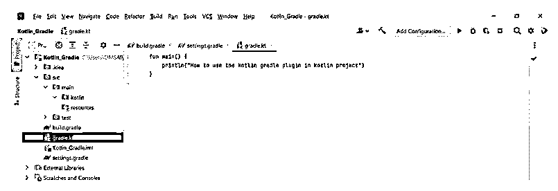


### 科特林·格拉德项目瞄准

为了定位多平台，我们需要 kotlin 多平台插件。以多个平台为目标被称为多平台项目。

以下示例显示了我们如何定位多个平台，如下所示:

**代码:**

```
plugins {
  kotlin ("multiplatform") version "1.7.10"
}
```

**输出:**

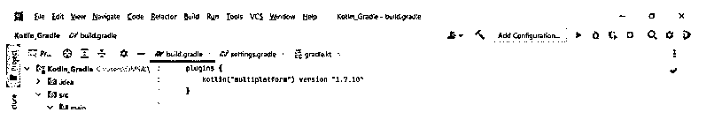


我们还可以通过使用 kotlin 来定位 JVM 为了定位 JVM，我们需要应用 kotlin JVM 的插件。下面的例子显示了我们如何应用 kotlin JVM 插件，如下所示。

**代码:**

```
plugins {
  kotlin ("multiplatform") version "1.7.10"
}
```

**输出:**

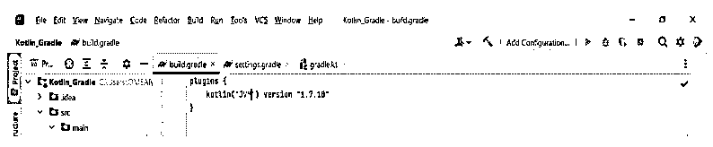


gradle 6.7 将引入 java 的工具链支持。使用 JDK 和 JRE，这与 java 不同。使用工具链的支持，gradle 将自动检测构建所需的缺失的 JDK 和本地 JDK。Gradle 可以在任何 JDK 上运行，这需要 gradle 被构建。kotlin 支持不使用工具链的本地任务。kotlin 的编译器总是运行 gradle 守护进程来运行 java 工具链。我们可以使用下面的代码来设置工具链。

**代码:**

```
kotlin {
   jvmToolchain {
   languageVersion.set (JavaLanguageVersion.of (8))
   }
}
```

**输出:**

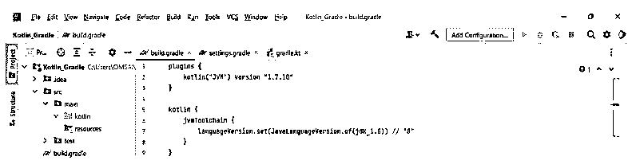


在下面的例子中，我们的目标是 javascript 我们使用 kotlin-js 插件如下。

**代码:**

```
plugins {
  kotlin("JS") version "1.7.10"
}
```

**输出:**

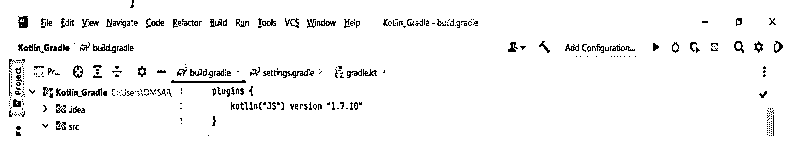


插件只对 kotlin 的文件起作用，所以建议把 java 和 kotlin 文件分开。假设我们没有单独存储它；我们需要指定源文件夹。

### Kotlin Gradle 常见问题

我们可以在 gradle 项目中定义 kotlin gradle 插件。

#### Q1。我们如何创建 kotlin gradle 的共享库？

**答案:**

我们可以在 gradle 中使用 produce 动态编译器。我们可以如下创建一个共享库。

**代码:**

```
kotlin {
   iosArm64("gradle") {
   binaries.sharedLib()
   }
}
```

**输出:**

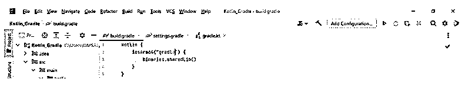


#### Q2。为什么 kotlin gradle 在 kotlin 开发中最好？

**答案:**

我们可以使用 jet brains 的 kotlin gradle 插件来编译 JVM 和 JS 代码。

#### Q3。我们如何在 kotlin gradle 项目中创建一个静态库？

**代码:**

```
kotlin {
  iosArm64("gradle") {
  binaries.staticLib()
  }
}
```

**输出:**

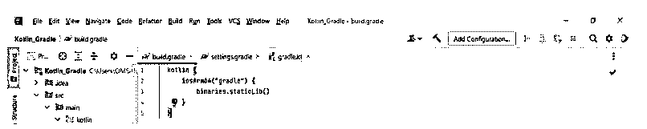


### 结论

它包含了一个我们无法从其他构建工具中获得的非常重要的特性。它是 kotlin 和其他编程语言中常用的构建系统。Gradle 是多平台和 kotlin 在系统构建时的默认选择。

### 推荐文章

这是一个科特林格拉德指南。这里我们讨论一下 kotlin gradle 插件的介绍和使用方法？项目定位和常见问题。您也可以看看以下文章，了解更多信息–

1.  [Kotlin Web 框架](https://www.educba.com/kotlin-web-framework/)
2.  [科特林内部](https://www.educba.com/kotlin-internal/)
3.  [科特林印花](https://www.educba.com/kotlin-print/)
4.  科特林队列


