# kot Lin graph QL(kot Lin 图形 SQL)

> [https://www . educba . com/kot Lin-graph QL/](https://www.educba.com/kotlin-graphql/)


## Kotlin graphQL 简介

Kotlin graphql 是一个生成 java 模型和 kot Lin graph QL 查询的客户端。Kotlin graphql 将执行 graphql 服务器的查询，并将结果作为 Kotlin 特定类型返回。这意味着我们不需要处理 JSON 在地图上的传递，它将手动确定角色的值。使用它，我们不需要写模型类型。

### 关键要点

*   graphql 是运行时的查询语言，也是用来完成现有数据查询的 API。
*   graphql 在我们的 API 中提供了一个可理解的、完整的数据描述，让客户能够询问他们到底需要什么。

### Kotlin graphQL 是什么？

graphql 是用于获取数据的 API 查询语言。此外，它是 REST API 的替代品；graphql 并不特定于单一的平台。此外，graphql 支持所有类型的客户端，包括 IOS、web 和 android。graphql 将站在客户端和服务器之间，帮助我们以优化的方式查询数据。kotlin 中的每个 graphql 服务都将定义一组描述数据的类型。通过使用这些数据，我们可以查询特定的服务。这很重要。

<small>网页开发、编程语言、软件测试&其他</small>

### Kotlin graphQL 安装

以下步骤显示了我们如何安装 graphql，如下所示。为了首先安装 graphql 插件，我们需要在系统中打开 Intellij idea。

我们正在 Intellij idea 软件中安装 graphql 插件，如下所示:

1.为了安装 graphql，首先，我们在系统中打开 Intellij idea。在打开 Intellij idea framework 时，我们没有打开任何项目。

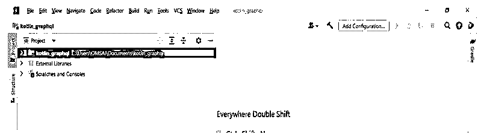


2.打开这个框架后，我们正在安装 graph QL 3 . 2 . 0 版本的插件。在安装 graphql 插件的时候，它会显示它包含的所有特性。

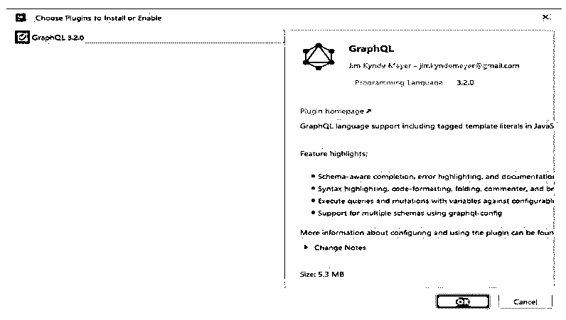


3.单击“安装确定”按钮后，将显示隐私声明选项卡。我们需要接受这个 graphql 插件的隐私声明。如果不接受隐私声明，我们将无法安装 graphql 插件。

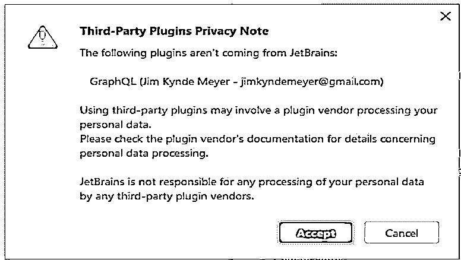


4.在安装插件使其在项目中生效后，我们需要重启 Intellij idea。在下面的例子中，我们在安装 graphql 插件后重启 Intellij idea。

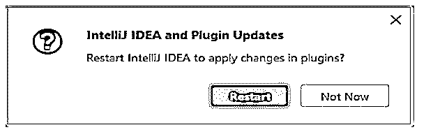


5.在重启 Intellij idea 之后，添加了 graphql 的插件，这样我们就可以在我们的项目中使用它了。

### Kotlin graphQL 客户端

基本上，graphql 将支持如下三种类型的文件。在 kotlin graphql 中，我们使用的是 graphql 文件。

*   **graphql 模式文件—**该文件将使用 graph QL 的语法描述我们后端中的类型。
*   **Json 模式文件—**这个文件将使用 graphql 的语法描述我们后端的类型。
*   **Graphql 可执行文件—**该文件将我们的操作和查询描述成 Graphql 的语法。

默认情况下，kotlin 需要我们模块中的模式。我们可以在 src/main 目录中创建模式。在下面的示例中，我们在/src/main 目录中创建了一个名为 graphql 的新目录。

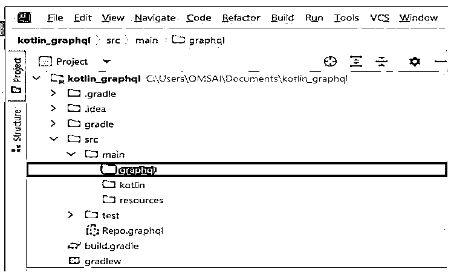


创建目录后，我们通过使用自省来下载模式。有时候自省是禁用的，我们需要从后端获取。我们需要复制模块中的模式。下载模式后，我们将下面的查询写入 graphql 文件，如下所示。

**代码:**

```
query Student ($stud_id: String!) {
 stud(stud_id: $stud_id) {
  stud_id
  stud_name
 }
}
```

**输出:**

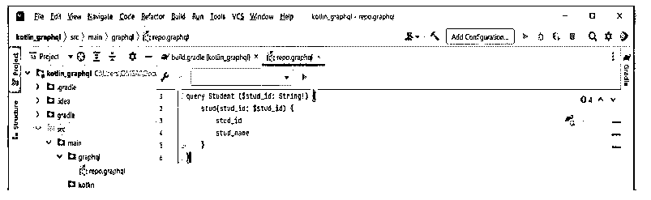


编写完查询后，我们将创建一个客户机，如下所示。我们正在编写下面的代码来创建一个客户端。

**代码:**

```
val client = client.Builder ()
.url("https://test.com/")
.build()
val res = client.query (Student(id = "1")).execute()
println("stud.stud_name=${res.data?.stud?.stud_name}")
```

**输出:**

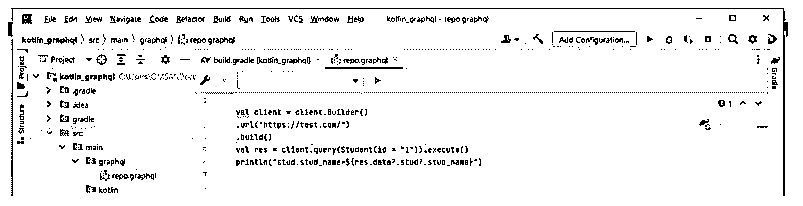


### Kotlin graphQL 项目配置

为了配置 graphql 项目，我们需要在 kotlin 中创建项目。

下面我们将 kotlin 项目名称创建为 kotlin_graphql，如下所示:

1.为了在 kotlin 中配置 graphql，在第一步中，我们使用 Intellij idea 将 kotlin 项目名创建为 kotlin_graphql。我们在创建 kotlin 项目时提供以下参数，如下所示。

名称–kot Lin _ graph QL 位置-\ Documents
语言–kot Lin 构建系统–Intellij
Jdk–Java 版本 11 项目–新项目

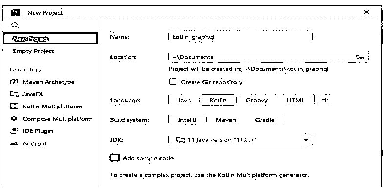


2.在创建了名为 kotlin_graphql 的项目模板后，现在我们检查指定项目的结构。

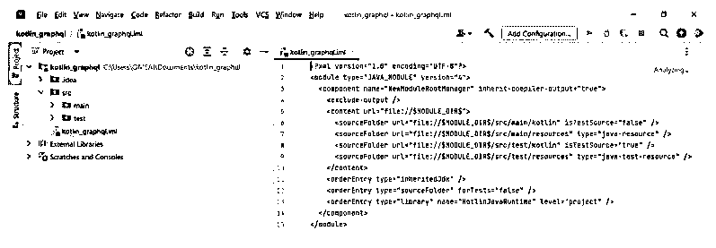


3.现在，在这一步，我们将插件添加到 build.gradle 文件中。我们正在将以下插件添加到 build.gradle 文件中。

**代码:**

```
plugins {
  id ("com.apollographql.apollo3").version("3.4.0")
}
```

**输出:**

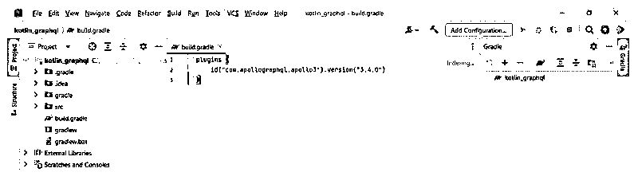


4.添加完依赖项后，现在我们需要为 kotlin graphql 设置运行时依赖项，如下所示。

**代码:**

```
dependencies {
  implementation("com.apollographql.apollo3:apollo-runtime:3.4.0")
}
```

**输出:**

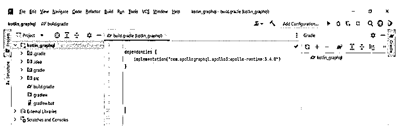


5.添加完依赖项后，我们将创建包名，以便使用生成的模型，如下所示。在包名中，我们定义了包的名称。

**代码:**

```
apollo {
  packageName.set ("com.example")
}
```

**输出:**

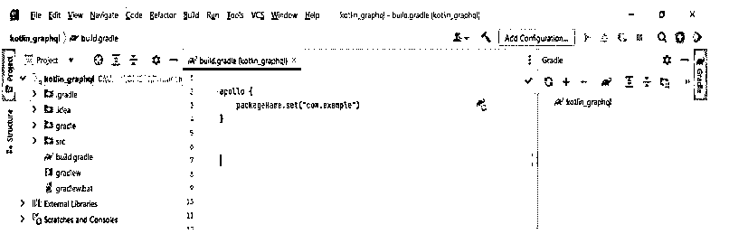


6.设置项目名称后，我们创建 graphql 目录和 graphql 的客户端。创建客户端后，我们的配置如下所示。

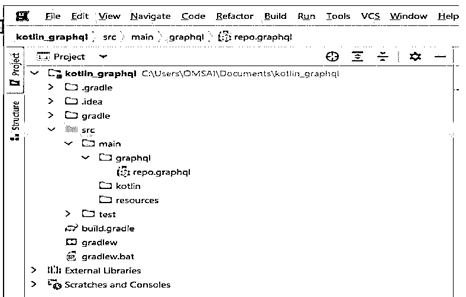


### 常见问题解答

下面是提到的常见问题:

#### Q1。kotlin graphQL 支持多少种文件类型？

**答案:**

它支持三种类型的文件。即 graphql、json 和 graph QL。在这方面，我们主要使用 graphql 文件。

#### Q2。使用 graphQL 时会用到哪些类型的依赖关系？

**答案:**

在 kotlin 中使用 graphql 时，我们需要使用 ktor、koin、squash 和 graphql 依赖项。

#### Q3。graphQL 中的 API 端点是什么？

**答案:**

为了指定端点，我们需要通过注释传递字符串。然后我们需要创建数据类来表示 get 或 post 请求。

### 结论

它将站在客户端和服务器之间，帮助我们以优化的方式查询数据。它将执行对 graphql 服务器的查询，并将结果作为特定于 kotlin 的类型返回。这是一个生成 java 模型和 graphql 的 kotlin 查询的客户机。

### 推荐文章

这是一个 Kotlin graphQL 的指南。在这里，我们讨论简介、kotlin graphQL 安装、客户端、项目配置和常见问题。您也可以看看以下文章，了解更多信息–

1.  [Kotlin Web 框架](https://www.educba.com/kotlin-web-framework/)
2.  [科特林内部](https://www.educba.com/kotlin-internal/)
3.  [科特林印花](https://www.educba.com/kotlin-print/)
4.  科特林队列


