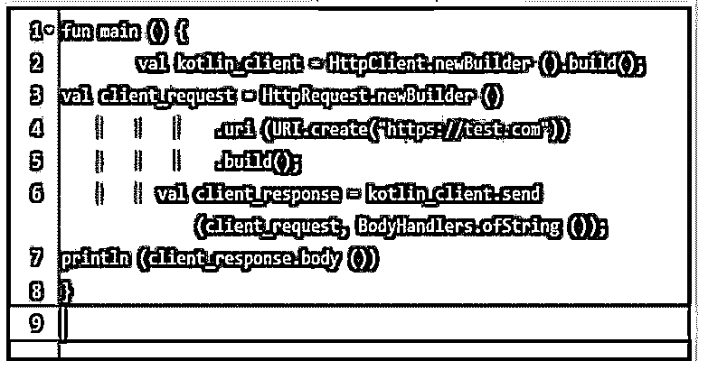
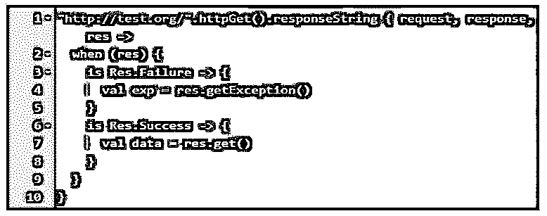
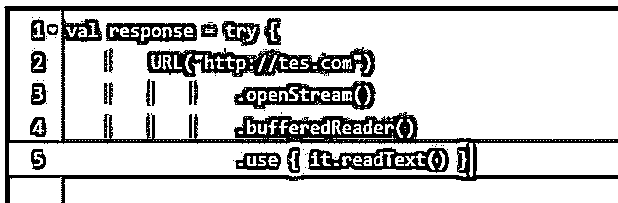
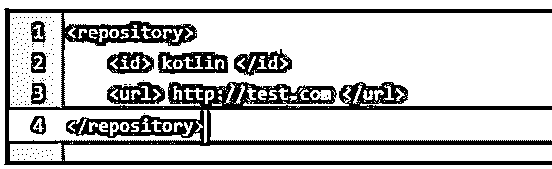
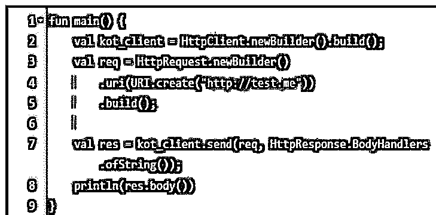
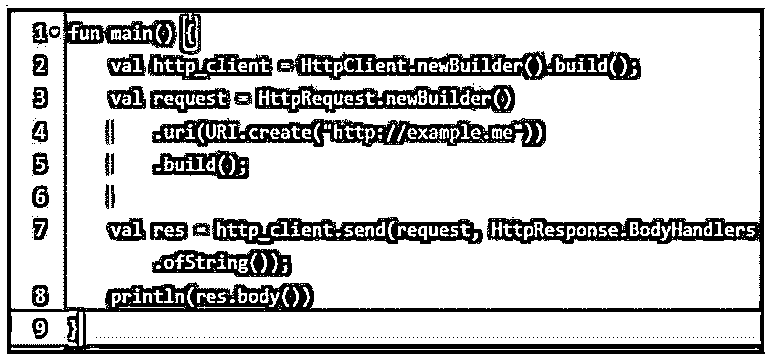
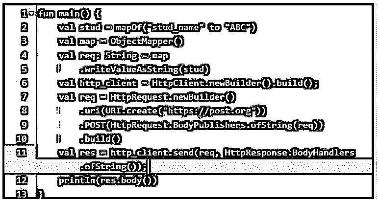

# Kotlin HTTP 客户端

> 原文：<https://www.educba.com/kotlin-http-client/>


## Kotlin HTTP 客户端介绍

Kotlin http 客户端用于获取和发布请求；这就是我们在 kotlin 中发送 get 和 post 请求的方式。Http 是一种超文本传输协议，用于协作和分布式信息系统。Http 是全世界都有的数据通信。我们使用 ktor 框架在 kotlin 中发出 http 客户端请求，这有助于构建应用程序。

### 关键要点

*   在 Kotlin 中，我们使用 URLConnection.setDoOutput 函数发送 post 请求，并将其设置为 true。此外，我们还将 post 参数写入输出流的连接。
*   http url 连接类是 url 连接的一个子类，它提供了 http 的几个特性。

### 什么是 Kotlin HTTP 客户端？

我们可以使用 ktor 框架或任何其他框架向 API 发出 http 客户端请求，以从应用程序获得响应。在 kotlin 框架中，为针对传统 UI 工具包开发的应用程序添加网络功能非常简单。通过使用 kotlin 中的 ktor 框架，我们可以提交 http 客户端请求，这些请求是异步的，运行在多个平台上，如 android、JavaScript、IOS 和其他平台。我们可以使用 java.net URL 连接类在 kotlin 中发送 http 请求。发送请求是非常有用和重要的。

<small>网页开发、编程语言、软件测试&其他</small>

### Kotlin HTTP 客户端请求

对于在 kotlin 中使用 http 客户端发送客户端请求，如果我们使用最新版本的 JDK，那么我们可以使用 http 客户端的新 API，这是完全兼容的。它将支持 http 2.0 版本，也将支持 web 套接字，而且它是完全同步的，集成了协程。

下面我们创建 http 客户端的新请求，并如下传递 http 请求的对象。

**代码:**

```
 fun main () {
  val kotlin_client = HttpClient.newBuilder().build();
  val client_request = HttpRequest.newBuilder()
  .uri (URI.create("https://test.com"))
  .build();
val client_response = kotlin_client.send(client_request, BodyHandlers.ofString());
  println(client_response.body())
  }
```

**输出:**




API 也支持执行请求，这是异步的。如果假设我们正在使用，那么我们可以使用完成阶段等待如下。

**代码:**

```
fun main() {
suspend fun getData (): String {
val client_res = client.sendAsync (request, BodyHandlers.ofString ());
return client_res.await ().body()
}
val data = getData ()
process (data)
}
```

**输出:**


http 客户端请求中最常用的库是 fuel。这个图书馆功能齐全；我们也可以使用配置的默认设置来启动并运行它。Fuel 还生成库结果，它是由同一个创建者返回的，用于捆绑响应和错误条件。以下示例显示了燃料是如何处理请求的。

**代码:**

```
when (res) {
is Res.Failure -> {
val exp = res.getException()
}
is Res.Success -> {
val data = res.get()
   } }
}
```

**输出:**




我们还可以使用 ktor 客户端发出 http 客户端的请求。下面的例子展示了 ktor 客户端如何用 kotlin 发出请求。

**代码:**

```
val kotlin_client = HttpClient (Apache) {
install (JsonFeature) {
serializer = GsonSerializer()
   }
}
val htmlContent = kotlin_client.get <String>("https://test.org/")
```

**输出:**


假设我们使用的是专用库，那么我们不需要做如下的定制配置。

**代码:**

```
val response = try {
URL ("http://tes.com")
.openStream()
.bufferedReader()
.use { it.readText() }
```

**输出:**




### 配置

为了在 kotlin 中使用 http 客户端，我们需要添加一个 http 依赖项。

以下步骤显示了 http 客户端的配置，如下所示。:

1.为了在我们的项目中使用这个库，我们需要添加如下依赖项。

**代码:**

```
<dependency>
<groupId> khttp </groupId>
<artifactId> khttp </artifactId>
<version> 0.1.0 </version>
</dependency>
```

**输出:**


2.添加完依赖项后，我们将添加存储库指令，如下所示。

**代码:**

```
<repository>
<id> kotlin </id>
<url> http://test.com </url>
</repository>
```

**输出:**




3.在下面的例子中添加了 repository 指令后，我们将如下配置 http 客户端请求。

**代码:**

```
fun main() {
val kot_client = HttpClient.newBuilder().build();
val req = HttpRequest.newBuilder()
.uri(URI.create("http://test.me"))
.build();
val res = kot_client.send(req, HttpResponse.BodyHandlers.ofString ());
println(res.body ())
}
```

**输出:**




### Kotlin HTTP 客户端方法

基本上，http 客户端有两种可用的方法，即 http get 和 http post。下面是这些方法的示例:

#### 1.HTTP GET

http get 方法请求指定的资源表示形式。使用 get it 发出的请求将只检索数据。

以下示例显示了 http 客户端的 get 请求，如下所示:

**代码:**

```
fun main() {
val http_client = HttpClient.newBuilder().build ();
val request = HttpRequest.newBuilder()
.uri (URI.create ("http://example.me"))
.build ();
val res = http_client.send(request, HttpResponse.BodyHandlers.ofString ());
println (res.body())
}
```

**输出:**




#### 2.HTTP 帖子

http post 方法将向服务器发送数据。该方法在上传文件或提交任何 web 表单时使用。以下示例显示了 http post 请求方法，如下所示。

**代码:**

```
fun main() {
val stud = mapOf("stud_name" to "ABC")
val map = ObjectMapper()
val req: String = map
.writeValueAsString (stud)
val http_client = HttpClient.newBuilder().build();
val req = HttpRequest.newBuilder()
.uri(URI.create("https://post.org"))
.POST(HttpRequest.BodyPublishers.ofString(req))
.build()
val res = http_client.send(req, HttpResponse.BodyHandlers.ofString());
println(res.body())
}
```

**输出:**




### 常见问题解答

下面是提到的常见问题:

#### Q1。kotlin 中可用的 http 客户端请求方法的类型是什么？

**答案:**

基本上，kotlin 中有两种类型的 http 客户端请求方法，即 HTTP GET 和 HTTP POST。

#### Q2。什么是 HttpUrlConnection？

**答案:**

http url 连接是 url 连接的子类，它提供了 http 的几个特性。为了获得 http url 连接，我们可以转换 url 连接的实例。

#### Q3。什么是 kotlin http 客户端 API？

**答案:**

http 客户端 API 用于执行异步请求。使用 http 客户端 API，我们创建一个新的 http 客户端，并传递 http 请求的对象。

### 结论

使用 ktor 框架，我们可以提交 http 客户端请求，它是异步的，运行在多个平台上，比如 android 和其他平台。它用于 get 和 post 请求；这是我们在 kotlin 中发送 get 和 post 请求的方式。

### 推荐文章

这是一个 Kotlin HTTP 客户端的指南。这里我们讨论介绍、请求、kotlin HTTP 客户端配置、方法和常见问题。您也可以看看以下文章，了解更多信息–

1.  [Kotlin Web 框架](https://www.educba.com/kotlin-web-framework/)
2.  [科特林内部](https://www.educba.com/kotlin-internal/)
3.  [科特林印花](https://www.educba.com/kotlin-print/)
4.  科特林队列


