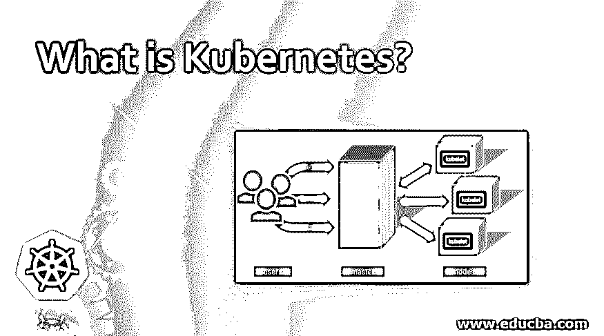
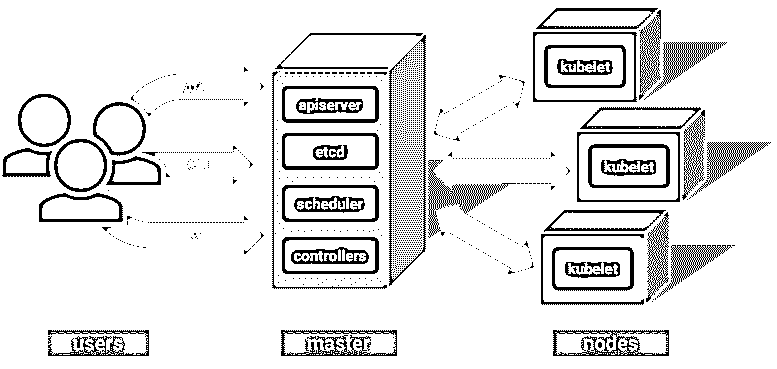
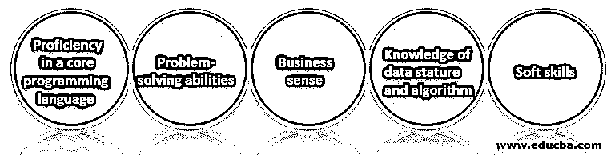

# What is Kubernetes?

> 原文：<https://www.educba.com/what-is-kubernetes/>

## 忽必烈的概论

下面的文章为什么是 Kubernetes 提供了一个大纲？容器是打包应用程序及其所有依赖项的标准方式，因此您可以无缝地跨环境移动应用程序。与虚拟机不同，容器不捆绑操作系统。容器包含应用程序代码、运行时、系统工具、库和设置。容器比虚拟机更轻、更便携、更有效。

它是一个容器管理工具。这个工具的主要目标是部署容器，缩放和清除容器，平衡容器负载。它不是基于集装箱化平台；它提供了管理多个容器的解决方案。它支持多种云和裸机环境。它是 100%开源的，用 GoOne 编写。两年前，谷歌推动 Kubernetes 开源。它的一个关键卖点是，它已经被用来运行谷歌的庞大系统很长时间了。

<small>网页开发、编程语言、软件测试&其他</small>

### 不可思议的建筑

下面是架构:

因为这在集群计算中创建了一个[背景，所以一切都在集群内部工作。该群集托管一个节点，该节点充当群集的“主节点”，其他节点充当“容器化”节点。每个节点可以运行几个这样的部署单元，它们是一组相互交互的容器。复制控制器是一个主控制器，可确保所需的 no-pods 始终在节点上运行。](https://www.educba.com/what-is-cluster-computing/)

Node 是 Kubernetes 集群中一个独立的主机，用于启动线程和容器。这个 Minion 节点从属通常只用于启动和开发应用程序容器。Kubelet 是在每个较低节点启动的进程，用于管理、负载控制和操作。

### 使用 Kubernetes 的好处

现在，这项技术在几乎所有基于云的谷歌项目中被积极使用。它通过分发容器为多个主机提供了昂贵的水平可伸缩性。在突然断电或技术紧急自我恢复期间，提供系统可操作性复制。它有像这样的运算算法。

### Kubernetes 的优势

我们将着眼于有助于您超越竞争对手并提高您的利润的优势。

#### 1.负载平衡和服务发现

由于 Kubernetes 会自动为每个容器分配一个特定的 IP 地址，因此无需担心容器之间的联网和通信。它们通过 IP 地址相互通信。它还为一组容器分配一个 DNS 名称，即[域名系统](https://www.educba.com/what-are-the-types-of-dns-servers/)，以平衡负载集群的流量。

#### 2.自动装箱

根据需求和可用资源，它自动打包应用程序调度容器。它管理关键的和最大的努力，以确保数据的完全利用，并相应地保存未使用源的报告。

#### 3.存储编排

它允许用户装载存储；如果用户的存储空间已满，他们可以创建另一个装载并保存他们的数据。用户可以选择任何存储选项，如本地存储、公共或私有[云提供商如](https://www.educba.com/top-cloud-providers/) AWS 或存储[系统如 NFS](https://www.educba.com/nfs-in-linux/) (网络文件系统)、 [iSCSI](https://www.educba.com/what-is-iscsi/) 等。

#### 4.自愈

当任何容器在执行期间失败时，它会自动重新启动那些失败的容器。如果容器没有给用户任何响应，这些容器将被删除。

#### 5.批量执行

它可以一次运行一批容器，并且能够处理 CI 工作负载。如果容器失败，它会重新启动这些容器，或者在需要时用另一个容器替换它们。

#### 6.水平缩放

在其中，只需一个命令就可以放大和缩小容器。也可以使用 [Kubernetes 仪表盘](https://www.educba.com/install-kubernetes/)携带。

#### 7.机密和配置管理

它部署和更新配置和机密，而不会泄露堆栈配置的机密。

#### 8.自动回滚和展示

在其中，更改会自动推出并更新应用程序。如果出现问题，它会自动回滚更改。

#### 9.帮助你更快地移动

它通过创建自助服务平台即服务(PaaS ),为开发团队提供硬件级层的抽象。开发项目可以快速请求他们需要的资源。

#### 10.Kubernetes 具有成本效益

Kubernetes 和容器比虚拟机管理程序和虚拟机更好地利用资源。由于轻量级容器，需要更少的 CPU 和内存资源来工作。

### Why do we Need Kubernetes?

许多组织使用 Linux、docker 和 rocket 来管理容器。他们大规模使用这些容器。组织不使用一个或两个容器；相反，他们使用 10 到 100 个集装箱来保持装载平衡，并确保资源可用。

当装载流量增加时，即一秒钟内出现 N 个请求时，组织可能必须扩大容器的规模。但是当容器与日俱增时，变得复杂的可能性也会增加。正因为如此，为了处理这些容器，对容器管理工具的需求增加了。然后 Kubernetes 进入市场。它因其功能性而变得流行，并被用作谷歌的创意。

### Scope 还是 scope

Kubernetes 专家是 IT 行业中一个热门且令人兴奋的职业。因此，对于 Kubernetes 管理员、Kubernetes 服务提供商来说，有很多机会。即使是初级的 Kubernetes 管理员的工资也相当高。初级 Kubernetes 管理人员在印度的年薪大约为 600，000 卢比。而在美国，初级管理人员的平均年薪是 5 万美元。

因此，对训练有素和熟练的 Kubernetes 管理人员和工程师的需求越来越大。所以可以说，这项技术将在未来成为配器领域的领先技术。因此，随着 Kubernetes 的发展速度日益加快，它正在创造新的工作岗位。Kubernetes 培训认证课程帮助任何想成为 Kubernetes 管理员或服务提供商的人。认证可从 IBM，Linux 学院，云学院等。它的管理人员也可以通过参加高级课程来提高他们的技能。

### 结论

这是 Kubernetes 的指南，它允许用户在高度可扩展的开源平台上运行可扩展的、高度可用的容器化工作负载。本文介绍了 Kubernetes 的架构、优点、应用和范围。

### 推荐文章

这是一个什么是 Kubernetes 的指南？这里我们讨论 Kubernetes 的介绍、好处、架构和优点。您也可以浏览我们推荐的其他文章，了解更多信息——

1.  [立方联合会](https://www.educba.com/kubernetes-federation/)
2.  密密秘
3.  [立方入口](https://www.educba.com/kubernetes-ingress/)
4.  [立方命名空间](https://www.educba.com/kubernetes-namespace/)

