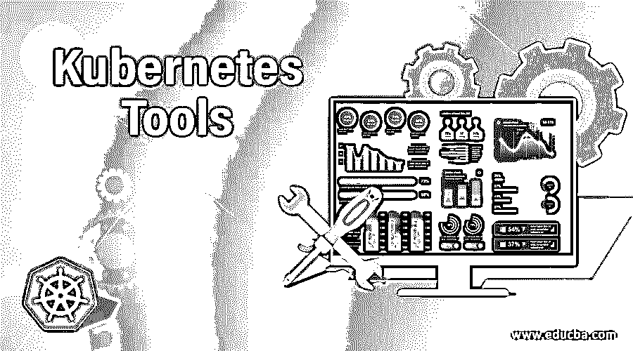

# Kubernetes 工具

> 原文：<https://www.educba.com/kubernetes-tools/>

## Kubernetes 工具简介

Kubernetes 工具用于管理、监控、部署、测试和保护 Kubernetes。这些工具为 Kubernetes 添加了更多的功能来使用它的大部分，并补充 Kubernetes 以增强开发工作，从而从 Kubernetes 获得更多。有几个内置工具可以帮助我们使用 Kubernetes。有不同的工具来完成相同的工作，因此我们应该使用哪种工具完全取决于需求和基础架构。例如，有多种工具可用于部署 Kubernetes 集群，如 kubeadm、minikube 等。然而，每个工具在不同的场景中都是有用的。

### Kubernetes 的 10 大工具

以下是有助于使用 Kubernetes 的最基本的工具:-

<small>网页开发、编程语言、软件测试&其他</small>

#### 1.库贝特尔

Kubectl 是一个命令行工具，用于与 Kubernetes 集群进行交互。它提供了一个命令行界面来管理 Kubernetes 集群，如检查节点状态、部署和删除 pod、部署、服务、名称空间等。

Kubectl 版本必须在一个不同于集群版本的版本之内。例如，1.2 版适用于 1.1 版、1.2 版和 1.3 版主版本。

我们可以在一台机器上使用 kubectl 远程管理多个 Kubernetes 集群。出于身份验证的目的，我们需要将配置文件从 Kubernetes 集群的主服务器复制到用户的主目录。

#### 2\. Kube-shell

Kube-shell 也是与 Kubernetes 集群交互的命令行工具。它提高了生产率，因为它提供了命令自动完成和自动建议。如果我们输入了错误的命令，它可以搜索并建议正确的命令。它还提供了有关已执行命令的内嵌文档。

#### 3\. Kubeadm

Kubeadm 是一个用于轻松供应多节点 Kubernetes 集群的工具。这是一个命令行工具，用于初始化我们的 Kubernetes 集群。我们需要在初始化集群时提供 pod CIDR 值。这有助于我们轻松启动 Kubernetes 集群。它首先进行飞行前检查，然后创建所有必需的证书和配置文件，并将这些文件放在适当的位置，这样我们就不必手动处理这些东西。然而，它不包括插件和网络设置，所以我们需要手动部署网络插件，如法兰绒，编织网，印花布等。按照我们的要求。

#### 4.迷你库贝

Minikube 也是一个引导 Kubernetes 集群的工具，但是，它只允许我们在我们的计算机或笔记本电脑上本地运行一个单节点集群，这对测试和开发非常有用。我们可以使用软件包或者直接下载或者使用自制软件来安装 Minikube。我们可以在 Windows、Linux 和 OSX 上运行 Minikube。我们可以在几分钟内初始化单节点集群，并开始使用它。这是用最少的资源部署 Kubernetes 集群的最简单的方法。

#### 5.仪表盘

Dashboard 提供了一个基于 web 的用户界面来管理 Kubernetes 集群。我们可以部署容器化的应用程序，解决集群问题，以及管理集群及其资源。我们可以使用控制面板监控节点和单元的资源利用率。它还可以监控工作负载的运行状况。它提供了资源利用的图形视图，有助于轻松识别任何资源问题。默认情况下不部署仪表板，我们需要在 Kubernetes 集群中将它作为一个 pod 单独部署。

#### 6.舵

Helm 是一个包管理工具，它管理预先配置的 Kubernetes 资源包。它也被称为 Kubernetes 图表。它类似于其他包管理工具，如 YUM、APT 和 Homebrew，但适用于 Kubernetes。Helm 用于查找和使用流行的软件包，并允许我们以 Kubernetes 图表的形式共享我们自己的应用程序。它还用于创建可重现的构建和 Kubernetes 清单文件。它是一种模板。

#### 7\. Kompose

Kompose 是一个用于将 docker-compose 转换为 Kubernetes 资源的工具。它将一个 Docker Compose 文件作为参数，并使用一个简单的命令“kompose convert”转换成 Kubernetes 部署和服务。如果我们计划将我们的工作负载从 Docker Swarm 迁移到 Kubernetes，这是一个非常有用的工具，因为我们需要将 Docker Compose 格式转换为 Kubernetes 资源清单。转换可能不精确；然而，当我们第一次在 Kubernetes 上部署应用程序时，它会有很大的帮助。安装 Kompose 有多种方法，但推荐的方法是从 Github 下载二进制文件。

#### 8.普罗米修斯

Prometheus 是一个用于监控 Kubernetes 星团的监控工具。这是用围棋写的。这是一个基于指标的监控系统，支持多维数据模型。在 Kubernetes 中公开普罗米修斯度量是一件非常容易的事情。我们可以将其设置为在满足某些条件时触发警报。它通过 HTTP 上的拉模型收集时间序列数据。Prometheus 中有两种发现目标的方法，第一种是通过服务发现，第二种是静态配置。它还支持数据可视化的图形和仪表板。Grafana 是现在非常流行的工具。

#### 9.格拉夫纳

它是一个可视化工具，用于可视化 Kubernetes 集群的资源利用情况，在满足特定条件时发出警报，例如任何节点或 pod 的 CPU 或内存利用情况等。我们可以根据需要创建仪表板，并与我们的团队轻松共享。它有大量的可视化选项，有助于更好地理解数据。我们可以直观地定义警报，并通过 PagerDuty、Slack 等方式获得通知。我们需要将它与 metrics collector 工具(如 Prometheus)连接起来，但是它有内置的 Graphite 查询解析器。

#### 10.扭锁

它是一个安全工具，可以扫描部署在 Kubernetes 集群上的应用程序的漏洞和合规性问题。它包括主机、容器和映像。它有一个内置的防火墙，可以保护前端微服务免受外部攻击。

### 结论

还有其他一些工具可以用来管理 Kubernetes 集群并增强其功能。我们可以将这些工具分为监控工具、部署工具、测试工具、安全工具等。每个小组都有不止一个工具，我们根据自己的需求选择其中一个。

### 推荐文章

这是一个 Kubernetes 工具指南。在这里，我们还讨论了 kubernetes 的介绍和 10 大工具，包括 kubectl、kube-shell、kubeadm 等。您也可以看看以下文章，了解更多信息–

1.  [立方负载平衡器](https://www.educba.com/kubernetes-load-balancer/)
2.  [立方命名空间](https://www.educba.com/kubernetes-namespace/)
3.  [Kubernetes 部署](https://www.educba.com/kubernetes-deployment/)
4.  [立方入口](https://www.educba.com/kubernetes-ingress/)