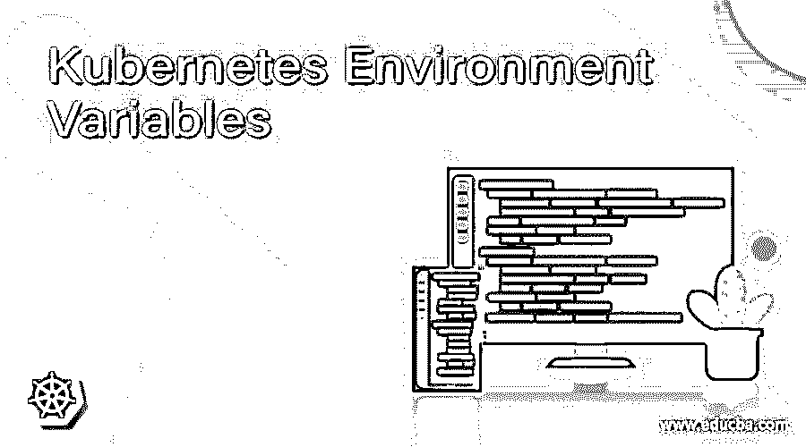
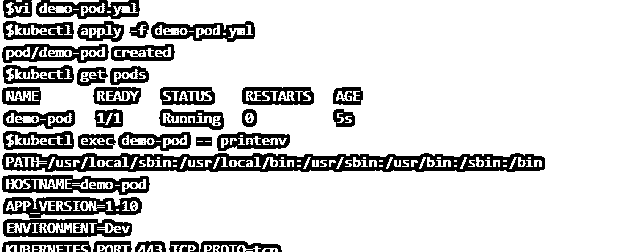
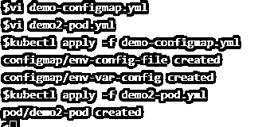
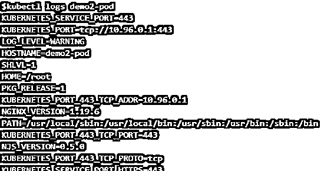
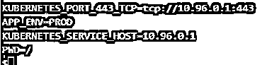
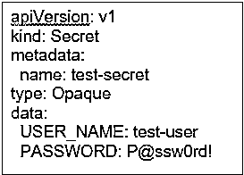
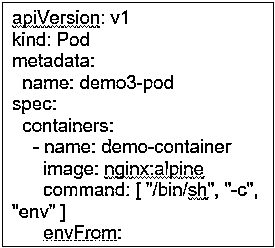

# Kubernetes 环境变量

> 原文：<https://www.educba.com/kubernetes-environment-variables/>

## Kubernetes 环境变量简介

Kubernetes 环境变量只是我们可以在 Pod 的配置中定义的变量，它可以在配置中的其他地方使用。我们可以使用 Kubernetes 中的 ConfigMap 来定义 Kubernetes 环境变量，以单独保存配置工件，并使容器化的应用程序可移植。我们可以使用' env '或' envFrom '字段来设置 Kubernetes 环境变量。它覆盖容器映像中指定的任何环境变量。我们还有相关的环境变量。我们可以在配置文件的 env 值中使用$(VAR_NAME)来设置相关的环境变量。

**语法:**

<small>网页开发、编程语言、软件测试&其他</small>

**解释:–**在上面的快照中，我们有两个名为“APP_VERSION”和“environment”的环境变量，并在“env”字段下指定。

### 环境变量如何在 Kubernetes 中工作？

我们必须在 YAML 文件中使用' env '关键字来声明环境变量，它可能是 pod YAML 文件或秘密 YAML 文件等。然后，我们在 env 关键字下指定了环境变量的名称及其值，如上例所示。我们必须使用' printenv '来列出 pod 的容器环境变量。它列出了所有环境变量，包括在 YAML 文件中明确指定的变量。我们也可以从 configMap 引用环境变量。

### 例子

让我们用例子来理解:

**场景:1。**使用一些环境变量创建一个 pod，并在容器启动后在 STDOUT 上打印。

**步骤:1。**首先，我们需要创建一个如下图所示的 YAML 文件，这里文件名是 demo-pod . yml:–

`demo-pod.yml`

**第二步。**让我们使用上面的 YAML 文件创建 pod，如下所示:–

`$kubectl apply -f demo-pod.yml`

**第三步。**现在，检查 pod 的状态，它应该处于运行状态。要检查 pod 的状态，请运行以下命令，您将看到名为“demo-pod”的 pod:

`$kubectl get pods`

**第四步。**最后，让我们检查容器中的环境是否可用。要检查状态，我们必须连接到 pod 并执行“printenv”命令，如下所示:-

`$kubectl exec <POD_NAME> -- printenv
$kubectl exec demo-pod -- printenv`

**说明:–**在上面的快照中，我们可以看到 yaml 文件中提到的环境变量‘APP _ VERSION’和‘ENVIRONMENT’都存在于容器中。

**场景:2。**创建配置图，并在 pod 中引用配置图的数据作为环境变量。

**第一步。**首先，让我们使用下面名为“demo-configmap.yml”的 yaml 文件创建两个配置图:

`demo-configmap.yml
$kubectl apply -f demo-configmap.yml`

**第二步。**现在，创建一个 pod，它将从 configMap 中引用 pod yaml 文件或容器中提到的环境变量的值。这里的文件名是 demo 2-pod . yml:-

`demo2-pod.yml
$kubectl apply -f demo2-pod.yml`

**说明:**在上面的例子中，我们可以看到 Kubernetes 创建了 2 个 configMap 'env-config-file '和' env-var-config '，还创建了一个名为' demo2-pod '的 pod。

**第三步。**让我们继续检查 pod 的状态，看看环境变量的值是否已被成功替换。

`$kubectl get pods`

**说明:**在上面的快照中，我们可以看到状态不是正在运行而是已完成，因为在运行了‘demo 2-pod . yml’文件中提到的命令之后，容器已经停止。

**第四步。**让我们继续检查 pod 的日志，看看环境变量是否可用，值是否正确:–

`$kubectl logs <POD_NAME>  (Note – It will only show the pods running in default namespace)
$kubectl logs demo2-pod`

**说明:**在上面的快照中，我们可以看到 ConfigMap 中提到的环境变量的值已经被赋值。

**场景:3** 。将机密作为容器环境变量传递。

**第一步。**在这个场景中，首先，我们必须使用下面的 yaml 文件创建一个秘密:-

`test-secret.yml`

`$kubectl apply -f test-secret.yml`

**第二步。**接下来，使用下面的 YAML 文件创建一个 pod，如前所述，使用“envForm”关键字获取秘密引用，如下面的 YAML 文件所示:–

`demo3-pod.yml`

`$kubectl apply -f demo3-pod.yml`

**第三步。**让我们检查在该容器下运行的容器的 pod 和环境变量的状态:–

`$kubectl get pods`

 `$kubectl logs demo3-pod`

**解释:**在上面的快照中，我们可以看到容器有环境变量“PASSWORD”和“USER_NAME ”,并且它有一个不可见的文本值，因为它来自 Kubernetes secret。

### 优势

1.  在创建 pod 时，为容器指定环境变量是非常有用的，例如，如果我们想为容器指定一个标签，等等。
2.  如果需要，它有助于覆盖容器中的图像变量。
3.  它还允许我们引用 ConfigMap 或 secrets 中的值。

### 结论

Kubernetes 环境变量提供了我们在 Linux 或任何应用程序开发中从普通环境变量中获得的所有优势。我们已经讨论了 Kubernetes 环境变量的基本用法，但是，我们可以通过使用依赖环境变量使它变得复杂。

### 推荐文章

这是 Kubernetes 环境变量指南。这里我们讨论一下环境变量在 Kubernetes 中是如何工作的？以及示例。您也可以看看以下文章，了解更多信息–

1.  [Kubernetes 复制控制器](https://www.educba.com/kubernetes-replication-controller/)
2.  [Kubernetes 自动缩放](https://www.educba.com/kubernetes-autoscaling/)
3.  [立方注释](https://www.educba.com/kubernetes-annotations/)
4.  [Kubernetes 选择器](https://www.educba.com/kubernetes-selector/)

