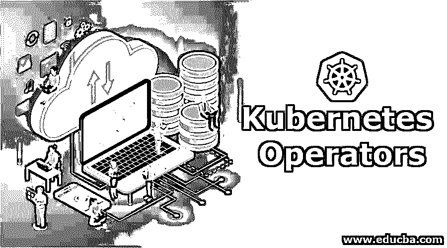
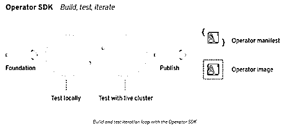
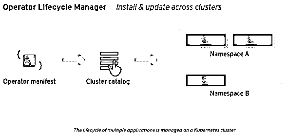

# Kubernetes 算子

> 原文：<https://www.educba.com/kubernetes-operators/>

## Kubernetes 运算符简介

在这个快速发展的技术世界中，保持对新技术的更新变得非常重要。Kubernetes Operators 是一项最初由谷歌设计的技术，现在由云原生计算基金会负责。通过使用 Kubernetes APIs 和 kubectl 工具管理并部署在 Kubernetes 上的应用程序称为 Kubernetes 应用程序。Kubernetes 应用程序的打包、部署和管理是通过使用操作符来完成的，这就是为什么操作符是 Kubernetes 应用程序的主干。

### What is Kubernetes?

Kubernetes(通常风格化为 k8s)是一个可移植的开源系统，旨在自动化容器化应用程序的伸缩、管理和部署。它将构成应用程序的容器分组为逻辑单元，以便于发现和管理。

<small>网页开发、编程语言、软件测试&其他</small>

由于其大量的特性，Kubernetes 可以被认为是一个微服务平台、一个容器平台、一个可移植的云平台，或者更多。凭借基础设施即服务(IaaS)的灵活性，它提供了平台即服务(PaaS)的许多简单性，并支持跨基础设施提供商的可移植性。

### Kubernetes 中的运算符有哪些？

运营商就像一片云，他们提供诸如供应、扩展和备份/恢复等服务，Kubernetes 帮助他们做到这一点，因为运营商可以在 Kubernetes 可以运行的任何地方运行。

### Kubernetes 算子框架

Operator Framework 是一个开源项目，提供运行时和开发人员 Kubernetes 工具，帮助您改进操作员的开发。它由运营商 SDK、运营商生命周期管理和运营商计量(最近发布的功能)组成。

*   Operator SDK: 它使得开发人员无需事先了解 Kubernetes APIs 及其复杂性就可以轻松构建自己的操作符。
*   **运营商生命周期管理:**它帮助 Kubernetes 提供一种自信的方式来安装、更新和管理运营商及其依赖关系。它还能提供良好的用户体验。
*   **操作员计量:**负责收集 Kubernetes 中发生的数据和其他事件，然后生成相应的报告。

#### 1.运营商 SDK

操作符的打包、构建和测试是由名为 Operator SDK 的工具完成的。它提供了构建应用程序所需的 API。它让您了解如何使用这些 API 升级、扩展或备份应用程序。随着时间的推移，它允许工程师使应用程序变得更智能，并为云服务提供更好的用户体验。有许多基本实践和代码模式在操作符之间共享，并且包含在 SDK 中，这有助于防止复制已经制定或优化的基本方法。

#### 2.运营商生命周期管理器

当一个操作符被构建时，它需要被部署在一个 Kubernetes 集群上，并且这样做；我们有一个运营商生命周期经理。

*   背板使操作员的工作更加顺畅。
*   它帮助设备控制器控制操作符的名称空间。
*   它还有助于设备控制器确保谁可以与正在运行的操作员通信。
*   OLM 监督操作符及其依赖项的生命周期。
*   它会自动升级/更新应用程序。

无状态和简单的应用程序可以利用操作符框架的生命周期管理特性，而无需通过使用通用操作符(例如 Helm 操作符)编写任何代码。然而，在有状态和复杂的应用程序中，操作符被赋予了适当的重要性。运营商代码中编码的类似云的功能可以提供更好的用户体验和功能，如扩展、备份和更新。

#### 3.操作员计量

新版本将很快发布。应用程序的使用将由运营商计量器监控和计量，这将最终帮助 IT 团队向软件供应商提供财务和预算软件。它被设计成绑定到集群的 CPU。它还有助于计算定制指标和其他相关数据，如许可和 Iaas 联系。

### 运营商框架的优势

下面是提到的好处:

*   **扩展输出:**Kubernetes 的设计原则与允许 Google 一天运行数千个容器的原则相同，它可以在不增加运营团队的情况下进行扩展。
*   **永不过时:** Kubernetes 非常灵活地满足您的需求，因为它可以帮助您轻松稳定地交付本地或全球可用的应用程序，无论您的需求有多复杂。
*   **可以在任何地方运行:** Kubernetes 是开源的，它让您可以自由地利用内部、混合或公共云基础架构，让您可以毫不费力地将工作负载转移到对您至关重要的地方。

### 如何创建一个 Kubernetes 运算符？

操作员本质上是特定于应用程序的，因此，困难的工作是将所有的应用程序操作领域知识转换成合理的逻辑配置资源和控制循环。

为任何应用程序构建操作符时，需要遵循一些常见且重要的步骤:

*   将操作员作为单个部署进行安装。例如，ku bectl create-f[https://coreos.com/operators/etcd/latest/deployment.yaml](https://www.openshift.com/learn/topics/operators)，一旦安装后就不要再做其他动作。
*   安装到 Kubernetes 时，请等待运营商创建新的第三方类型。然后使用该类型创建新的应用程序实例。
*   运营商应该尽可能利用内置的 Kubernetes 原语，如副本集和服务，以利用充分理解和充分测试的代码。
*   运算符应该是向后兼容的，并且总是理解您已经创建的资源的以前版本。
*   以这样一种方式设计您的操作符，即使操作符被停止或删除，应用程序实例也能不受影响地有效运行。
*   操作错误和安全问题的一个常见来源是没有升级软件，运营商可以帮助您更加自信地处理这个问题。它们使您能够声明所需的版本，并基于所需的版本协调应用程序升级。因此，确保在构建自己的操作符时应用这个特性。
*   使用“混沌猴”测试套件测试您的操作员，该套件模拟 pod、配置和网络的潜在故障。

### 推荐文章

这是 Kubernetes 运营商的指南。这里我们已经详细讨论了 Kubernetes 算子的概念和不同类型。您也可以浏览我们推荐的其他文章，了解更多信息——

1.  [立方结构](https://www.educba.com/kubernetes-architecture/)
2.  密密秘
3.  [立方入口](https://www.educba.com/kubernetes-ingress/)
4.  [立方命名空间](https://www.educba.com/kubernetes-namespace/)

