# 不可告人的秘密

> 原文：<https://www.educba.com/kubernetes-secrets/>

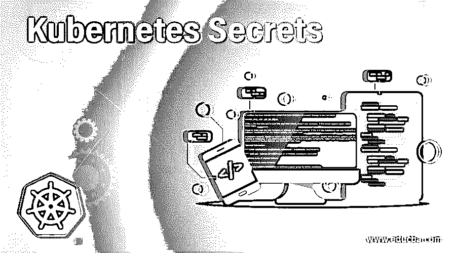

## Kubernetes 的秘密介绍

在 Kubernetes 中，pod 需要进行通信以产生所需的结果，并处理彼此生成的数据。为此，很明显，他们需要存储一些敏感信息，如用户名、密码、SSH 密钥、OAuth 令牌、API 密钥以及任何您认为是秘密的、不公开可见的信息。

你要知道，pods 和 Kubernetes 系统本身也是使用秘密的；例如，Kubelet 在需要从图像存储库中提取图像时使用它，当 Pods 与 API 服务器组件通信时，图像存储库需要认证。

<small>网页开发、编程语言、软件测试&其他</small>

### Kubernetes 的秘密是什么？

Kubernetes Secret 允许您以更安全、更灵活的方式将敏感和机密信息存储在 Kubernetes 对象中，而不是将这些信息放在 Pod 的定义、Kubernetes **ConfigMap** 或容器映像中。

Kubernetes 被设计成使用 YAML (JSON)格式的文件，所以对象定义只以 YAML(JSON)格式存储。同样，Kubernetes Secret 被视为一个存储敏感数据的 Kubernetes 对象，这样内容就不会泄露。

使用 Kubernetes 的秘密时，您必须注意以下几点:-

*   Kubernetes 机密对象的名称必须是有效的 DNS 子域
*   在 Kubernetes 系统中，服务帐户会自动创建秘密，并附上 API 凭证。
*   特殊字符，如$、\、*、)和！将被您的工作 shell 解释，因此它必须要求转义。对这样的字符进行转义的最简单的方法是用 single 将它们括起来。

### 如何打造 Kubernetes Secrets？

创建和使用 Kubernetes 秘密对象有多种方法。我们可以在这里探索其中一些，如果不是全部的话。如果你熟悉 Kubernetes ConfiMap 对象，那么你就会明白秘密也是以同样的方式创建和使用的。因此，首先，我们将了解创建秘密的可能方法，然后了解如何在 Pod 中使用它。

下面是创建秘密的两种主要方法及其子方法:

#### 1.库贝特尔

在命令行上，您可以使用 kubectl 在下面创建秘密

**文件**:在 kubectl 命令行上，您可以参考如下包含您的机密信息的文件。您应该注意到，如果您在文件中以普通字符串的形式提供内容，那么当您像下面这样读取对象时，您会看到这些值将出现在数据下面

映射和编码如下。另外，请注意，您不需要对文件中的特殊字符进行转义。

`echo  -n ‘admin’ > ./username.txt
echo  -n ‘pAss)1’ > ./password.txt
kubectl create secret generic get-cred --from-file=./username.txt --form-file=./password.txt
kubectl get secrets get-cred -0 yaml`

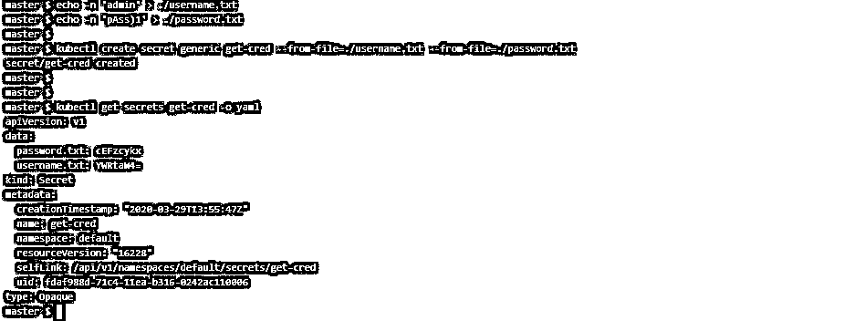

**环境变量文件**:当我们有一个包含密钥对格式数据的变量文件时，我们想把它作为秘密使用；然后我们可以做下面的事情:

`cat << EOF > credential.txt`

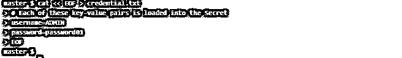

下面可以看到相同秘密的描述。

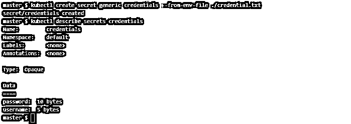

**Literal** :在 kubectl 命令行上，可以直接给出如下这样的机密数据，当它被转换成类似

`kubectl create secret generic dev-secret --from-literal=username=admin --from-literal=password=’passw0rdo1’
kubectl get secret dev-secret -o yaml`

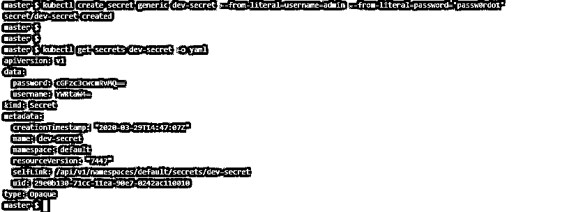

**手动**:你可以写一个 YAML 文件，在这个文件中你可以用两种方式映射敏感数据，

*   **数据**:支持 base64 编码的字符串。因此，在加入秘密定义之前，必须用 base64 编码对敏感数据进行编码
*   **stringData** :这个直接支持普通字符串，不需要编码。此外，当您在 Kubernetes Secret 对象中看到这些信息时，您会看到它们被编码，因此您不必担心。

一个名为 Kube-secret.yaml 的秘密定义 YAML 文件的例子:-

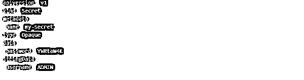

如下所示部署该文件:

`kubectl apply -f ./kube-secret.yaml`

你会看到这个对象被创建。

`kubectl get secrets my-secret –o yaml`

#### 2.草泽

从 1.14 版开始，您还可以使用 Kustomize for resource generator 来创建机密和配置映射。生成器应该在 yaml 中指定，它应该位于一个目录下。生成秘密后，可以使用 kubctl apply 在 API 服务器中生成秘密。

有几种方法可以使用 Kustomize 创建秘密。下面介绍几个:—

**文件:**您可以在字段 secretGenerator 下指定包含您的敏感数据的文件，如下所示:

`cat kustomization.yaml`

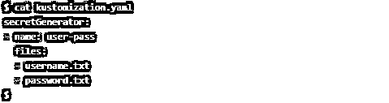

然后部署这个文件。

`kubectl apply -k .`

然后，您可以检查是否创建了秘密。另外，记下创建的秘密的名称；如果您正在修改同一个对象，它会有一个后缀以使其与众不同。

`kubectl describe secrets user-pass-dht85d7kff`

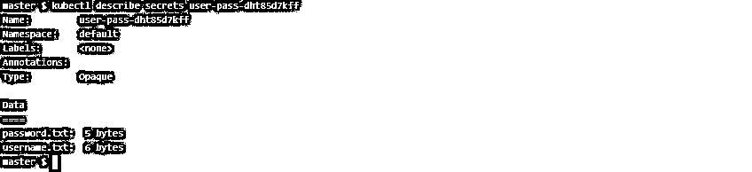

**文字**:使用 yaml 中的资源生成器创建秘密时，可以直接使用字面上的密钥对值。

举个例子:

创建 kustomization.yaml，内容如下:-

`cat << EOF >./kustomization.yaml`

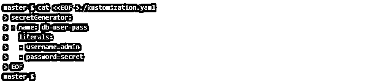

然后部署该文件并获得如下输出:-

`kubectl apply -k .`

### Kubernetes 秘密的例子

现在我们探索一些在 pods 定义中使用类似上面创建的秘密的方法。但首先，我们必须注意以下几点:

*   多个 pod 可以引用同一个。
*   秘密数据将作为文件出现在容器中。之后就看容器怎么用了。
*   秘密和参考荚应该在同一个。
*   在中使用之前，必须创建机密。

我们可以通过以下方式在 pod 中使用 Secret:

*   由于文件在卷下装入容器内，要在 pod 内的卷中使用机密，我们必须记住以下几点:
    *   在定义 pod 时，我们应该在. spec.volumes[]下添加一个卷，并根据您的意愿命名该卷。
    *   此外，我们还有字段. spec . volumes[]. secret . secret name，它们表示秘密对象。
    *   每个需要保密的容器，你都要定义. spec.containers[]。volumeMounts[]并指定**。**规格容器[]。卷装载[]。readOnly = true 和. spec.containers[]。卷装载[]。mountPath 指向一个未使用的文件夹名，您的机密将被装载到该文件夹中。
    *   然后，修改您的图像或使用命令行，使应用程序将找到文件。

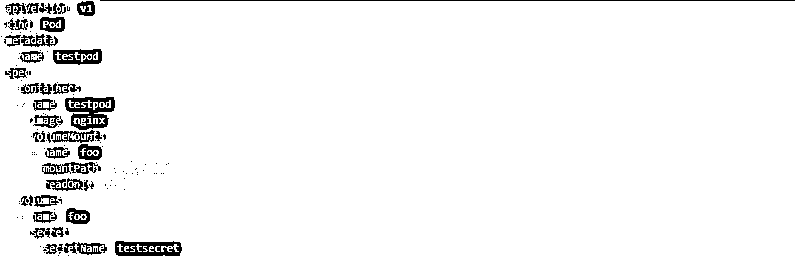

`cat << EOF > testsecret`

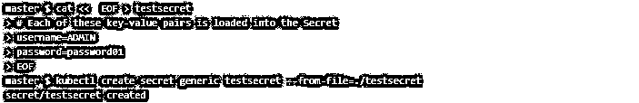

`kubectl apply -f secretfile.yaml`

`kubectl exec testpod -- cat /etc/foo/testsecret.txt`

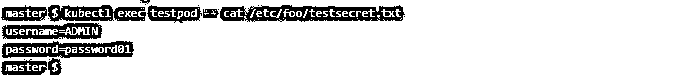

*   作为环境变量，首先，使用–from-env-file =创建一个 Secret 对象，如下所示。

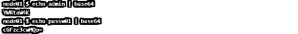

`kubectl create secret generic credentials --form-env-file=testsecret.txt`

然后像下面这样将这个秘密与字段 env[]value from . secretkeyref 一起使用，其中 name 和 Key 表示秘密对象内的密钥-值对中的秘密名和密钥名。

`kubectl apply -f ./newpod.yaml`

当您像下面这样检查容器中的环境变量时，您可以看到您秘密定义的环境变量。

`kubectl exec env-pod -- env | grep ENV`

### 结论

Kubernetes 的秘密也不像其他安全工具和方法那样是完全可靠的。但是使用 Secret 对敏感信息进行编码，而不是将敏感信息以纯文本的形式放在某个地方，这是一个很好的实践。此外，在基础设施环境的 Kubernetes 安全策略中包含秘密还会在系统级别上增加一层安全性。

### 推荐文章

这是一个 Kubernetes 的秘密指南。在这里，我们还讨论了介绍以及如何创建 Kubernetes 的秘密，以及不同的例子和它的代码实现。您也可以看看以下文章，了解更多信息–

1.  [什么是 Kubernetes？](https://www.educba.com/what-is-kubernetes/)
2.  [立方结构](https://www.educba.com/kubernetes-architecture/)
3.  [立方算子](https://www.educba.com/kubernetes-operators/)
4.  [立方入口](https://www.educba.com/kubernetes-ingress/)

