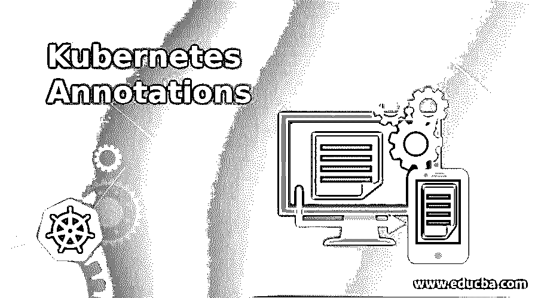
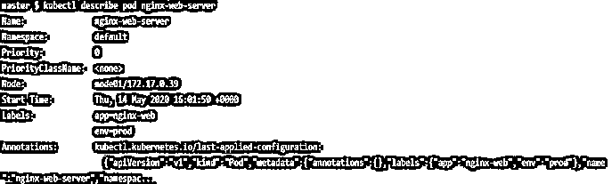
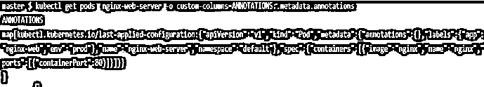
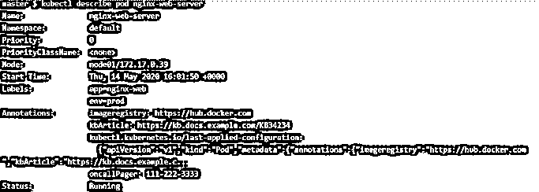
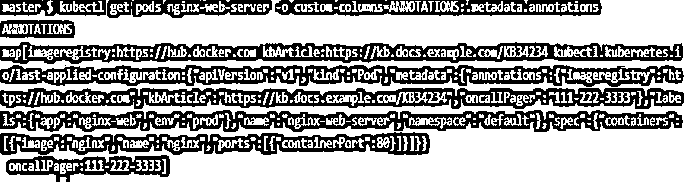

# 永恒的注释

> 原文:# t0]https://www . educba . com/kubrintes-annotations/

## 永恒的注释

注释用于向 Kubernetes 对象添加额外的元数据，这些元数据是不可识别的，这意味着我们不能使用选择器来查询附加了特定注释的 Kubernetes 对象。简单地说，注释不是用来识别和选择 Kubernetes 对象的。任何 Kubernetes 组件都不使用注释来对集群执行任何操作或操纵。注释可以是结构化或非结构化的，也可以是小型或大型的。我们可以在注释中包含标签中不允许的字符。它提供了关于工具和库可以使用的 Kubernetes 对象的附加信息。注释对 Kubernetes 本身没有帮助，但是它为与 Kubernetes 对象交互的用户、人员或工具提供了很大的帮助，因为它包含有用的信息，这样人们可以正确理解对象并明智地采取行动。例如，添加负责人的寻呼机信息、知识库文章的链接等。

### Kubernetes 中的注释是如何工作的？

注释具有与标签相同的键/值对。注释关键字由两部分组成，一个可选的前缀和一个名称。这两部分由斜杠“/”分隔。名称部分是必填项，长度不超过 63 个字符。它以字母数字字符([a-z0-9A-Z])开始和结束，并带有破折号(-)、下划线(_)、点(。)，以及其间的字母数字。前缀是可选的，但是如果指定，它必须是 DNS 子域，长度必须等于或少于 253 个字符，并以斜杠(/)结束。如果自动系统组件(如 kube-controller-manager、kube-scheduler、kube-apiserver、kubectl 或任何其他第三方自动化)向最终用户 Kubernetes 对象添加注释，它必须指定前缀。kubernetes 核心组件有两个保留前缀“kubernetes.io/”和“k8s.io/”。

<small>网页开发、编程语言、软件测试&其他</small>

我们使用“annotations”关键字向对象添加注释。注释也是类似标签的键/值对，如下所示:

`“metadata”: {
“annotations”: {
“key1” : “value1”,
“key2” :  “value2”,
“key3” : “value3”
}
}`

### Kubernetes 注释的示例

让我们用语法来理解 Kubernetes 注释的例子。

#### 示例 1

我们有一个 nginx pod，我们希望附加注释，如应召人员的寻呼机号码，图像注册表的 URL 或名称以及知识库文章的链接等。我们可以在元数据原语下的注释下添加这些细节。不管我们是否给 Kubernetes 对象附加注释，kubectl 都会给每个 Kubernetes 对象附加默认注释。这个注释是“ku bectl . kubernetes . io/last-applied-configuration”。让我们使用下面的 yaml 文件创建一个 pod。

`apiVersion: v1
kind: Pod
metadata:
name: nginx-web-server
labels:
env: prod
app: nginx-web
spec:
containers:
- name: nginx
image: nginx
ports:
- containerPort: 80`

创建 pod 后，我们使用以下两个命令来检查附加的注释:

**语法:**

`$kubectl describe <object_type> <object_name>`
T1】

#### 示例 2

`$kubectl describe pod nginx-web-server`

`$kubectl get pods nginx-web-server -o custom-columns=ANNOTATIONS:.metadata.annotations`

**解释:**在上面的示例中，没有标注附加到 pod，但是，有一个标注附加到 pod，并且是由 Kubernetes 核心组件附加的，因为它具有保留前缀“kubernetes.io ”,并且标注的名称是“last-applied-configuration ”,这意味着它保存了应用到该对象的最后一个配置。在我们从第一个命令获得的输出中，注释的值被截断。如果我们想知道或提取完整的值，我们使用第二个命令，它只输出注释的键/值对。

让我们创建一个 pod 并附加注释“oncallPager”、“imageregistry”和“kbArticle”，就像我们上面讨论的那样。下面是相同的 YAML 配置文件:–

`apiVersion: v1
kind: Pod
metadata:
name: nginx-web-server
labels:
env: prod
app: nginx-web
annotations:
oncallPager: 111-222-3333
imageregistry: "https://hub.docker.com"
kbArticle: "https://kb.docs.example.com/KB34234"
spec:
containers:
- name: nginx
image: nginx
ports:
- containerPort: 80`

部署上述 pod 后，我们使用“kubectl describte”命令来查看附加的注释，如下面的快照所示:-

**说明**:在上面的快照中，我们可以看到附加的注释以及之前讨论过的默认注释。注释按字母顺序显示，我们如何在配置文件中指定注释并不重要。

让我们只输出注释，看看它是什么样子。以下是输出结果:-

**解释:**在上面的快照中，键/值对与先前的输出相比并不清楚，如果有许多注释附加到 Kubernetes 对象，将很难找到键/值对。

### Kubernetes 注释的场景

在很多情况下，注释非常有用。一些使用案例如下:

1.  我们可以添加应用构建、发布或映像信息构建号、发布 ID、git 分支、注册地址、映像散列等。
2.  出于调试目的，我们可以附加客户端库或工具的名称、版本和构建信息。
3.  我们可以从对象产生的地方添加用户或工具/系统信息。例如，在 CI/CD 模型中，对象可以由像 Jenkins 这样的自动化工具创建。谁创建了 Kubernetes 对象是非常有用的信息。
4.  将由声明性配置层管理的字段附加为注释有助于将它们与由客户端或服务器设置的默认值以及自动生成的字段和由自动调整大小或自动缩放系统设置的字段区分开。
5.  我们还可以附上负责人的电话号码或呼机号码，或者目录或链接，如果发生不好的事情，人们可以在那里找到这些信息。
6.  还可以附加知识库文章或文章编号的链接，以解决与该对象相关的已知问题。
7.  我们可以添加指向日志、监控、分析或审计存储库的指针。

### 结论

Kubernetes 类似于标签，因为它也有键/值对，但是，它不能被 Kubernetes 本身查询，但是有许多工具被配置为基于它们的注释来查询对象，例如，Prometheus、第三方工具等。巨大的注释不会影响 Kubernetes 的内部性能，所以没有像标签那样受约束的键和值。

### 推荐文章

这是 Kubernetes 注释指南。在这里，我们讨论 Kubernetes 注释的介绍，以及如何通过例子使用 Kubernetes 注释。您也可以看看以下文章，了解更多信息–

1.  [立方入口](https://www.educba.com/kubernetes-ingress/)
2.  [立方算子](https://www.educba.com/kubernetes-operators/)
3.  [立方负载平衡器](https://www.educba.com/kubernetes-load-balancer/)