# 多维数据集自动调整

> 原文：<https://www.educba.com/kubernetes-autoscaling/>

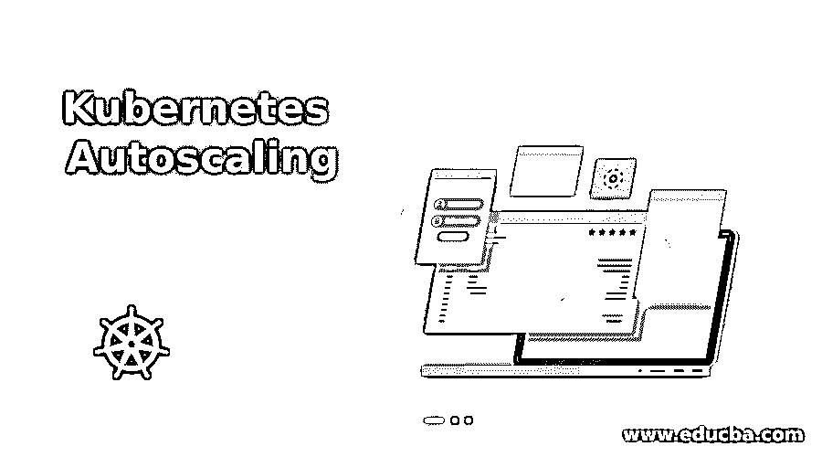

## Kubernetes 自动缩放简介

正如我们所知，Kubernetes 是一个容器资源管理和编排工具，或者简单地说，是一种容器管理技术，用于跨物理、虚拟和云环境管理容器中的容器化应用程序。Kubernetes 具有内在的可伸缩性，许多工具支持应用程序和基础设施节点；根据需求、效率、阈值/限制和其他一些指标进行扩展。我们有三种可用的自动缩放，我们将在本文中详细阐述。

*   垂直窗格自动缩放(VPA)
*   水平 Pod 自动缩放(HPA)
*   聚类自动缩放(CA)

### 它是如何工作的？

自动缩放是使用我们在命令行配置参数、环境变量和监控指标中设置的条件来执行的。让我们来讨论三种类型的自动缩放:-

<small>网页开发、编程语言、软件测试&其他</small>

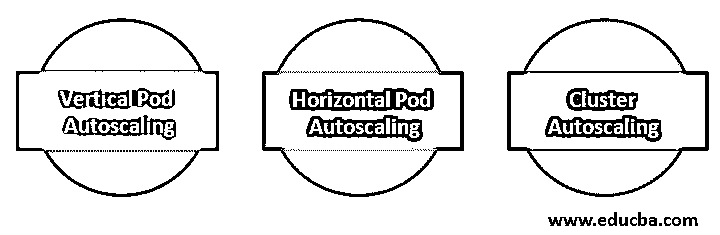

#### 1.垂直窗格自动缩放(VPA)

**VPA 只关心增加驻留在节点上的单元的可用资源，通过自动增加或减少单元的 CPU 和内存来进行控制。VPA 可以检测内存不足事件，并以此作为触发来扩展 pod。您可以设置资源分配的最小和最大限制。**

 **#### 2.水平 Pod 自动缩放(HPA)

HPA 可以说是 Kubernetes 的主要功能，也是使用最多的功能。HPA 可以更改 pod 的副本数量，根据需要扩展 pod 以添加或删除 pod 容器集合。HPA 通过检查各种指标来查看是否达到了预设的阈值并做出相应的反应，从而实现其目标。HPA 负责在整个可用节点上扩展和分布机架。

#### 3.聚类自动缩放(CA)

CA 自动在群集节点池中添加或删除节点，以满足需求并节省资金。它可以增加或减少集群中的节点数量。CA 根据挂起的 pod 扩展集群节点。它定期检查是否有任何未决的 pod，并且如果需要更多的资源并且如果扩大的集群仍然在用户提供的约束内，则增加集群的大小。在最新版本的 Kubernetes 中，它可以与多个云提供商(如 Google Cloud Platform)接口，以请求更多节点或删除已使用的节点。

缩放是基于指标完成的。有三种度量标准:

*   默认的每个 pod 资源指标:与 CPU、内存一样，这些指标是从每个的资源指标 API 中获取的
*   自定义每 pod 指标:-这些指标不在默认类别下，但需要基于相同类别进行扩展。它处理原始值，而不是利用率值。
*   对象指标和外部指标:–获取描述 Pod 的单个指标。然后将该度量与目标值或阈值进行比较。

### Kubernetes 自动缩放的优势

我们可以列举几个好处，但下面是我希望你反复灌输的主要好处

*   如今，我们的 IT 基础架构是基于云和虚拟的，成本是基于消费的。Kubernetes 能够部署和管理 pod、pod 集群，并以多种方式自动扩展整体解决方案。这是一个巨大的资产和能力，以减少整体每月。
*   不仅可以对单个容器进行动态资源管理，还可以对应用程序状态、pod、完整集群和整个部署进行自动化、扩展和管理，这有助于减轻您的工作负载并简化系统管理员的操作，尤其是当您的环境正在进行迁移、新环境创建和
*   在虚拟机和 pod 使用相同节点的环境中，Kubernetes autoscaling 将有助于确保您始终拥有足够的计算能力来运行您的任务。

### 设置 Kubernetes 自动缩放

在您的环境中开始设置 Kubernetes Autoscaling 之前，您必须首先了解您的环境以及当前和未来对资源或单元的需求。

以下面的设置为例，请考虑以下内容:

*   我们的基础设施只是测试环境
*   我们必须有一个指标服务器来收集来自 pod 的自定义指标，基于这些指标进行扩展。
*   在这里，我们将向您展示如何设置 HPA。
*   我们将设置 CPU 指标来检查，为此我们设置了限制，因此，如果 CPU 百分比增加，可以创建 pod。

还要注意，水平窗格自动缩放器是 Kubernetes 自动缩放 API 组中的一个 API 资源。当前的稳定版本只支持 CPU 自动缩放，可以在 autoscaling/v1 API 版本中找到。创建水平窗格自动缩放 API 对象时，请确保指定的名称是有效的 DNS 子域名称。

在这里，我们有一个 HPA 设置，为此我们事先做了一些先决条件:

*   库伯内特大师
*   部署在单个节点中的应用程序群集。
*   Docker，Kubeadm 包安装并配置在主节点以及 minion/worker 节点上。
*   docker 和 Kubernetes 的配置已经完成。
*   本实验室使用了 ngnix 的 docker image 等应用程序。

要实现 HPA，您可以通过两种方式进行自动缩放。

#### 1.创建 YAML 文件

*   首先，使用名为“ngnix.yaml”的 Yaml 文件创建一个部署，如下所示:

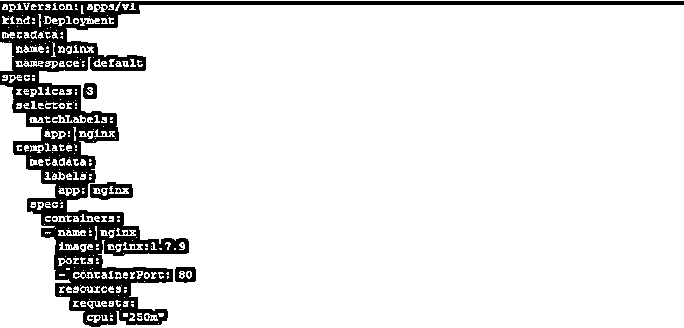

*   然后使用 kubectl 命令来应用和实现它。

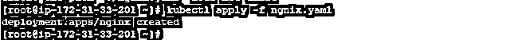

*   检查此部署中部署的吊舱数量。如您所见，创建了 3 个 pod 副本。

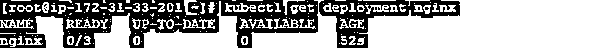

*   创建如下所示的 HPA 文件:–

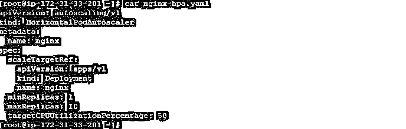

*   然后应用它，使用

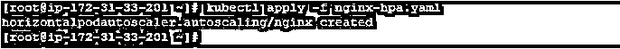

*   您可以检查 HPA 状态:

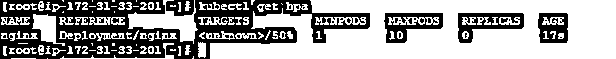

*   要获得关于 HPA 的详细信息，您可以将“kubectl get hpa”与“-o yaml”一起使用。

状态字段包含有关当前副本数量和任何最近自动缩放事件的信息。

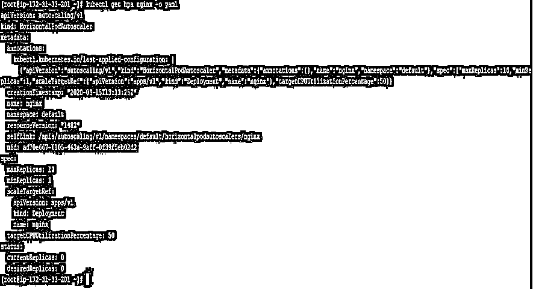

#### 2.使用命令行

*   设置新的部署或使用在步骤 1 中部署的部署，即名为“nginx”
*   要在如下所示的单个命令中创建 HPA

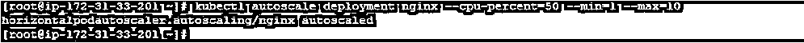

*   检查 HPA 状态

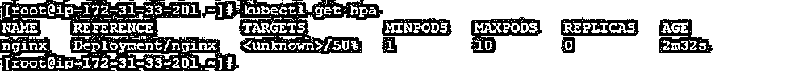

### 结论

我们可以说，Kubernetes 的核心是自动缩放，您必须在生产环境中使用它来简化您的工作。拥有 Kubernetes 的技能和自动缩放的实践经验会让你成为一名称职的 Kubernetes 管理员。请记住，在设计使用基于容器的微服务和 Kubernetes 的架构时，尤其是在运行混合系统(包括多云和内部部署)时，自动伸缩应该是您的待办事项。

### 推荐文章

这是 Kubernetes 自动缩放的指南。在这里，我们还讨论了 Kubernetes 自动缩放的介绍和工作方式。以及不同的示例及其代码实现。您也可以看看以下文章，了解更多信息–

1.  [立方 vs 码头](https://www.educba.com/kubernetes-vs-docker/)
2.  [立方算子](https://www.educba.com/kubernetes-operators/)
3.  [立方负载平衡器](https://www.educba.com/kubernetes-load-balancer/)
4.  [立方命名空间](https://www.educba.com/kubernetes-namespace/)**