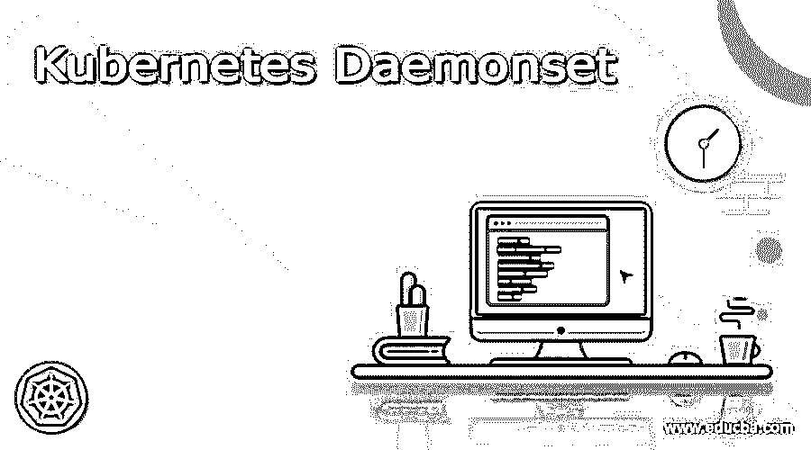
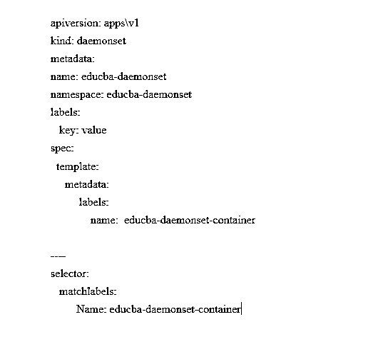

# 库伯内特·达蒙塞特

> 原文：<https://www.educba.com/kubernetes-daemonset/>

## Kubernetes Daemonset 的定义

Kubernateshas 有各种各样的选项和部署方法来执行容器。达蒙塞特就是其中之一。kubernetes Daemonset 是一个容器工具，用于检查所有节点及其子集是否在一个 pod 副本上执行。Daemonsets 可以在可以添加到集群的新节点上开发 pod。在暗示库伯内特人的时候，大部分都不会去想豆荚的执行力。但有时，用户希望在所有节点上执行单个 pod。如果用户希望在所有节点上执行 fluentd 来收集日志，他使用 daemon set implied 与 kubernetes 联系，以确保 pods 的实例在集群的节点中。

### 什么是 Kubernetes Daemonset？

Daemonset 通常使用 YAML 文件进行解释，而 YAML 文件中的组件为用户提供了对 pod 部署过程的额外控制。Pods 是部署在 Kubernetes 中的简单对象，表示集群中可执行流程的单个实例。Pod 由一个或多个作为单一资源管理的容器组成。Daemonset 是 kubernetes 中由控制器管理的动态对象。用户可以设置表示每个节点上需要存在的特定 pod 的期望状态。控制回路中的折衷可以将当前实际状态与期望状态进行比较。如果实际节点不适合匹配的 pod，则 Daemonset 的控制器会自动创建一个新节点。这个自动化的过程包含所有最近创建的节点和现有的节点。由 Daemonset 的控制器开发的 pod 被 Kubernetes 调度程序忽略，并作为同一个节点本身出现。

<small>网页开发、编程语言、软件测试&其他</small>

### Daemonset 有哪些使用案例？

Daemonset 的用例如下:

要在每个节点上执行集群存储守护进程，请使用:-glusterd-ceph。要在每个节点上执行一个收集日志的守护进程，可以使用:fluentd-logstash。
要在每个节点上执行监控节点的守护程序，请使用:-collectd，-datadog 代理作为 Prometheus 节点导出程序。
由于用例复杂，用户可以通过不同类型硬件的各种标志、CPU 请求和内存单元，为典型类型部署许多可能的数据集。

Daemonset 可以通过部署 pod 来增强群集的性能，以便为每个节点执行维护活动和支持服务。像 Kubernetes 和其他服务中的监控应用程序这样的后台进程必须与集群一起存在，以提供及时和相关的服务。

它主要适用于长期运行的服务，如日志收集、节点资源监控、集群存储以及与基础设施相关的 pod。Daemonset 在集群中所有节点的单个守护进程上运行是标准的。多个 Daemonset 可以通过应用不同的标签来管理一种类型的 Daemonset。该标签可以基于单个节点的行为来标识部署中的规则。Daemonsets 部署在后台任务上，用户可以在所有可能的节点上执行这些任务，但不需要任何干预。用户可以为每种类型的守护程序设置 Daemonset，以便在所有节点上执行。用户还可以为每个守护程序类型执行多个守护程序集。而是可以针对不同的硬件模型和资源需求使用各种配置。

### 如何创建 Daemonset？

*   要创建 Daemonset，需要执行以下步骤。
*   Daemonset 是在 YAML 文件中开发的，只有很少的部分。
*   它需要一个版本
*   它需要 Daemonset 的行为类型或种类
*   它需要恶魔集的元数据
*   它需要用户需要在所有节点上执行的 pod 定义的 spec_template。
*   它需要 spec_selector 来管理 Daemonset 的 pod，并且这种类型必须是 pod 模板中的特定标签。模板中定义的选择器名称应用于选择器中。但是，一旦创建了 Daemonset，就不能更改此名称，除非之前在 Daemonset 中创建了 pod。
*   spec_template-spec-node 选择器用于只执行适合选择器的节点子集
*   Spec-template-spec-affinity 用于在具有相似性匹配的节点子集上执行。
*   配置完成后，将在集群中创建 Daemonset。

### 与豆荚通信的方法

用户可以将数据从其他 pod 传输到在该节点上执行的 Daemonset 的 pod。用户可以通过两种方式向 pod 监控发送数据指标，

Daemonset 中的 pod 规范指定了主机端口以在节点上发现它。然后，它可以直接与在其上执行的节点的 IP 进行交互。

使用相同的 pod 选择器，服务被创建为 Daemonset，然后它被用来访问 Daemonset。该服务的局限性在于，pod 的 Daemonset 是随机接收请求的。这意味着请求可以通过网络传递，而不是挂在与被请求的 pod 相似的 pod 上。

用于通信守护程序单元的可能模式是推送、具有已知端口的 nodeIP、DNS 和服务。在 push 中，放置在 Daemonset 中的 pod 被定制为将更新传输到其他服务，如统计数据库，它们没有客户端。

在具有已知端口的节点 IP 中，Daemonset pods 使用主机端口，因此 pod 通过节点 IP 连接。客户端了解使用 nodeIP 列表，也知道端口约定。

DNS 开发无头服务，并使用端点从 DNS 检索报告来探索 Daemonset

在服务中，它使用类似的 pod 选择器创建服务，并使用它来访问随机节点的守护进程。

### 结论

因此，Daemonset 的特性用于检查在每个可用的节点上执行和调度了少数还是所有的 pod。它在所有节点上执行所需 pod 的副本。因此，当一个新节点加入 Kubernetes 集群时，这个新的 pod 会被添加到最近连接的节点中。

### 推荐文章

这是一个 Kubernetes Daemonset 指南。这里我们讨论定义，什么是 Kubernetes Daemonset？如何创建 Daemonset？.您也可以看看以下文章，了解更多信息–

1.  [Kubernetes 主机路径](https://www.educba.com/kubernetes-hostpath/)
2.  [Kubernetes 环境变量](https://www.educba.com/kubernetes-environment-variables/)
3.  [Kubernetes 自动缩放](https://www.educba.com/kubernetes-autoscaling/)
4.  [立方注释](https://www.educba.com/kubernetes-annotations/)

