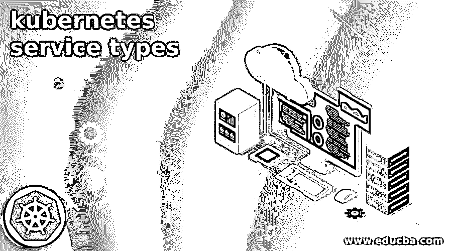

# 不可思议的服务模式

> 原文:# t0]https://www . educba . com/kubrintes-service types/

## kubernetes 服务类型介绍

Kubernetes 中的服务是一个逻辑抽象，它帮助我们公开运行一个或一组 pod 的应用程序。如果我们想在应用程序中使用任何服务，那么我们不需要修改它，如果服务是陌生的。在 Kubernetes 中，服务被认为是一种抽象，因为它定义了 pod 和许多进一步使用它们的策略。为了识别服务所指向的一组 pod，它使用了一个选择器。由于服务提供抽象，因此它有助于提供解耦，这是编程时要遵循的好东西之一。在本教程的下一部分，我们将看到它的内部工作方式，以及如何在应用程序中实现它，以便让初学者更好地理解它。

### Kubernetes 服务是如何工作的？

正如我们已经讨论过的，它是一个抽象层，用于定义一组 pods，在本节中，我们将看到它如何在 Kubernetes 内部工作，我们可以将服务定义为一个简单的 REST 对象，我们可以创建所有这些对象，并将服务定义发送到服务器，以便从中创建新的实例。下面是我们在 Kubernetes 中定义服务的定义，见下文；

<small>网页开发、编程语言、软件测试&其他</small>

**例如:**

`apiVersion: v1
kind: Service
metadata:
name: your_name
spec:
selector:
app: name
ports:
- protocol: TCP
port: 80
targetPort: 9376`

如你所见，我们试图在这里定义一个服务，我们在这里定义名称、版本、文章等。来定义它。此外，我们需要提到它是哪种类型的 REST 对象，以使用' kind '关键字在语法上定义它。

1)首先它在服务 IP 中分配它们，这个 IP 被服务代理进一步使用。

2)我们还有服务控制器，负责扫描与服务选择器匹配的 pod。匹配后，它会向该端点发送任何更新。

3)服务使用的默认协议是 TCP。

4)在服务的帮助下，我们可以在 Kubernetes 支持的服务对象上公开尽可能多的端口。

### Kubernetes 服务类型有哪些？

在本节中，我们将看到 Kubernetes 服务的各种类型，首先，看看组件，然后我们将看到它的类型，这使他们能够更好地理解，让我们开始吧；

**1)标签选择器:**它有助于定位容器

**2)集群 IP:** 分配了 IP 地址和端口号

**3)端口定义**

**4)映射:**可选映射，将端口映射到目标端口。

现在让我们开始详细了解 Kubernetes 服务的类型，以便更好地理解它。

我们主要有 4 种不同类型的 Kubernetes 服务，如下所述；

**a) clusterIP:** 这种类型的服务的主要目的是帮助公开可以从给定集群访问的服务。

**b) NodePort:** 这种类型的服务帮助我们通过静态端口公开服务。

**c)负载平衡器:**这种类型的服务有助于我们通过使用云提供商来公开服务。

**d)externalName:**这种类型的服务通过使用预定义的名称“external name”字段来帮助我们公开或映射服务。

如上所述，我们已经看到了 Kubernetes 提供的每种服务类型的一行程序，但现在我们必须详细了解它们，以便更加清晰，因此，现在让我们详细讨论它们，见下文；

**1) Kubernetes ClusterIP 服务:**这是 Kubernetes 提供的默认服务，它主要使用 IP 地址来公开服务。但它有一个限制，即它帮助我们在 IP 地址的帮助下公开服务，但它将在群集内部。这意味着我们可以在同一个集群内访问公开的服务，而不是从该集群之外。当我们不希望另一个外部服务使用我们的 expose 服务时，可以使用这个方法，因此增加了这里的可访问性部分。简而言之，我们可以说它有助于在内部集群 IP 上公开服务。如果我们选择该服务，那么我们将只能通过集群访问该服务。

**2) Kubernetes 节点端口服务:**顾名思义，这种类型的服务有助于在每个节点端口上公开服务。这意味着它有助于我们打开每个集群节点上的端口。因此，它会将流量导航到服务的每个节点，即使服务没有在该特定节点上运行，这也有助于我们通过将流量导航到不同的节点来处理流量。它是可以在开发中使用的高级方法之一。如果我们想从任何集群的外部连接到节点端口，那么我们可以使用这种格式来连接它们；

`<NodeIP>:<NodePort>`

**3) Kubernetes ExternalName 服务:**顾名思义，这类服务可以通过分配给它们的外部名称来访问。而不是通过集群 IP 等访问它们。简而言之，如果我们想要访问这个服务，那么我们必须使用在创建服务时定义的 externalName 字段。它返回包含 externalName 参数值的 CNAME 记录。在这种类型的服务中，不设置代理。

**4) Kubernetes 负载平衡器服务:**这种类型的服务有助于我们向云提供商公开服务。假设我们有一个运行在任何公共云(例如 AZURE、Aws)上的集群，那么通过创建一个负载平衡器服务，它将帮助我们实现类似集群 Ip 的等效访问，方法是将其扩展到外部负载平衡器，后者将专门转向云提供商。因此，Kubernetes 将自动创建包含所有必需内容的环境，如防火墙，它还将帮助我们使用云提供商提供的外部 IP 地址填充服务，创建负载平衡器等。

### 结论

由于我们已经详细了解了类型、工作及其组件，我们现在可以决定如何在应用程序中使用它，我们还了解了如何定义服务，开发人员也可以轻松使用、处理和维护它。此外，通过抽象提供解耦。

### 推荐文章

这是 kubernetes 服务类型指南。这里我们详细讨论了类型、工作及其组件，现在我们可以决定如何在应用程序中使用它。您也可以看看以下文章，了解更多信息–

1.  [Kubernetes 环境变量](https://www.educba.com/kubernetes-environment-variables/)
2.  [立方注释](https://www.educba.com/kubernetes-annotations/)
3.  [Kubernetes 工具](https://www.educba.com/kubernetes-tools/)
4.  密密秘

