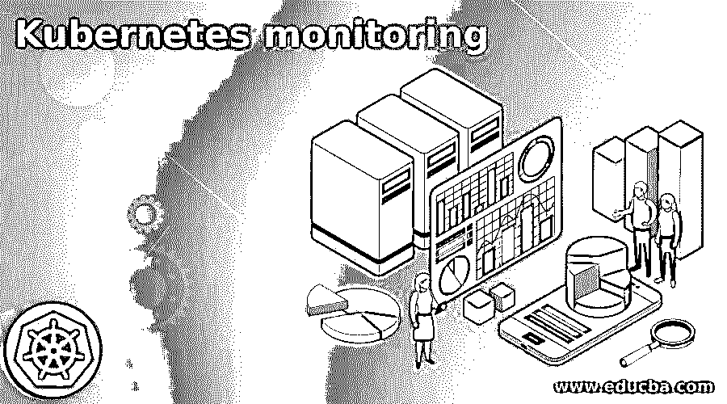

# Kubernetes 监控

> 原文：<https://www.educba.com/kubernetes-monitoring/>

## Kubernetes 监控简介

顾名思义，在 Kubernetes monitoring 中，借助这个工具，我们可以做一个报告，帮助我们跟踪我们的集群，通过使用这个工具，我们可以轻松地管理我们的集群。通过监控来管理群集有助于轻松跟踪基础架构资源，其中可能包括内存、存储 CPU 等资源。在监控的帮助下，我们甚至可以针对特定事件发出警报，假设有任何 pod 没有运行，我们就可以收到警报。此外，它可以跟踪任何故障，限制特定资源的范围，或者不再工作的 pod，然后我们可以在 Kubernetes monitoring 的帮助下跟踪或监控这一点，在本教程的下一部分中，我们将详细了解其内部工作情况，以便更清楚和理解。

### 为什么 Kubernetes 监控很重要？

对我们的应用程序进行监控总是有好处和重要性的，因为这有助于我们跟踪应用程序正在进行的活动，并让我们了解性能、故障、内存等。正如我们已经讨论过的，但让我们从 Kubernetes 监控的一些主要重要因素开始，说明为什么看下面的内容很重要；

<small>网页开发、编程语言、软件测试&其他</small>

1)它帮助我们生成报告，帮助我们管理集群。

2)在此帮助下，我们可以在出现任何故障时轻松生成警报。

3)我们可以跟踪 pod 的运行以及所有参与的内容。

4)通过使用它，我们可以跟踪存储、内存、CPU 等资源。

5)它有助于组织更深入地了解应用程序。

6)在此帮助下，我们可以更深入地了解码头、集装箱化、集群和其他基础设施部分。

### 顶级 Kubernetes 监控工具

Kubernetes 为我们提供了许多开源工具，帮助我们详细监控您的应用程序及其基础设施。它还为我们提供了许多附加功能，但它非常复杂。正如我们所看到的，持续监控我们的应用程序非常重要，我们有许多免费的解决方案为我们提供免费的应用程序监控，在这里，我们将讨论 Kubernetes 提供的各种工具，以监控应用程序如下:

1.Grafana:它是一个监控工具，也是一个用于可视化和分析的开源平台。它为我们提供了四个控制面板，帮助我们监控我们的应用程序，包括部署、集群、Pod/Container 和节点。在 Kubernetes 内部，在 Kubernetes admin 的帮助下，我们可以很容易地安装 Grafana。因此，它易于使用，处理，并有助于监控应用程序的每一部分。

2.Prometheus:它也是一个监控工具，是一个开源平台，我们可以用它来报警，它在监控工具中很受欢迎。它帮助我们获得指标、分析和 docker 信息。该工具主要用于监控我们的应用以及在容器规模内运行的微服务。它没有提供任何仪表板，因为它不是，但我们可以将它与我们之前讨论过的 Grafana 工具集成，以借助它提供的仪表板可视化我们的应用程序数据。

3.Dashboard:这是一个 Kubernetes Dashboard，它帮助我们可视化数据，据说它是 Kubernetes 集群的 UI，允许我们监控应用程序的健康、状态和工作负载等。

4.Jaeger:它也是一个监控工具，主要是帮助解决复杂分布式系统中的问题和事务。它基本上是为解决分布式系统可能产生的软件问题而设计的，例如上下文传播、事务、延迟监控等等。所以它基本上是设计用来监控分布式系统等。

5.Weave Scope:它也是一个用于监控和可视化基础设施指标的工具。它还涵盖了我们的整个基础设施，它最初是由 Weaveworks 开发的，它也是一个图形用户界面，帮助我们可视化统计数据。借助于此，我们可以轻松地在容器上运行命令并管理它们。

6.InfluxDB:它基本上是为搅拌非常大容量的监控日志或记录而设计的。还通过集群提供高可用性、可伸缩性。可以认为是监测数据的长期存储，可以作为历史数据或以后的记录。

## 最佳 Kubernetes 监控实践方法

我们有七种应该遵循的不同的监测实践方法，因此在下面提到。所以让我们开始吧

1)我们应该挖掘更多系统可见性

2)我们应该捕获历史系统数据

3)尝试检查 Kubernetes 控制面板的细节。

4)深入查看控制面板和警报，了解详细调查情况

5)尽量选择基于 SaaS 的监控系统

6)我们应该尝试评估策略

7)嵌入式上下文

### Kubernetes 监控解决方案

监控解决方案是指我们如何监控我们的系统，我们已经通过使用工具讨论过了，我们有几种不同的开源工具可以帮助我们，并为我们提供监控应用的解决方案。

此外，我们还看到了最佳实践方法，这些方法帮助并指导我们尽可能以最佳方式监控系统，就像我们可以监控控制面板一样，它还为我们提供了不同的组件来实现这一目的。下面提到了一些监控解决方案；

*   顾问
*   麋鹿栈
*   kubewatch
*   kube-ops-view
*   普罗米修斯算子
*   还有更多

### 结论

我们已经看到了所有的好处，为什么使用以及它如何帮助我们监控我们的应用程序，它还跟踪故障，浏览整篇文章以了解 Kubernetes 监控的重要性，易于使用，可维护和由开发人员处理。

### 推荐文章

这是一个 Kubernetes 监测指南。为了更清楚和理解，我们在这里详细讨论内部工作。您也可以看看以下文章，了解更多信息–

1.  [Kubernetes 自动缩放](https://www.educba.com/kubernetes-autoscaling/)
2.  [立方命名空间](https://www.educba.com/kubernetes-namespace/)
3.  密密秘
4.  [立方负载平衡器](https://www.educba.com/kubernetes-load-balancer/)

