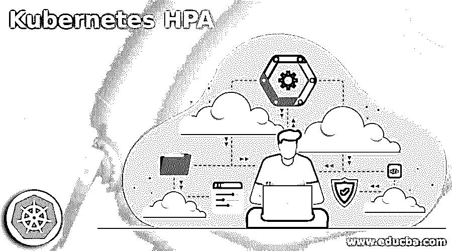

# 不可思议的 HPA

> 原文：<https://www.educba.com/kubernetes-hpa/>

## Kubernetes HPA 的定义

Kubernetes HPA 的定义是，HPA 代表 Horizontal Pod Autoscaler，它可以通过自动转换复制中的 Pod 数量来自动转换我们的 Kubernetes 负载的状态。实施时，复制集基于 CPU 支持指标或响应来自 Kubernetes 的自定义指标或来自群集外部的原始指标。Kubernetes 是一个可移植、可扩展的开源系统，由 Google 开发，现在由云本地计算基金会提供支持，用于自动实施、扩展和支持堆栈应用程序。我们可以在 Kubernetes 中测试 HPA

### 什么是 Kubernetes HPA？

正如我们在上面看到的，HPA 是 CPU 工作负载中可以自动转换我们的 Kubernetes 工作负载形状的 pod 的数量，因此当我们将我们的任务用于 Kubernetes 集群时，我们可能不确定资产的本质，也不知道这些资产是如何转换的，HPA 有助于确保功能的工作负载在各种状态下保持不变，从而允许根据需求管理额外的容量。

<small>网页开发、编程语言、软件测试&其他</small>

HPA 可以自动转换我们的 Kubernetes 工作负载中的 pod 数量，这基于一些指标，这些指标是实际的资源使用情况，可以提供可以提供给 pod CPU 的请求的详细值，自定义指标可以由 Kubernetes 中的集群对象描述，外部指标向我们的集群外部提供服务。

当管道中有许多请求时，我们的工作负载可能需要额外的 CPU，此时我们必须根据队列大小创建额外的指标，然后配置 HPA 以自动扩展单元，但是当队列大小减小时，队列大小也可能减小。

### kubernetes HPA 怎么用？

Kubernetes 具有自动扩展功能，因此它可以扩展 pod，还可以横向自动扩展基础架构，这可以通过资产来实现，而 HPA 是 Kubernetes 的资产或资源，对于基本单元的实施，Kubernetes 利用 pod，HPA 无法帮助转换重复的 pod，因为实施完全取决于指标。

应用 HPA 以周期性的方式管理循环，因此在每个周期中，管理器可以在使用指标的同时管理查询，并且还从原始指标或从其他指标获取指标。

对于每个 pod，CPU 等原始指标，控制器从 API 中获取 HPA 提供的每个 pod 的原始指标，如果设置了存在发挥值，则控制器可以评估每个 pod 的请求值。并且如果设置了目标原始值，则原始度量可以直接使用它，然后控制器可以搜索出目标 pod 将得到的平均值，并且它的比率可以用于转换优选重复的数量。

### kubernetes HPA 入门

在我们开始使用 Kubernetes HPA 之前，首先我们必须确保我们有 Google Kubernetes engine API，然后我们还必须安装 Cloud SDK，为了设置它，我们必须遵循一些步骤，即我们必须将“gcloud”设置为默认设置，然后如果我们想要浏览设置，我们可以使用“gcloud init ”,然后我们可以使用“gcloud config”来设置 id、区域和地区。

当我们尝试使用 Google cloud 的控制台时，会在 API 的帮助下创建“HorizontalAutoScaler”对象，当我们使用“kubect1”查看有关 HPA 的信息时，我们还可以定义自动缩放版本的 API，其中“apiversion1”是默认版本，允许我们根据 CPU 的利用率自动缩放指标，而“apiversion2”是由 HPA 的对象生成的。

### 最佳实践 kubernetes HPA

*   确保所有单元都指定了资源请求:

CPU 利用率是 Kubernetes 控制器的一部分，因此 HPA 可以做出缩放决定，其中利用率值可以在对单个 pod 的资源请求的百分比中仔细考虑，因此最佳实践是确保为每个 pod 的所有容器确定请求值，该 pod 是已由 HPA 缩放的 Kubernetes 控制器的一部分。

*   要安装度量服务器:

对于每个 pod，资源指标可以单独做出决定，它会恢复由指标服务器提供的 API 指标，因此最佳实践是在我们的 Kubernetes 集群中启动指标服务器。

*   要配置外部指标:

在外部指标的帮助下，他们还可以得出扩展的结论，它有两个类别，即 pod 指标和对象指标，pod 指标有助于通过目标平均值确定目标值，最佳做法是确保 pod 指标和对象指标使用正确的目标值类型。

*   自定义指标优于外部指标:

可能有两个选项可供选择最佳实践是选择自定义指标，因为外部指标的 API 可以获得许多尝试来修正它与自定义指标的对比。

*   配置冷却期:

HPA 还可以测量度量的重要情况，这导致在重复数量不同的情况下出现跳动，这是不利的。

### 结论

在本文中，我们得出结论，Kubernetes 具有 HPA，it 可以确保每个 pod 都有资源请求，我们需要安装指标，我们可以选择上面讨论过的指标，我们还了解了如何开始使用 Kubernetes HPA。

### 推荐文章

这是一个 Kubernetes HPA 的指南。这里我们讨论 Kubernetes 具有 HPA，它可以确保每个 pod 都有资源请求。您也可以看看以下文章，了解更多信息–

1.  [Kubernetes 复制控制器](https://www.educba.com/kubernetes-replication-controller/)
2.  密密秘
3.  [立方负载平衡器](https://www.educba.com/kubernetes-load-balancer/)
4.  [立方命名空间](https://www.educba.com/kubernetes-namespace/)

