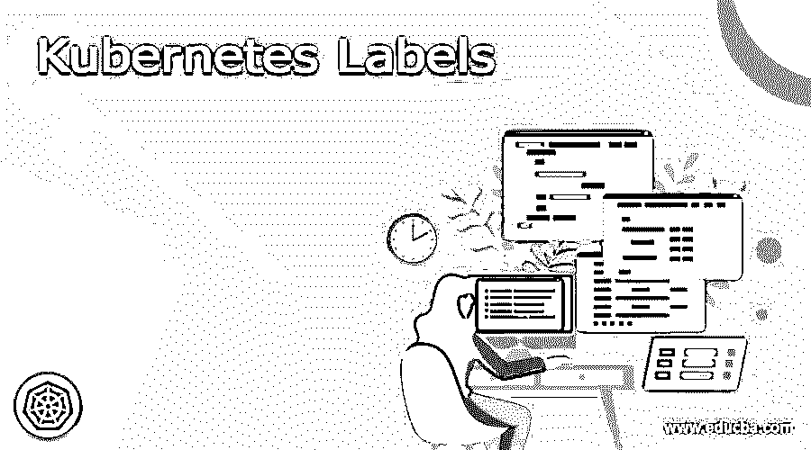

# 无间隙标签

> 原文：<https://www.educba.com/kubernetes-labels/>

## 什么是 Kubernetes 标签？

顾名思义，标签是用来标识对象的，它以键和值对的形式表示。这个键-值对附加到 Kubernetes 对象，即 pods，标签帮助我们识别对象的属性。这对用户来说也是有意义的相关信息。它用于向用户而不是向核心系统提供有意义的信息。我们可以在创建时给对象贴上标签，如果需要，我们可以随时轻松地修改它们。我们拥有的每个对象都应该定义有键值对，并且给定对象的每个键都应该是唯一的，以便正确地标识它。在本教程的下一节中，我们将更仔细地研究实现和语法，以便更好地理解和清楚地了解标签的细节。

### Kubernetes 标签要求

在创建标签之前，我们有一些语法需要遵循，而且标签帮助我们将我们的组织或公司结构映射到系统对象，这将是松散耦合的。这些映射客户端不需要在它们的末端存储。在开始创建标签之前，我们应该记住以下几点:

<small>网页开发、编程语言、软件测试&其他</small>

1)标签应该总是以键-值对的形式。
2)标签的关键字由两段组成，这两段由可选的前缀和名称表示，应该用(/)斜杠分隔。
3)名称段由 63 个字符组成，可以更少，要求有。
4)名称段必须以字母数字字符结尾和开头，并用(-)破折号、点(.)和(_)下划线。
5)前缀段是可选的
，因此库伯内特酒的有效标签应记住以下几点，见下文；
1)名称段长度应为 63 个字符。
2)不能为空
3)前缀是可选的。
4)创建标签时应遵循此正则表达式，'[a-z0-9A-Z]'必须用点号、下划线和破折号分隔。

下面是我们在 Kubernetes 中创建标签的语法，请参见下面的参考；

**语法:**

`"metadata": {
"labels": {
"key1" : "value1",
"key2" : "value2",
"key3" : "value3",
"key4" : "value4",
"key5" : "value5"
}
}`

### 方法

为了在标签的帮助下识别资源，Kubernetes 为我们提供了两种不同的方法。一种是通过标签，另一种是通过注释。在这一节中，我们将讨论我们拥有的不同方法，让我们详细讨论每一种方法，见下文；

1)通过标签
2)通过注释

让我们详细地看一看它们中的每一个，见下文；

*   通过标签:正如我们所知，标签是用来表示 Kubernetes 对象的键值对，基本上它帮助我们识别与 Kubernetes 对象相邻的元数据，它们提供关于对象的相关和有意义的信息。在 Kubernetes 中，我们可以根据标签查询对象，也可以对其应用大量操作。所以它们经常被用作我们想要在团队中分享的信息，因为它为我们提供了元数据。
*   通过注释:我们还有一种方法可以帮助我们识别对象的元数据，这是通过注释完成的。在标签的位置上，我们可以使用“注释”。注释也是一个关键的基于值的结构，它帮助我们识别附加到对象的元数据。但是我们不能使用注释来查询基于注释的对象。

让我们仔细看看这两种方法的语法细节，以便更好地理解和清楚，见下文；

方法一通过标签:

**语法:**

`"metadata": {
"labels": {
"key1" : "value1",
"key2" : "value2",
"key3" : "value3",
"key4" : "value4",
"key5" : "value5"
}
}`

方法二通过注释:

**语法:**

`"metadata": {
"annotations": {
"key1" : "value1",
"key2" : "value2",
"key3" : "value3",
"key4" : "value4",
"key5" : "value5"
}
}`

### Web 应用程序 Kubernetes 标签和示例

在本节中，我们将更仔细地了解特定于 web 应用程序的标签，其中还将包括示例，以便更好地理解它，所以让我们开始吧，见下文；

1)app.kubernetes.io/version:这个标签用来表示应用程序的版本，我们可以说是当前版本。
2)app.kubernetes.io/instance:这个标签用来唯一地标识应用程序的实例。
3)app.kubernetes.io/name:借助这个标签我们可以很容易地定义我们的应用程序的名字应该总是在最上面。【app.kubernetes.io/created-by:】4)此标签用于标识或定义创建资源的名称所有者或控制器/资源的所有者。app.kubernetes.io/part-of:本标签用于定义该申请所属的更高一级申请的名称。【app.kubernetes.io/managed-by:】6)这个标签是用来定义工具的，这个工具是为我们管理应用程序的操作的东西。
7)app.kubernetes.io/component:这也是使用的一个重要标签，有助于我们识别应用中使用的组件。
现在让我们仔细看看在应用中正确使用这些标签的例子；

### 例子

`apiVersion: your_api_version
kind: StatefulSet
metadata:
labels:
app.kubernetes.io/name: mysql
app.kubernetes.io/instance: mysql-abcxzy
app.kubernetes.io/version: "5.7.21"
app.kubernetes.io/component: database
app.kubernetes.io/part-of: wordpress
app.kubernetes.io/managed-by: helm
app.kubernetes.io/created-by: controller-manager`

### 结论

Kubernetes 标签有助于我们识别对象的属性，因为可以很容易地为 Kubernetes 对象创建标签。此外，它遵循我们已经讨论过的键-值对模式。通读整个文档以更好地理解这个主题的细节，它还会让你了解/，，的语法和限制。标签。

### 推荐文章

这是一个 Kubernetes 标签指南。这里我们讨论什么是 Kubernetes 标签，要求，方法，代码示例。您也可以看看以下文章，了解更多信息–

1.  [Kubernetes 主机路径](https://www.educba.com/kubernetes-hostpath/)
2.  [Kubernetes 环境变量](https://www.educba.com/kubernetes-environment-variables/)
3.  [Kubernetes 复制控制器](https://www.educba.com/kubernetes-replication-controller/)
4.  [Kubernetes 自动缩放](https://www.educba.com/kubernetes-autoscaling/)

