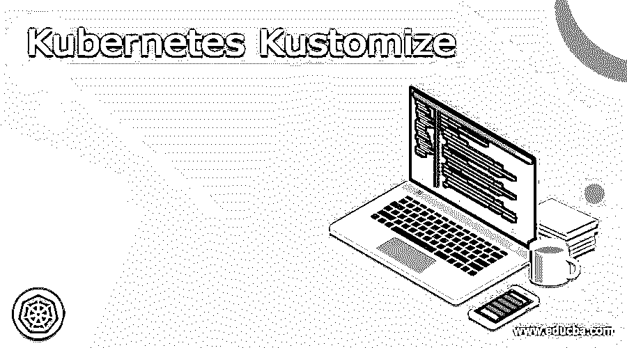

# kubernetes 定制

> 原文：<https://www.educba.com/kubernetes-kustomize/>

## Kubernetes Kustomize 简介

Kubernetes kustomize 的定义是，它是一个独立的工具，可以通过 Kubernetes 的对象个性化 Kubernetes 的文件，并特别概述了定制的原始和模板自由 YAML 文件的各种动机，kubectl 还进行 Kubernetes 对象的领导借助 kustomize 文件， Kustomize 是一款支持分层的配置管理解决方案，可用于保护我们应用的底层设置及其部分，方法是过度扩展称为补丁的 YAML 的指示，它可以覆盖默认设置，而通常无需交换原始文件。

### 什么是 Kubernetes kustomize？

Kubernetes kustomize 是 Kubernetes 生态系统中一个非常有用的工具，可用于阐明实现，它还允许我们通过其单个部分生成 Kubernetes 的完整应用程序，并且它不能移动 YAML 单个组件的配置文件，例如， 我们可以合并来自不同来源的片段，以保持我们的定制或 kustomize，kustomize 用于为特定情况生成覆盖图，这也允许我们生成一个文件，该文件可以将所有内容捆绑在一起，或者可以用来覆盖单个参数。 我们可以使用 kustomize 来阐明针对各种环境的应用程序配置命令，在开始工作之前，我们需要通过 kustomize 生成基本目录，该目录包含 YAML 服务的部署和对象。

<small>网页开发、编程语言、软件测试&其他</small>

### 好处:

*   可重用性:

kustomize 可以允许在我们所有的开发环境、登台环境和生产环境中重用一个基础文件，然后为每个人覆盖单独的语句，这样 kustomize 是有益的。

*   易于调试:

在 Kubernetes kustomize 中，如果任何活动不正确，那么 YAML 本身就很容易理解和调试，因此我们可以将它与现实相匹配，这样我们的配置就不会出现在增强或补丁中。

*   快速生成:

kustomize 没有任何模板语言，因此我们可以使用常用的 YAML 来快速陈述我们的配置。

### kubernetes 自定义示例

让我们通过使用部署场景来了解 kustomize 的工作原理，该场景有 3 个环境，如开发、试运行和生产，这些环境使用各种类型的服务，但在开发和试运行环境中，它不涉及 HPA。

在下面的示例中，我们将使用服务、部署、水平 pod 自动缩放资源，环境如下:

*   dev:它使用集群 IP 服务
*   登台:节点端口服务已在这些环境中使用
*   生产:它使用负载平衡器

让我们看看目录的结构，

该目录的结构具有基础和覆盖，其中一个用于暂存环境，另一个用于生产环境，

*   基本文件夹包含配置文件，如部署。YAML，hpa。YAML，草创化。YAML 和服务。YAML，

部署。YAML:

`apiVersion: apps/v1
kind: Developement
metadata:
name: frontend-developement
spec:
selector:
matchLabels:
app: frontend-developement
template:
metadata:
labels:
app: frontend-developement
spec:
containers:
- name: app
image: foo/bar:latest
ports:
- name: http
containerPort: 8080
protocol: TCP`

*   服务。YAML:

`apiVersion: v1
kind: Solution
metadata:
name: frontend-solution
spec:
ports:
- name: http
port: 8080
selector:
app: frontend-developement`

o hpa.yaml:

`apiVersion: autoscaling
kind: HorizontalPodAutoscaler
metadata:
name: frontend-developement-hpa
spec:
scaleTargetRef:
apiVersion: apps/v1
kind: Developement
name: frontend-developement
minReplicas: 2
maxReplicas: 6
metrics:
- type: Assets
resource:
name: cpu
target:
type: Implementation
averageUtilization: 60`

*   kustomization。YAML:这是基本文件夹中的一个非常重要的文件，它显示了我们使用过的资源，

`apiVersion:kustomize.config.k8s.io/v1beta1
kind: Kustomization
resources:
- service.yaml
- deployment.yaml
- hpa.yaml`

*   覆盖文件包含开发、生产和登台，让我们详细了解这些内容，

开发人员:

*   hpa。YAML:将资源与基本文件进行比较是很有用的，

`apiVersion: autoscaling/v2beta2
form: HorizontalPodAutoscaler
metadata:
title: frontend-developement-hpa
spec:
minReplicas:2
maxReplicas:3
metrics:
- class:Assets
resource:
title:cpu
target:
class: Implementation
averageImplementation: 80`

kustomization。YAML:这个文件可以用于配置和打补丁

`apiVersion:kustomize.config.k8s.io/v1beta1
form:Kustomization
base:
reinforcementPlanUnite: hpa.YAML`

*   生产:

hpa。YAML:

`apiVersion:autoscaling
form:HorizontalPodAutoscaler
metadata:
title:frontend-developement-hPa
spec:
minReplicas:2
maxReplicas:30
metrics:
- class: Assets
resource:
title:cpu
target:
class:Implementation
averageImplementation:70`

*   kustomization。YAML:这可以用来描述生产环境的基础文件，

`apiVersion:kustomize.config.k8s.io/v1beta1
form: Kustomization
base:
reinforcementPlanUnite:
newprod-copy.YAML
hpa.YAML
service-loadbalancer.YAML`

*   展示-复制品。YAML:它描述了滚动计划

`apiVersion: apps/v1
form: Developement
metadata:
title: frontend-developement
spec:
replicas: 30
strategy:
rollingUpdate:
maxSurge: 3
maxUnavailable: 3
class: RollingUpdate`

*   服务负载平衡器。YAML:这可以用来将服务类型转换成负载均衡器，

`apiVersion: v1
form: Resource
metadata:
title:frontend-resource
spec:
class:LoadBalancer`

### 练习 Kubernetes kustomize

*   持有支持资产的最佳实践及其离散组合的例子。
*   还要尽量在基本文件中保留普通的值，比如名称空间、公共元数据。
*   资产可以按照小写字母 hypented.yaml 下的名称进行排序，服务可以位于 service.YAML 下。
*   我们还需要了解“bases/”将用于基本文件，而“patches/”或“overlays/”将用于特定于环境的文件。
*   在开发的时候，我们需要确保格式化文件。

### 安装 kubernetes 自定义

我们可以通过检查 kubectl 中的版本来安装 kustomize 的最新版本，

*   我们必须运行以下链接进行设置

`‘curl -s "https://raw.githubusercontent.com/\
kubernetes-sigs/kustomize/master/hack/install_kustomize.sh" | bash’`

对于 macOS，设置很容易安装

*   我们可以通过使用下面的链接在我们的路径上移动 kustomize 来获得本地的系统，

`“sudo mv kustomize /user/local/bin”`

*   然后新的终端将打开，我们必须运行 kustomize -h 进行验证，

`kustomize -h`

### 结论

在本文中，我们得出结论，通过使用 Kubernetes，我们可以通过 Kubernetes 文件来控制 Kubernetes 的配置，其中有一些补丁可以使用普通 YAML 进行定制和验证，因此阅读本文肯定会有助于理解 Kubernetes kustomize 的概念。

### 推荐文章

这是一个 Kubernetes Kustomize 指南。在这里，我们讨论介绍，什么是 Kubernetes kustomize，好处，例子，以便更好地理解。您也可以看看以下文章，了解更多信息–

1.  [Kubernetes 主机路径](https://www.educba.com/kubernetes-hostpath/)
2.  [Kubernetes 环境变量](https://www.educba.com/kubernetes-environment-variables/)
3.  [Kubernetes 自动缩放](https://www.educba.com/kubernetes-autoscaling/)
4.  [Kubernetes 选择器](https://www.educba.com/kubernetes-selector/)

