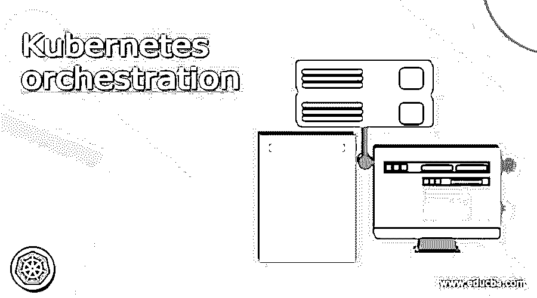

# 忽必烈的管弦乐团

> 原文:# t0]https://www . educba . com/kubrines-orchestration/

## Kubernetes 编排简介

Kubernetes 编排的定义是，Kubernetes 是一个很受欢迎的开源编排平台，允许开发人员简单地构建容器化的应用程序和服务。它还可以设置它们的规模、计划、扫描这些容器，因此它也称为容器编排，因为我们知道 Kubernetes 在行业中具有标准，因为它提供了大型容器的潜力，一个活跃的开发团队，Kubernetes 非常大而且可移动，因此它可以在多种环境中运行，并且可以与其他技术并发，因为 Kubernetes 是高度声明性的，所以他们可以报告我们希望系统如何执行动态应用程序。

### 什么是 Kubernetes 编排？

编排可用于将一些粒度元素创建到一个更高级的组合服务中，并且如果任何组织想要定位和指导大量的 Linux 容器和主机，则编排可自动安排、协调和管理软件容器，以便它可以从容器编排中受益，并且可以在我们可以使用容器的任何环境中使用，因此我们不需要重新设计它，因为它将有助于在各种环境中利用相同的应用程序。

<small>网页开发、编程语言、软件测试&其他</small>

编排工具可以提供安排容器和微服务架构的结构，它有许多在其生命周期中使用的工具，Kubernetes 是一个开源的容器编排工具，由 Google 设计和开发。Kubernetes 为我们提供了一个简单而准确地管理这些集群的平台。

### 忽必烈管弦乐团模板

Kubernetes orchestration 的模板已经定义并描述了资产集，对于创建应用程序，我们可以使用 Kubernetes orchestration 的模板，它有自己特定的风格和要求。

编排的模板定义了应用程序的名称，它还会告诉我们要查看图像和许多其他资源，

*   资源类型可以用一种格式定义:deployment，因此我们可以说它具有配置许多应用程序的灵活性。
*   应用程序的名称可以定义为 name: app-deployment。
*   副本的数量可以写成副本:4
*   我们可以将图像名称定义为，image: app:2.5.4 等

我们需要遵循一些步骤，

*   我们首先需要登录到 ACK 的控制台。
*   然后，我们必须从控制台左侧的市场选项中选择编排模板。
*   然后在模板页面上，有一个创建选项卡，我们必须单击它。
*   点击创建后，对话框将打开，我们需要填写，并通过指定名称保存它，描述，模板已配置确认其语法。

### 应用程序生命周期

应用程序的生命周期有一些步骤，如创建、更新、缩放和删除，所以让我们来讨论一下，

*   #### To create an application:

我们可以使用 Apache Dubbo、Spring Cloud 等框架，也可以借助 WAR 包、JAR 包来构建应用程序。

o 借助容器服务 Kubernetes cluster，我们可以将映像部署到应用程序中。o 通过使用 JAR 或 WAR 包，该应用程序已被部署在容器服务 Kubernetes 集群中。
o 我们通过发布应用程序使其适用于 Kubernetes 集群。
o 插件工具包一直在帮助实现应用程序的下一阶段。

*   #### Deploy application:

让他们认为我们已经创建了一个应用程序，在它尚未部署之前，它有一个基本信息选项卡，然后我们必须单击当前的部署应用程序，然后我们必须发布该应用程序，如果我们单击部署应用程序选项卡，它也会得到升级。

*   #### Scale-out and extension in application:

这是应用程序生命周期中的另一个步骤，应用程序横向扩展显示了有助于扩大应用程序容量的示例数量，而应用程序纵向扩展显示大量应用程序一直在减少，以减少应用程序的容量。“基本信息”选项卡具有应用程序扩展功能，用于增加应用程序的数量，我们可以说这些应用程序是次要的，它还具有“应用程序扩展”选项卡，用于减少大量应用程序。

*   #### Delete application:

“基本信息”选项卡也有“删除”应用程序，当我们单击它时，将删除从该应用程序中释放的所有窗格。

### 忽必烈管弦乐团的例子

我们已经看到了 Kubernetes 容器的生命周期，Kubernetes 命令创建部署并将映像插入到应用程序中，Kubernetes 可以在运行时自动选择容器的 docker。

让我们看看可以在 Kubernetes 流程编排中使用的命令，

*   " kubectl.exe 创建部署 my-nginx–image nginx "，
*   上面是我们可以在部署准备就绪时使用的命令，使用这个 Kubernetes 构造一个 pod 来托管大型应用程序。
*   当我们在运行前面的命令后进入“get pods”时，pods 就会被部署。
    "kubectl.exe 获取 pods "
*   describe 关键字可以与部署的名称一起使用，

“kubectl.exe 获取开发”和“kubectl.exe 描述开发 hi”

*   上述命令将提供副本、所需状态和时间戳。
*   我们可以通过使用“kubectl scale deployment”并将参数作为“–replicas”来检查大量应用程序的纵向扩展
*   当我们执行这个命令“kubectl。exe scale deployment hi–replicas 4”，它将显示应用程序已经部署。

### 结论

在本文中，我们总结说，我们已经讨论了什么是 Kubernetes 编排及其模板，我们也看到了应用程序的生命周期，如果有人想了解 Kubernetes 编排的概念或了解它是什么，那么本文将对您有所帮助。

### 推荐文章

这是一个 Kubernetes 编排指南。在这里我们讨论如何介绍，什么是 Kubernetes 编排，以及不同的例子及其代码实现。您也可以看看以下文章，了解更多信息–

1.  [Kubernetes 主机路径](https://www.educba.com/kubernetes-hostpath/)
2.  [Kubernetes 环境变量](https://www.educba.com/kubernetes-environment-variables/)
3.  [Kubernetes 复制控制器](https://www.educba.com/kubernetes-replication-controller/)
4.  [Kubernetes 自动缩放](https://www.educba.com/kubernetes-autoscaling/)

