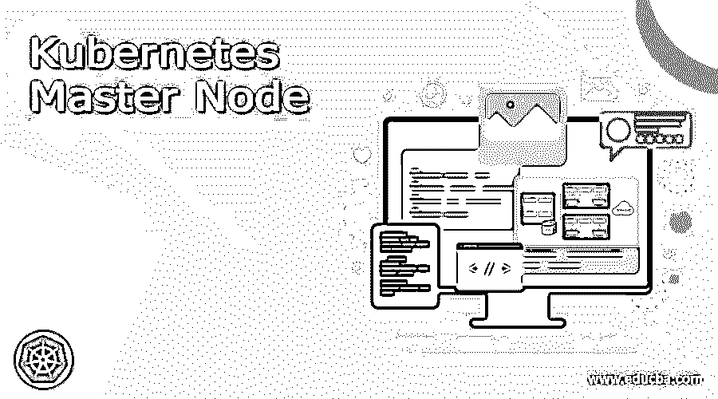

# kuble master node(库比特主节点)

> 原文：<https://www.educba.com/kubernetes-master-node/>

## Kubernetes 主节点介绍

Kubernetes 主节点被定义为 Kubernetes 主节点，在该节点中，它可以指挥和安排一组工作节点，或者我们可以说，它处理运行时的工作负载，并且它也有利于 Kubernetes 的集群。主节点可以有 Kube-APIServer、Kube-Controller-Manager、Etcd 和 Kube Scheduler 等组件，Kubernetes 节点是一个资产分析组，其中可以包含一个或多个容器，节点可以提供一个或多个 pods，其中每个节点都有生成编译时环境和支持 pods 的解决方案。

### 什么是 Kubernetes 主节点？

主节点可以提供集群的标准级别功能，这是所有其他功能的基础，它使用 API 端点，允许用户进行互连，并提供资产，以便 Kubernetes 能够安排 pod。通常，这种类型的 pod 不用于安排应用程序的工作负载， Kubernetes 中的主节点是一个节点，它指导和控制一组工作节点，并创建一个集群，该集群包含一些组件，如位于前端的 KubeAPIServer、用于控制正在运行的集群的 Kube-controller、Etcd 以及用于通信的 Kube-scheduler。

<small>网页开发、编程语言、软件测试&其他</small>

### kuble master node(库比特主节点)

在 Kubernetes 的最高层，它有两个主服务器，一个是主服务器，一个是节点服务器，其中我们可以说是 Linodoes、虚拟机或物理服务器，它们通过组合组成一个集群，这些服务器由服务管理，它们在其中创建一个控制平面。

*   **Kubernetes 主:**

这是一个不同的服务器，负责支持集群的脉冲状态，通过这个 Kubernetes 可以告诉节点我们的应用程序可以运行多少次以及在哪里运行。

*   **节点**:

Kubernetes 中的节点是可以运行我们的应用程序的工作服务器，节点的数量可以由用户生成和控制，有两个运行应用程序的进程，

从 API 服务器，kubelet 可以确定 pod 的状态，以确保 pod 在节点上正常运行。

kube-proxy 可用于连接服务，它是一个网络代理，代理每个节点的 UDP、TCP 和 SCTP。

*   **控制平面:**

集群的状态可以由控制平面通过负责制定解决方案来转换，

*   kube-APIServer:它出现在 API 服务器的前端。
*   kube-controller-manager:可以控制控制回路。
*   kube-scheduler:它搜索没有节点的新 pod，然后根据主机要求设置节点。
*   Etcd:它提供了后端数据库，该数据库具有键值，这些键值还提供和再现集群的状态。

### 重新配置 kubernetes 主节点:

如果 Kubernetes 的主节点不起作用并且检索也是不可能的，

*   当我们重新配置节点时，有些数据不需要更新，
*   没有必要更新主机名和 FQDN，因为它可以扰乱 Calico。
*   我们不需要更新 Kubernetes 主节点角色，而是可以使用命令“kubectl label node”在以后重新调整节点的标签。
*   网络插件也不需要改变，从印花布到编织。

让我们看到一些我们可以改变的信息，

*   可以更换主机。
*   我们可以改变 MAC 地址。
*   操作系统也可以改变。
*   应用程序证书也可以更改。

现在让我们来看看这个预言。

*   对于主节点的重新配置，我们必须验证 MAAS 应该正常工作，还需要检查它是否应该通过分配 IP 地址和引导示例来提供 DHCP 服务。
*   通过使用给定的命令，我们可以验证目标节点与 salt-master 节点的连接性:

`salt ‘ctl[<NUM>]*’ test.ping`

*   要在新的 minion 上更新 salt-master 节点的模块 ad 状态，以下命令非常有用:

`salt ‘ctl[<NUM>]*’ saltutil.sync_all`

*   要使用 salt 状态为服务生成和颁发 SSL 证书，请执行以下操作:

`salt ‘ctl[<NUM>]*’ state.sls salt`

*   我们可以使用下面的命令来安装 keepalive:

`salt ‘ctl[<NUM>]*’ state.sls keepalived –b 1`

*   我们可以使用以下命令来安装 HAProxy 并进行相应的验证:

`salt ‘ctl[<NUM>]*’ state.sls haproxy
salt ‘ctl[<NUM>]*’ service.status haproxy`

*   为了安装 etcd 和验证集群健康状况，我们可以使用以下命令:

`salt 'ctl[<NUM>]*' state.sls etcd.server.service
salt 'ctl[<NUM>]*' cmd.run "etcdctl cluster-health"`

*   为了安装 etcd 并提供 SSL 支持:

`salt 'ctl[<NUM>]*' state.sls salt.minion.cert,etcd.server.service
salt 'ctl[<NUM>]*' cmd.run '. /var/lib/etcd/configenv && etcdctl cluster-health'`

*   然后我们可以使用下面的命令来安装 Kubernetes:

`salt 'ctl[<NUM>]*' state.sls Kubernetes.master.kube-addons
salt 'ctl[<NUM>]*' state.sls kubernetes.pool`

*   我们可以使用以下命令为 calico 设置 NAT:

`salt 'ctl[<NUM>]*' state.sls etcd.server.setup`

*   要运行主程序检查一致性，我们可以使用以下命令:

`salt 'ctl[<NUM>]*' state.sls Kubernetes exclude=kubernetes.master.setup`

*   之后，可以使用以下命令注册附加组件:

`salt 'ctl[<NUM>]*' --subset 1 state.sls Kubernetes. master.setup`

注意:ctl[ <num>]-是变量 id。</num>

### 结论

在本文中，我们得出结论，Kubernetes 中主节点的特性已经可以用于 Kubernetes 集群，但是如果我们想要开发大量的集群，那么它有多个主节点，因此本文将有助于获得关于 Kubernetes 主节点的详细信息。

### 推荐文章

这是 Kubernetes 主节点指南。这里我们讨论一下入门，Kubernetes 主节点是什么，例子。您也可以看看以下文章，了解更多信息–

1.  [Kubernetes 主机路径](https://www.educba.com/kubernetes-hostpath/)
2.  [Kubernetes 环境变量](https://www.educba.com/kubernetes-environment-variables/)
3.  [Kubernetes 复制控制器](https://www.educba.com/kubernetes-replication-controller/)
4.  [Kubernetes 自动缩放](https://www.educba.com/kubernetes-autoscaling/)

