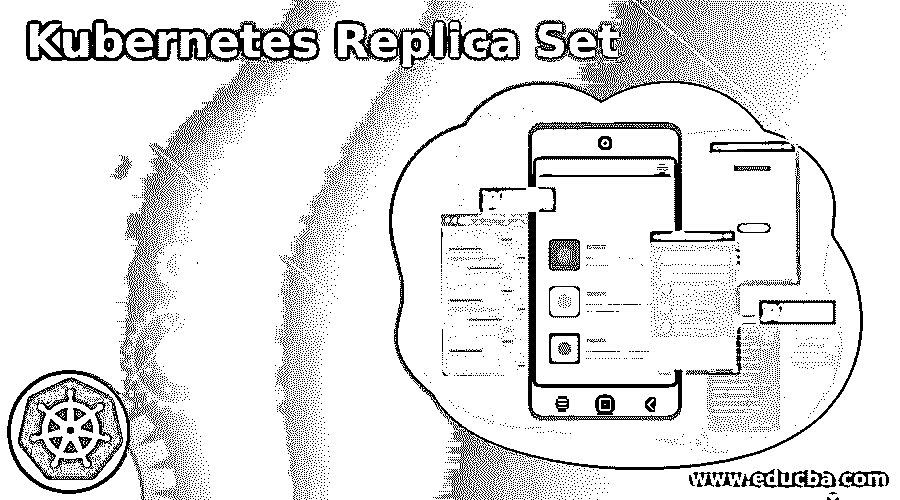

# 库比特复制集

> 原文：<https://www.educba.com/kubernetes-replica-set/>

## Kubernetes 副本集简介

以下文章提供了 Kubernetes 副本集的概要。这里的副本集与相同 pod 的可用性有关。它基本上是被使用的，或者说它的目的是维持一组指定的 pod 在指定的时间运行。它还用于保证相同的 pod 的可用性。

我们可以通过使用字段来定义副本集，包括选择器；这是一个概述。顾名思义，它还保证了一次应该运行多少个副本，这意味着一个 pod 副本；它帮助我们替换副本控制器。它们之间有显著的区别:副本集基于基于集合的控制器，而复制控制器基于基于等式的选择器。

<small>网页开发、编程语言、软件测试&其他</small>

### 什么是 Kubernetes 副本集？

顾名思义，副本集，这基本上意味着一个豆荚的精确副本。它决定了将同时创建多少个 pod 副本。它是用字段定义的，这些字段基本上包括选择器。该选择器用于识别它可以获取的 pods 我们还指定了副本的数量，代表它将维护的 pod 的数量。正确完成配置后，副本集将根据标准识别并开始删除和创建 pod，以达到需要维护的数量。

以下是 Kubernetes 副本集的一些要点:

*   首先，它创建了 pod 的副本或复制品。
*   然后，它继续创建和删除 pod，以达到需要维护的 pod 数量。
*   最后，它通过创建其副本来保证 pod 的可用性，所有 pod 都在指定的时间运行该副本。
*   它可以通过使用字段和选择器来定义，这将决定 pod 的数量。

### 创建和设置 Kubernetes 副本集

要创建和设置 Kubernetes 副本集，我们必须遵循以下步骤:

1.我们会创造一个。名为“frontend.yaml”的 yml 文件，我们将把这个文件提交给 Kubernetes 集群。

2.一旦提交，Kubernetes 集群将创建 pod 和副本集。

最后，3。运行下面的命令。

**代码:**

`kubectl apply -f https://kubernetes.io/examples/controllers/frontend.yaml`

4.现在，我们可以使用下面的命令检查部署的副本集。

**代码:**

`kubectl get rs`

5.如果我们想检查副本集的状态，那么运行下面的命令。

**代码:**

`kubectl describe rs/frontend`

6.最后，我们还可以通过运行下面的命令来检查显示的窗格。

**代码:**

`kubectl get pods`

下面是 frontend.yml 文件，供大家参考:

`apiVersion: apps/v1
kind: ReplicaSet
metadata:
name: frontend
labels:
app: guestbook
tier: frontend
spec:
# modify replicas according to your case
replicas: 3
selector:
matchLabels:
tier: frontend
template:
metadata:
labels:
tier: frontend
spec:
containers:
- name: php-redis
image: gcr.io/google_samples/gb-frontend:v3`

### 扩展您的应用程序 Kubernetes 副本集

要放大和缩小副本集，我们可以使用 to of 字段，即. spec.replicas 在这里，副本控制器向我们保证，将创建与选择器相匹配的所需数量的单元，这些单元将始终可用且可操作。顾名思义，m 缩减意味着指定的副本集在当前不可用或不需要。因此，ReplicaSet 控制器将尝试选择窗格来删除它们，它将对它们进行排序和优先排序，以便按比例缩小指定的窗格，但为此，它通常遵循一种算法。

*   首先，我们必须缩小悬而未决和不可调度的吊舱。
*   如果 ReplicaSet 控制器有如下注释，即. kubernetes . io/pod-deletion-cost，它会先选择值较低的 pod。
*   它将尝试计算具有较少副本的像元，而不是具有较高副本的像元，较高的像元将首先按比例缩小。
*   现在，它将检查最近创建的 pod 和旧的 pod，因此它们将出现在旧的 pod 之前。
*   它将匹配所有这些点以缩小比例；如果所有标准都匹配，则选择是随机的。

### Kubernetes 副本集的替代

以下列表显示了 Kubernetes 副本集的替代方案:

*   **部署:**建议拥有副本，并使用它通过声明性的服务器端更新来更新副本和 pod。另一方面，副本集可以独立使用。但是当我们尝试使用部署时，我们不应该担心维护副本。
*   **作业:**当 pod 自行终止时，我们可以使用作业。
*   **DaemonSet:** DaemonSet 为我们提供机器级的功能，如机器日志、监控等。因为 pod 的寿命与机器的寿命相关联，因为当机器重启/关闭时，pod 可以安全地终止。
*   **ReplicationController:** 如果我们谈到了副本集，那么这些就是 ReplicationController 的继承者，两者的行为相似，服务于相同的目的；它们之间的唯一区别是 ReplicationController 不支持设置基数选择器；它有助于平等选择器。但是复制集比复制控制器更受欢迎。

### Kubernetes 副本集的使用

使用 Kubernetes 副本集的要点如下:

*   它创建了此刻正在运行的 pod 的副本。
*   它有助于轻松地放大和缩小应用程序。
*   检查状态；使用简单的命令部署吊舱。

### 结论

我们已经看到了维护 Kubernetes 副本集的所有必要点和步骤，浏览一次教程，您将对 Kubernetes 中的副本集有一个很好的了解，它如何工作以及我们如何创建它，它很容易被开发人员使用和维护。

### 推荐文章

这是一个 Kubernetes 副本集指南。在这里，我们讨论介绍，创建和设置 Kubernetes 副本集，替代品，和使用。您也可以看看以下文章，了解更多信息–

1.  [Kubernetes 主机路径](https://www.educba.com/kubernetes-hostpath/)
2.  [Kubernetes 环境变量](https://www.educba.com/kubernetes-environment-variables/)
3.  [Kubernetes 复制控制器](https://www.educba.com/kubernetes-replication-controller/)
4.  [Kubernetes 选择器](https://www.educba.com/kubernetes-selector/)

